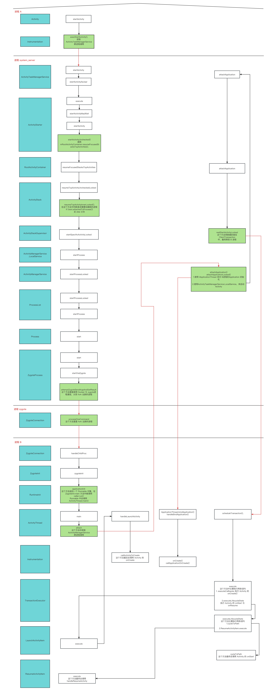

Android 跨进程 Activity 的启动流程分析，基于 Android10(API 29)。

本次目标如下：
1. 何时 fork 进程

2. fork 之后，Activity 是如何被创建

3. Activity 的生命周期
<!--more-->

从桌面点击图标启动目标应用，这里把桌面应用进程称为进程 `A`，目标应用进程为 `B`，其余设计的进程为 `system_server` 、`zygote` 。

代码的追踪的起点为 `Activity.startActivty()`

<hr/>
进程 A

```java
@Override
public void startActivity(Intent intent) {
    this.startActivity(intent, null);
}

@Override
public void startActivity(Intent intent, @Nullable Bundle options) {
    if (options != null) {
        startActivityForResult(intent, -1, options);
    } else {
        startActivityForResult(intent, -1);
    }
}

//最终会调用 Instrumentation 的 execStartActivity
public void startActivityForResult(@RequiresPermission Intent intent, int requestCode,
            @Nullable Bundle options) {
    ...
    mInstrumentation.execStartActivity(
        this, mMainThread.getApplicationThread(), mToken, this,
        intent, requestCode, options);
    ...
}
```

接下来调用 `Instrumentation` 的 `execStartActivity`

`Instrumentation.java`
```java
public ActivityResult execStartActivity(
        Context who, IBinder contextThread, IBinder token, Activity target,
        Intent intent, int requestCode, Bundle options) {
        ...
        int result = ActivityTaskManager.getService()
            .startActivity(whoThread, who.getBasePackageName(), intent,
                    intent.resolveTypeIfNeeded(who.getContentResolver()),
                    token, target != null ? target.mEmbeddedID : null,
                    requestCode, 0, null, options);
        ...
}
```

`ActivityTaskManager.java`
```java
public static IActivityTaskManager getService() {
    return IActivityTaskManagerSingleton.get();
}

@UnsupportedAppUsage(trackingBug = 129726065)
private static final Singleton<IActivityTaskManager> IActivityTaskManagerSingleton =
        new Singleton<IActivityTaskManager>() {
            @Override
            protected IActivityTaskManager create() {
                final IBinder b = ServiceManager.getService(Context.ACTIVITY_TASK_SERVICE);
                return IActivityTaskManager.Stub.asInterface(b);
            }
        };
```

`IActivityTaskManager` 的具体实现类是
```java
public class ActivityTaskManagerService extends IActivityTaskManager.Stub {
}
```

<hr/>
进程 system_server

下面要开始跨进程通信了，使用 `SystemServer` 进程中 `ATMS`，跨进程之后我们盘点一下，跨进程传递的参数

`ActivityTaskManagerService.java`

```java
/**
 *
 * @param caller 调用者的 ApplicationThread
 * @param callingPackage 调用者的包名
 * @param intent 调用 startActivity 时传入的 Intent
 * @param resultTo 调用的的 Binder ，用于信息跨进程返回
 * @param bOptions 跨进程传递的数据
 * @return
 */
@Override
public final int startActivity(IApplicationThread caller, String callingPackage,
        Intent intent, String resolvedType, IBinder resultTo, String resultWho, int requestCode,
        int startFlags, ProfilerInfo profilerInfo, Bundle bOptions) {
    
    return startActivityAsUser(caller, callingPackage, intent, resolvedType, resultTo,
            resultWho, requestCode, startFlags, profilerInfo, bOptions,
            UserHandle.getCallingUserId());
}

int startActivityAsUser(IApplicationThread caller, String callingPackage,
        Intent intent, String resolvedType, IBinder resultTo, String resultWho, int requestCode,
        int startFlags, ProfilerInfo profilerInfo, Bundle bOptions, int userId,
        boolean validateIncomingUser) {
    
    userId = getActivityStartController().checkTargetUser(userId, validateIncomingUser,
            Binder.getCallingPid(), Binder.getCallingUid(), "startActivityAsUser");

    // TODO: Switch to user app stacks here.
    return getActivityStartController().obtainStarter(intent, "startActivityAsUser")
            .setCaller(caller)
            .setCallingPackage(callingPackage)
            .setResolvedType(resolvedType)
            .setResultTo(resultTo)
            .setResultWho(resultWho)
            .setRequestCode(requestCode)
            .setStartFlags(startFlags)
            .setProfilerInfo(profilerInfo)
            .setActivityOptions(bOptions)
            //这里会设置 mRequest.mayWait = true
            .setMayWait(userId)
            .execute();

}

ActivityStartController getActivityStartController() {
    return mActivityStartController;
}
```

`ActivityStartController.java`

```java
ActivityStarter obtainStarter(Intent intent, String reason) {
    return mFactory.obtain().setIntent(intent).setReason(reason);
}
```

可以得知 `getActivityStartController().obtainStarter()` 最终会返回一个 `ActivityStarter` ，传入一系列参数后，最终调用 `execute` 

`ActivityStarter.java`
```java
ActivityStarter setMayWait(int userId) {
    mRequest.mayWait = true;
    mRequest.userId = userId;

    return this;
}

int execute() {
    //mRequest.mayWait = true
    return startActivityMayWait(mRequest.caller, mRequest.callingUid,
            mRequest.callingPackage, mRequest.realCallingPid, mRequest.realCallingUid,
            mRequest.intent, mRequest.resolvedType,
            mRequest.voiceSession, mRequest.voiceInteractor, mRequest.resultTo,
            mRequest.resultWho, mRequest.requestCode, mRequest.startFlags,
            mRequest.profilerInfo, mRequest.waitResult, mRequest.globalConfig,
            mRequest.activityOptions, mRequest.ignoreTargetSecurity, mRequest.userId,
            mRequest.inTask, mRequest.reason,
            mRequest.allowPendingRemoteAnimationRegistryLookup,
            mRequest.originatingPendingIntent, mRequest.allowBackgroundActivityStart);
        
}

private int startActivityMayWait(...) {
    ...
    int res = startActivity(caller, intent, ephemeralIntent, resolvedType, aInfo, rInfo,
                    voiceSession, voiceInteractor, resultTo, resultWho, requestCode, callingPid,
                    callingUid, callingPackage, realCallingPid, realCallingUid, startFlags, options,
                    ignoreTargetSecurity, componentSpecified, outRecord, inTask, reason,
                    allowPendingRemoteAnimationRegistryLookup, originatingPendingIntent,
                    allowBackgroundActivityStart);
    ...
}

private int startActivity(...) {
    ......
    mLastStartActivityResult = startActivity(caller, intent, ephemeralIntent, resolvedType,
            aInfo, rInfo, voiceSession, voiceInteractor, resultTo, resultWho, requestCode,
            callingPid, callingUid, callingPackage, realCallingPid, realCallingUid, startFlags,
            options, ignoreTargetSecurity, componentSpecified, mLastStartActivityRecord,
            inTask, allowPendingRemoteAnimationRegistryLookup, originatingPendingIntent,
            allowBackgroundActivityStart);

    ......
}

private int startActivity(...) {
    ...
    final int res = startActivity(r, sourceRecord, voiceSession, voiceInteractor, startFlags,
                true /* doResume */, checkedOptions, inTask, outActivity, restrictedBgActivity);
    ...
}

private int startActivity(...) {
    ......
    result = startActivityUnchecked(r, sourceRecord, voiceSession, voiceInteractor,
                    startFlags, doResume, options, inTask, outActivity, restrictedBgActivity);
    ......
}

private int startActivityUnchecked(...) {
    ...
    mRootActivityContainer.resumeFocusedStacksTopActivities(
                        mTargetStack, mStartActivity, mOptions);
    ...
}
```

`RootActivityContainer.java`

```java
boolean resumeFocusedStacksTopActivities(
            ActivityStack targetStack, ActivityRecord target, ActivityOptions targetOptions) {
    result = targetStack.resumeTopActivityUncheckedLocked(target, targetOptions);
}
```

`ActivityStack.java`

```java
boolean resumeTopActivityUncheckedLocked(ActivityRecord prev, ActivityOptions options) {
    ......
    result = resumeTopActivityInnerLocked(prev, options);
    ......
}

private boolean resumeTopActivityInnerLocked(ActivityRecord prev, ActivityOptions options) {
    ......
    //新启动的应用的进程还没有创建，如果不需要新建进程，走这里
    if (next.attachedToProcess()) {
        ......
    } else {
        mStackSupervisor.startSpecificActivityLocked(next, true, true);
    }
    ......
}
```

`ActivityStackSupervisor.java`

```java
public ActivityStackSupervisor(ActivityTaskManagerService service, Looper looper) {
    //mService 为 ActivityTaskManagerService
    mService = service;
    mLooper = looper;
    mHandler = new ActivityStackSupervisorHandler(looper);
}


void startSpecificActivityLocked(ActivityRecord r, boolean andResume, boolean checkConfig) {
    //这里相当于调用 mService.mAmInternal.startProcess()
    final Message msg = PooledLambda.obtainMessage(
            ActivityManagerInternal::startProcess, mService.mAmInternal, r.processName,
            r.info.applicationInfo, knownToBeDead, "activity", r.intent.getComponent());
    
    mService.mH.sendMessage(msg);
}
```

再回到 `ActivityTaskManagerService.java`，`mAmInternal` 是从 `LocalService` 中获取的，在 `ActivityManagerService` 中注册，
```java
ActivityManagerInternal mAmInternal;

public void onActivityManagerInternalAdded() {
    synchronized (mGlobalLock) {
        mAmInternal = LocalServices.getService(ActivityManagerInternal.class);
    }
}
```

`ActivityManagerService.java`

```java
private void start() {
    LocalServices.addService(ActivityManagerInternal.class, new LocalService());
}

public final class LocalService extends ActivityManagerInternal {
    public void startProcess(String processName, ApplicationInfo info,
            boolean knownToBeDead, String hostingType, ComponentName hostingName) {
        startProcessLocked(processName, info, knownToBeDead, 0 /* intentFlags */,
                new HostingRecord(hostingType, hostingName),
                false /* allowWhileBooting */, false /* isolated */,
                true /* keepIfLarge */);
    }
}

final ProcessRecord startProcessLocked(String processName,
        ApplicationInfo info, boolean knownToBeDead, int intentFlags,
        HostingRecord hostingRecord, boolean allowWhileBooting,
        boolean isolated, boolean keepIfLarge) {
    return mProcessList.startProcessLocked(processName, info, knownToBeDead, intentFlags,
            hostingRecord, allowWhileBooting, isolated, 0 /* isolatedUid */, keepIfLarge,
            null /* ABI override */, null /* entryPoint */, null /* entryPointArgs */,
            null /* crashHandler */);
}


//代码来到 ProcessList.java
final ProcessRecord startProcessLocked(String processName, ApplicationInfo info,
        boolean knownToBeDead, int intentFlags, HostingRecord hostingRecord,
        boolean allowWhileBooting, boolean isolated, int isolatedUid, boolean keepIfLarge,
        String abiOverride, String entryPoint, String[] entryPointArgs, Runnable crashHandler) {
    final boolean success = startProcessLocked(app, hostingRecord, abiOverride);
}

....

private Process.ProcessStartResult startProcess(HostingRecord hostingRecord, String entryPoint,
            ProcessRecord app, int uid, int[] gids, int runtimeFlags, int mountExternal,
            String seInfo, String requiredAbi, String instructionSet, String invokeWith,
            long startTime) {
        startResult = Process.start(entryPoint,
                app.processName, uid, uid, gids, runtimeFlags, mountExternal,
                app.info.targetSdkVersion, seInfo, requiredAbi, instructionSet,
                app.info.dataDir, invokeWith, app.info.packageName,
                new String[] {PROC_START_SEQ_IDENT + app.startSeq});
}
```

接下来代码来到 `Process.java`

```java
public static final ZygoteProcess ZYGOTE_PROCESS = new ZygoteProcess();

public static ProcessStartResult start(@NonNull final String processClass,
                                        @Nullable final String niceName,
                                        int uid, int gid, @Nullable int[] gids,
                                        int runtimeFlags,
                                        int mountExternal,
                                        int targetSdkVersion,
                                        @Nullable String seInfo,
                                        @NonNull String abi,
                                        @Nullable String instructionSet,
                                        @Nullable String appDataDir,
                                        @Nullable String invokeWith,
                                        @Nullable String packageName,
                                        @Nullable String[] zygoteArgs) {
    return ZYGOTE_PROCESS.start(processClass, niceName, uid, gid, gids,
                runtimeFlags, mountExternal, targetSdkVersion, seInfo,
                abi, instructionSet, appDataDir, invokeWith, packageName,
                /*useUsapPool=*/ true, zygoteArgs);
}
```

`ZygoteProcess.java`

```java
public final Process.ProcessStartResult start(@NonNull final String processClass,
                                                final String niceName,
                                                int uid, int gid, @Nullable int[] gids,
                                                int runtimeFlags, int mountExternal,
                                                int targetSdkVersion,
                                                @Nullable String seInfo,
                                                @NonNull String abi,
                                                @Nullable String instructionSet,
                                                @Nullable String appDataDir,
                                                @Nullable String invokeWith,
                                                @Nullable String packageName,
                                                boolean useUsapPool,
                                                @Nullable String[] zygoteArgs) {

    return startViaZygote(processClass, niceName, uid, gid, gids,
            runtimeFlags, mountExternal, targetSdkVersion, seInfo,
            abi, instructionSet, appDataDir, invokeWith, /*startChildZygote=*/ false,
            packageName, useUsapPool, zygoteArgs);
}

private Process.ProcessStartResult startViaZygote(...){
    return zygoteSendArgsAndGetResult(openZygoteSocketIfNeeded(abi),
                                              useUsapPool,
                                              argsForZygote);
}

private Process.ProcessStartResult zygoteSendArgsAndGetResult(...){
    return attemptZygoteSendArgsAndGetResult(zygoteState, msgStr);
}

private Process.ProcessStartResult attemptZygoteSendArgsAndGetResult(
        ZygoteState zygoteState, String msgStr) throws ZygoteStartFailedEx {
    try {
        final BufferedWriter zygoteWriter = zygoteState.mZygoteOutputWriter;
        final DataInputStream zygoteInputStream = zygoteState.mZygoteInputStream;
        //这里开始 Socket 通信
        zygoteWriter.write(msgStr);
        zygoteWriter.flush();
        return result;
    }
}
```

`ZygoteProcess.attemptZygoteSendArgsAndGetResult()` 开始使用 `Socket` 跨进程通信，`ZygoteProcess` 中方法的调用点是 `Process` 的 `start` 方法
```java
public static final ZygoteProcess ZYGOTE_PROCESS = new ZygoteProcess();

ZYGOTE_PROCESS.start(processClass, niceName, uid, gid, gids,
                    runtimeFlags, mountExternal, targetSdkVersion, seInfo,
                    abi, instructionSet, appDataDir, invokeWith, packageName,
                    /*useUsapPool=*/ true, zygoteArgs)
```

```java
public class ZygoteProcess {

    private final LocalSocketAddress mZygoteSocketAddress;

    public ZygoteProcess() {
        //连接的地址
        mZygoteSocketAddress =
                new LocalSocketAddress(Zygote.PRIMARY_SOCKET_NAME,
                                       LocalSocketAddress.Namespace.RESERVED);
    }

    private Process.ProcessStartResult startViaZygote(...) throws ZygoteStartFailedEx {
        synchronized(mLock) {
            //openZygoteSocketIfNeeded 获取要连接的 Socket
            return zygoteSendArgsAndGetResult(openZygoteSocketIfNeeded(abi),
                                              useUsapPool,
                                              argsForZygote);
        }                                               
    }

    private ZygoteState openZygoteSocketIfNeeded(String abi) throws ZygoteStartFailedEx {
        attemptConnectionToPrimaryZygote();

        if (primaryZygoteState.matches(abi)) {
            return primaryZygoteState;
        }  
    }

    private void attemptConnectionToPrimaryZygote() throws IOException {
        if (primaryZygoteState == null || primaryZygoteState.isClosed()) {
            primaryZygoteState =
                    ZygoteState.connect(mZygoteSocketAddress, mUsapPoolSocketAddress);

        }
    }

    private static class ZygoteState implements AutoCloseable {
        static ZygoteState connect(@NonNull LocalSocketAddress zygoteSocketAddress,
            @Nullable LocalSocketAddress usapSocketAddress) throws IOException {

            final LocalSocket zygoteSessionSocket = new LocalSocket();
            //开始具体的连接
            zygoteSessionSocket.connect(zygoteSocketAddress);
        }
    }
}
```

连接的标识或者可以称为“地址？” 为 `Zygote.PRIMARY_SOCKET_NAME` ，这里连接到哪里呢，也即服务器在哪里？可以去 `ZygoteInit` 中寻找答案，
```java
public class ZygoteInit {
    public static void main(String argv[]) {
        //开启服务器，zygoteServer 为 ZygoteServer 的一个具体实例
        caller = zygoteServer.runSelectLoop(abiList);

        caller.run();
    }
}

class ZygoteServer {

    private LocalServerSocket mZygoteSocket;

    ZygoteServer(boolean isPrimaryZygote) {
        if (isPrimaryZygote) {
            // 可以看到 Socket Name 了
            mZygoteSocket = Zygote.createManagedSocketFromInitSocket(Zygote.PRIMARY_SOCKET_NAME);
            mUsapPoolSocket =
                    Zygote.createManagedSocketFromInitSocket(
                            Zygote.USAP_POOL_PRIMARY_SOCKET_NAME);
        } else {
            mZygoteSocket = Zygote.createManagedSocketFromInitSocket(Zygote.SECONDARY_SOCKET_NAME);
            mUsapPoolSocket =
                    Zygote.createManagedSocketFromInitSocket(
                            Zygote.USAP_POOL_SECONDARY_SOCKET_NAME);
        }
    }

    Runnable runSelectLoop(String abiList) {
        while (true) {
            while (--pollIndex >= 0) {
                ZygoteConnection newPeer = acceptCommandPeer(abiList);
            }
        }
    }

     private ZygoteConnection acceptCommandPeer(String abiList) {
        try {
            //mZygoteSocket 为 Server 端
            return createNewConnection(mZygoteSocket.accept(), abiList);
        } catch (IOException ex) {
            throw new RuntimeException(
                    "IOException during accept()", ex);
        }
    }

    protected ZygoteConnection createNewConnection(LocalSocket socket, String abiList)
            throws IOException {
        return new ZygoteConnection(socket, abiList);
    }
}
```

到这里可以确认新创建的进程是从 `zygote` fork 出来的。

好了，继续跨进程来到 zygote 进程，在进入 zygote 进程之前，再来梳理下，目前为止 `Activity` 启动的流程，
1. 从当前进程 `startActivity` 准备打开另一个应用的 `Activity`，调用 `Activity.startActivity()`

2. 来到 `Instrumentation` ，在这里开始准备跨进程调用 `ActivityTaskManagerService.startActivity()`

3. 来到新进程 `system_server` ，执行一系列的准备工作，最终判断出本次调用需要创建新的进程，最终在 `ZygoteProcess` 中开始使用 `Socket` 与 `zygote` 进程通信，要求 `zygote` fork 出新进程

4. 开始 fork 新进程

<hr/>
进程 fork

下面来看 `zygote` 是怎么 fork 新进程的，fork 之后又干了什么，本阶段代码起点为 `ZygoteServer.runSelectLoop`
```java
class ZygoteServer {

    Runnable runSelectLoop(String abiList) {
        final Runnable command = connection.processOneCommand(this);
    }

    private ZygoteConnection acceptCommandPeer(String abiList) {
        try {
            //mZygoteSocket 为 Server 端
            return createNewConnection(mZygoteSocket.accept(), abiList);
        } catch (IOException ex) {
            throw new RuntimeException(
                    "IOException during accept()", ex);
        }
    }

    protected ZygoteConnection createNewConnection(LocalSocket socket, String abiList)
            throws IOException {
        return new ZygoteConnection(socket, abiList);
    }
}

//
class ZygoteConnection {
    Runnable processOneCommand(ZygoteServer zygoteServer) {

        // fork 新的进程
        pid = Zygote.forkAndSpecialize(parsedArgs.mUid, parsedArgs.mGid, parsedArgs.mGids,
                parsedArgs.mRuntimeFlags, rlimits, parsedArgs.mMountExternal, parsedArgs.mSeInfo,
                parsedArgs.mNiceName, fdsToClose, fdsToIgnore, parsedArgs.mStartChildZygote,
                parsedArgs.mInstructionSet, parsedArgs.mAppDataDir, parsedArgs.mTargetSdkVersion);

        try {
            //pid = 0 表示当前进程为 fork 出来的新的进程
            if (pid == 0) {
                // in child
                zygoteServer.setForkChild();

                zygoteServer.closeServerSocket();
                IoUtils.closeQuietly(serverPipeFd);
                serverPipeFd = null;

                return handleChildProc(parsedArgs, descriptors, childPipeFd,
                        parsedArgs.mStartChildZygote);
            }
        } 
    }
    //isZygote 是 parsedArgs.mStartChildZygote
    private Runnable handleChildProc(ZygoteArguments parsedArgs, FileDescriptor[] descriptors,
            FileDescriptor pipeFd, boolean isZygote) {
        //isZygote = false
        if (!isZygote) {
            return ZygoteInit.zygoteInit(parsedArgs.mTargetSdkVersion,
                parsedArgs.mRemainingArgs, null /* classLoader */);
        } else {
            return ZygoteInit.childZygoteInit(parsedArgs.mTargetSdkVersion,
                    parsedArgs.mRemainingArgs, null /* classLoader */);
        }
    }
}
```

<hr/>
进程 B

下面的代码又进入新的进程了

`handleChildProc` 方法中传递的 `isZygote` 是由客户端(Socket) 传递过来的，可以扒一下，来看看传递的 `mStartChildZygote` 是什么值。回到 `system_server` 进程的
`ZygoteProcess` 

```java
public final Process.ProcessStartResult start(...) {
    return startViaZygote(processClass, niceName, uid, gid, gids,
            runtimeFlags, mountExternal, targetSdkVersion, seInfo,
            abi, instructionSet, appDataDir, invokeWith, /*startChildZygote=*/ false,
            packageName, useUsapPool, zygoteArgs);
}

private Process.ProcessStartResult startViaZygote(...,boolean startChildZygote,...){
    ArrayList<String> argsForZygote = new ArrayList<>();

    if (startChildZygote) {
        argsForZygote.add("--start-child-zygote");
    }
}
```

可以得知 `startChildZygote = false`，所以传递给 `handleChildProc` 的 `mStartChildZygote` 为 false，所以接下来代码来到 `ZygoteInit.zygoteInit()`

```java
public class ZygoteInit {
    public static final Runnable zygoteInit(int targetSdkVersion, String[] argv,
            ClassLoader classLoader) {
        return RuntimeInit.applicationInit(targetSdkVersion, argv, classLoader);
    }
}

public class RuntimeInit {
    protected static Runnable applicationInit(int targetSdkVersion, String[] argv,
            ClassLoader classLoader) {
        // Remaining arguments are passed to the start class's static main
        return findStaticMain(args.startClass, args.startArgs, classLoader);
    }

    protected static Runnable findStaticMain(String className, String[] argv,
            ClassLoader classLoader) {
        Class<?> cl;
        cl = Class.forName(className, true, classLoader);
        Method m;
        m = cl.getMethod("main", new Class[] { String[].class });
        return new MethodAndArgsCaller(m, argv);
    }

    static class MethodAndArgsCaller implements Runnable {
        private final Method mMethod;

        private final String[] mArgs;

        public MethodAndArgsCaller(Method method, String[] args) {
            mMethod = method;
            mArgs = args;
        }

        public void run() {
            mMethod.invoke(null, new Object[] { mArgs });
        }
    }
}
```

上面代码的目的是利用反射找出目标类的 `main` 方法，现在需要向前流程回溯，查看传递的 `className` 是什么，先在当前进程回溯，可以得知是由 `parsedArgs.mRemainingArgs` 来获取的，这个参数是由 `system_server` 进程的 `ZygoteProcess.attemptZygoteSendArgsAndGetResult()` 来传递，来到 `system_server` 的 `ZygoteProcess`

```java
public class ZygoteProcess {

    private Process.ProcessStartResult startViaZygote(final String processClass, ...){
        //这里的参数会放在 mRemainingArgs
        argsForZygote.add(processClass);
    }
}

public class Process {
    public static final ZygoteProcess ZYGOTE_PROCESS = new ZygoteProcess();

    public static ProcessStartResult start(...) {
        return ZYGOTE_PROCESS.start(processClass, niceName, uid, gid, gids,
                    runtimeFlags, mountExternal, targetSdkVersion, seInfo,
                    abi, instructionSet, appDataDir, invokeWith, packageName,
                    /*useUsapPool=*/ true, zygoteArgs);
    }
}
```

从之前的分析可以得知，是在 `ActivityStackSupervisor` 调用创建进程的方法的
```java
public class ActivityStackSupervisor implements RecentTasks.Callbacks {
    void startSpecificActivityLocked(ActivityRecord r, boolean andResume, boolean checkConfig) {
    //这里相当于调用 mService.mAmInternal.startProcess()
    final Message msg = PooledLambda.obtainMessage(
            ActivityManagerInternal::startProcess, mService.mAmInternal, r.processName,
            r.info.applicationInfo, knownToBeDead, "activity", r.intent.getComponent());
    
    mService.mH.sendMessage(msg);
    }
}
```

最终会调用 `ActivityManagerService.startProcessLocked()` 

```java
public class ActivityManagerService extends IActivityManager.Stub
        implements Watchdog.Monitor, BatteryStatsImpl.BatteryCallback {
    
    final ProcessList mProcessList = new ProcessList();

    final ProcessRecord startProcessLocked(...) {
        return mProcessList.startProcessLocked(processName, info, knownToBeDead, intentFlags,
                hostingRecord, allowWhileBooting, isolated, 0 /* isolatedUid */, keepIfLarge,
                null /* ABI override */, null /* entryPoint */, null /* entryPointArgs */,
                null /* crashHandler */);
    }
}

public final class ProcessList {
    final ProcessRecord startProcessLocked(...) {
        final boolean success = startProcessLocked(app, hostingRecord, abiOverride);
    }

    boolean startProcessLocked(...) {
        final String entryPoint = "android.app.ActivityThread";

        return startProcessLocked(hostingRecord, entryPoint, app, uid, gids,
                runtimeFlags, mountExternal, seInfo, requiredAbi, instructionSet, invokeWith,
                startTime);
    }

    ......

    private Process.ProcessStartResult startProcess(...,String entryPoint,...){
        startResult = Process.start(entryPoint,
                        app.processName, uid, uid, gids, runtimeFlags, mountExternal,
                        app.info.targetSdkVersion, seInfo, requiredAbi, instructionSet,
                        app.info.dataDir, invokeWith, app.info.packageName,
                        new String[] {PROC_START_SEQ_IDENT + app.startSeq});
    }
}
```

可以得知传入的目标类为 `android.app.ActivityThread` ，终于找到你...

好了，可以回到创建后的进程了，可以来看看 fork 后做了哪些事了。再回到 `ZygoteInit` ，
```java
public class ZygoteInit {
    public static void main(String argv[]) {
        caller = zygoteServer.runSelectLoop(abiList);
        if (caller != null) {
            caller.run();
        }
    }
}
```

fork 新进程之后调用 `caller.run` ，也即 `android.app.ActivityThread` 实例对象的 `main` 方法，所以下面代码来到 `android.app.ActivityThread`

```java
public final class ActivityThread extends ClientTransactionHandler {
    public static void main(String[] args) {
        Looper.prepareMainLooper();

        ActivityThread thread = new ActivityThread();
        thread.attach(false, startSeq);

        Looper.loop();
    }

    private void attach(boolean system, long startSeq) {
        if (!system) {
            final IActivityManager mgr = ActivityManager.getService();
            mgr.attachApplication(mAppThread, startSeq);
        }
    }
}
```

<hr/>
进程 system_server

`attach` 后，开始跨进程通信，来到 `system_server`， 代码来到 `ActivityManagerService` 

```java
public class ActivityManagerService extends IActivityManager.Stub
        implements Watchdog.Monitor, BatteryStatsImpl.BatteryCallback {

    public final void attachApplication(IApplicationThread thread, long startSeq) {
        synchronized (this) {
            int callingPid = Binder.getCallingPid();
            final int callingUid = Binder.getCallingUid();
            final long origId = Binder.clearCallingIdentity();
            attachApplicationLocked(thread, callingPid, callingUid, startSeq);
            Binder.restoreCallingIdentity(origId);
        }
    }

    private final boolean attachApplicationLocked(IApplicationThread thread,
            int pid, int callingUid, long startSeq) {
        ......
        //初始化 Application
        thread.bindApplication(processName, appInfo, providers, null, profilerInfo,
                        null, null, null, testMode,
                        mBinderTransactionTrackingEnabled, enableTrackAllocation,
                        isRestrictedBackupMode || !normalMode, app.isPersistent(),
                        new Configuration(app.getWindowProcessController().getConfiguration()),
                        app.compat, getCommonServicesLocked(app.isolated),
                        mCoreSettingsObserver.getCoreSettingsLocked(),
                        buildSerial, autofillOptions, contentCaptureOptions);
        
        if (normalMode) {
            try {
                //启动 Activity
                didSomething = mAtmInternal.attachApplication(app.getWindowProcessController());
            } catch (Exception e) {
                Slog.wtf(TAG, "Exception thrown launching activities in " + app, e);
                badApp = true;
            }
        }
        ......
    }
}
```

<hr/>
进程 B

`thread.bindApplication` 做 `Application` 初始化工作，再次跨进程通信，回到进程 B，代码来到 `ActivityThread`

```java
public final class ActivityThread extends ClientTransactionHandler {

    Application mInitialApplication;

    class H extends Handler {
        public void handleMessage(Message msg) {
            switch (msg.what) {
                case BIND_APPLICATION:
                    Trace.traceBegin(Trace.TRACE_TAG_ACTIVITY_MANAGER, "bindApplication");
                    AppBindData data = (AppBindData)msg.obj;
                    handleBindApplication(data);
                    Trace.traceEnd(Trace.TRACE_TAG_ACTIVITY_MANAGER);
                    break;
                ......
            }
        }
    }

    private class ApplicationThread extends IApplicationThread.Stub {
        public final void bindApplication(...) {    
            sendMessage(H.BIND_APPLICATION, data);
        }
    }

    //主要做一些 Application 的创建，及初始化工作
    private void handleBindApplication(AppBindData data) {
        Application app;
        app = data.info.makeApplication(data.restrictedBackupMode, null);
        mInitialApplication = app;

        mInstrumentation.onCreate(data.instrumentationArgs);
        //回调 Application 的 onCreate
        mInstrumentation.callApplicationOnCreate(app);
    }
}
```

<hr/>
进程 system_server

`mAtmInternal.attachApplication(app.getWindowProcessController())` 启动目标 `Activity`，`mAtmInternal` 的初始化代码

```java
mAtmInternal = LocalServices.getService(ActivityTaskManagerInternal.class);
```

为 `ActivityTaskManagerService.LocalService` 的一个实例对象

```java
public class ActivityTaskManagerService extends IActivityTaskManager.Stub {
    final class LocalService extends ActivityTaskManagerInternal {
        public boolean attachApplication(WindowProcessController wpc) throws RemoteException {
            synchronized (mGlobalLockWithoutBoost) {
                return mRootActivityContainer.attachApplication(wpc);
            }
        }
    }
}
```

代码来到 `RootActivityContainer`

```java
boolean attachApplication(WindowProcessController app) throws RemoteException {
    //Activity 启动
    mStackSupervisor.realStartActivityLocked(activity, app,
                                top == activity /* andResume */, true /* checkConfig */)
}
```

启动 Activity ，下面的流程就和正常启动 Activity 的流程一致了

代码来到 `ActivityStackSupervisor`

```java
public class ActivityStackSupervisor implements RecentTasks.Callbacks {
    boolean realStartActivityLocked(ActivityRecord r, WindowProcessController proc,
                boolean andResume, boolean checkConfig) throws RemoteException {
        // Create activity launch transaction.
        final ClientTransaction clientTransaction = ClientTransaction.obtain(
                proc.getThread(), r.appToken);

        final DisplayContent dc = r.getDisplay().mDisplayContent;
        clientTransaction.addCallback(LaunchActivityItem.obtain(new Intent(r.intent),
                System.identityHashCode(r), r.info,
                // TODO: Have this take the merged configuration instead of separate global
                // and override configs.
                mergedConfiguration.getGlobalConfiguration(),
                mergedConfiguration.getOverrideConfiguration(), r.compat,
                r.launchedFromPackage, task.voiceInteractor, proc.getReportedProcState(),
                r.icicle, r.persistentState, results, newIntents,
                dc.isNextTransitionForward(), proc.createProfilerInfoIfNeeded(),
                        r.assistToken));
        
        // Schedule transaction.
        //mService.getLifecycleManager() 为 ClientLifecycleManager
        mService.getLifecycleManager().scheduleTransaction(clientTransaction);
    }
}
```

`mService.getLifecycleManager()` 为 `ClientLifecycleManager` ，代码来到 `ClientLifecycleManager`

```java
class ClientLifecycleManager {
    void scheduleTransaction(ClientTransaction transaction) throws RemoteException {
        transaction.schedule();
    }
}

public class ClientTransaction implements Parcelable, ObjectPoolItem {
    private IApplicationThread mClient;

    public void schedule() throws RemoteException {
        mClient.scheduleTransaction(this);
    }
}
```

<hr/>
进程 B

开始跨进程调用，来到新创建的进程，代码来到 `ApplicationThread`

```java
public final class ActivityThread extends ClientTransactionHandler {

    private class ApplicationThread extends IApplicationThread.Stub {
        @Override
        public void scheduleTransaction(ClientTransaction transaction) throws RemoteException {
            ActivityThread.this.scheduleTransaction(transaction);
        }
    }
}
```

其中 `ActivityThread.this.scheduleTransaction()` 为 `ActivityThread` 的父类 `ClientTransactionHandler` 的方法，

```java
public abstract class ClientTransactionHandler {
    void scheduleTransaction(ClientTransaction transaction) {
        transaction.preExecute(this);
        sendMessage(ActivityThread.H.EXECUTE_TRANSACTION, transaction);
    }
}
```

发送 `EXECUTE_TRANSACTION` Message

```java
public final class ActivityThread extends ClientTransactionHandler {

    Application mInitialApplication;

    private final TransactionExecutor mTransactionExecutor = new TransactionExecutor(this);

    class H extends Handler {
        public void handleMessage(Message msg) {
            switch (msg.what) {
                case EXECUTE_TRANSACTION:
                    final ClientTransaction transaction = (ClientTransaction) msg.obj;
                    mTransactionExecutor.execute(transaction);
                    if (isSystem()) {
                        // Client transactions inside system process are recycled on the client side
                        // instead of ClientLifecycleManager to avoid being cleared before this
                        // message is handled.
                        transaction.recycle();
                    }
                    // TODO(lifecycler): Recycle locally scheduled transactions.
                    break;
                ......
            }
        }
    }
}
```

执行 `mTransactionExecutor.execute(transaction)` ，代码来到 `TransactionExecutor` 

```java
public class TransactionExecutor {
    public void execute(ClientTransaction transaction) {
        //创建 Activity
        executeCallbacks(transaction);
        //声明周期相关
        executeLifecycleState(transaction);
    }

    public void executeCallbacks(ClientTransaction transaction) {
        final List<ClientTransactionItem> callbacks = transaction.getCallbacks();
        for (int i = 0; i < size; ++i) {
            final ClientTransactionItem item = callbacks.get(i);
            item.execute(mTransactionHandler, token, mPendingActions);
        }
    }
}
```

`callbacks` 是什么，在前面有贴过代码，再 `ActivityStackSupervisor.realStartActivityLocked()` 中
```java
clientTransaction.addCallback(LaunchActivityItem.obtain(new Intent(r.intent),
            System.identityHashCode(r), r.info,
            // TODO: Have this take the merged configuration instead of separate global
            // and override configs.
            mergedConfiguration.getGlobalConfiguration(),
            mergedConfiguration.getOverrideConfiguration(), r.compat,
            r.launchedFromPackage, task.voiceInteractor, proc.getReportedProcState(),
            r.icicle, r.persistentState, results, newIntents,
            dc.isNextTransitionForward(), proc.createProfilerInfoIfNeeded(),
                    r.assistToken));
```

所以 `item` 为 `LaunchActivityItem` 的一个实例对象，所以接下来执行 `LaunchActivityItem.execute()`

```java
public class LaunchActivityItem extends ClientTransactionItem {
    public void execute(ClientTransactionHandler client, IBinder token,
            PendingTransactionActions pendingActions) {
        client.handleLaunchActivity(r, pendingActions, null /* customIntent */);
    }
}
```

遇到熟悉的代码了，`handleLaunchActivity`，`client` 为 `ActivityThread` 的一个实例对象，所以代码回到 `ActivityThread`

```java
public final class ActivityThread extends ClientTransactionHandler {
    public Activity handleLaunchActivity(ActivityClientRecord r,
            PendingTransactionActions pendingActions, Intent customIntent) {
        final Activity a = performLaunchActivity(r, customIntent);
    }

    private Activity performLaunchActivity(ActivityClientRecord r, Intent customIntent) {
        ContextImpl appContext = createBaseContextForActivity(r);
        Activity activity = null;
        java.lang.ClassLoader cl = appContext.getClassLoader();
        //创建 Activity 对象
        activity = mInstrumentation.newActivity(cl, component.getClassName(), r.intent);

        activity.attach(appContext, this, getInstrumentation(), r.token,
                        r.ident, app, r.intent, r.activityInfo, title, r.parent,
                        r.embeddedID, r.lastNonConfigurationInstances, config,
                        r.referrer, r.voiceInteractor, window, r.configCallback,
                        r.assistToken);
        
        mInstrumentation.callActivityOnCreate(activity, r.state);
    }
}

public class Instrumentation {
    public void callActivityOnCreate(Activity activity, Bundle icicle) {
        prePerformCreate(activity);
        //调用 Activity 的 performCreate，这个方法内部会调用 onCreate
        activity.performCreate(icicle);
        postPerformCreate(activity);
    }
}
```

到这里，Activity 的 `onCreate` 方法执行完毕，接下来是 `onResume`， 声明周期的调用在 `TransactionExecutor`

```java
public class TransactionExecutor {
    public void execute(ClientTransaction transaction) {
        //创建 Activity
        executeCallbacks(transaction);
        //声明周期相关
        executeLifecycleState(transaction);
    }

    private void executeLifecycleState(ClientTransaction transaction) {
        final ActivityLifecycleItem lifecycleItem = transaction.getLifecycleStateRequest();

        cycleToPath(r, lifecycleItem.getTargetState(), true /* excludeLastState */, transaction);

        lifecycleItem.execute(mTransactionHandler, token, mPendingActions);
    }

    private void cycleToPath(ActivityClientRecord r, int finish, boolean excludeLastState,
            ClientTransaction transaction) {
        final int start = r.getLifecycleState();
        //start: ON_CREATE ; finish: ON_RESUME
        //path: ON_START
        final IntArray path = mHelper.getLifecyclePath(start, finish, excludeLastState/* true */);
        performLifecycleSequence(r, path, transaction);
    }

    private void performLifecycleSequence(ActivityClientRecord r, IntArray path,
        ClientTransaction transaction) {
        final int size = path.size();
        for (int i = 0, state; i < size; i++) {
            state = path.get(i);
            switch (state) {
                case ON_START:
                    mTransactionHandler.handleStartActivity(r, mPendingActions);
                    break;
            }
        }
    }
}
```

`mTransactionHandler.handleStartActivity` 执行 `Activity.onStart()`，

再来看 `lifecycleItem.execute(mTransactionHandler, token, mPendingActions);`，`lifecycleItem` 是由 `transaction.getLifecycleStateRequest()` 来获取，`lifecycleItem` 是在 `ActivityStackSupervisor.realStartActivityLocked()` 中赋值的

```java
public class ActivityStackSupervisor implements RecentTasks.Callbacks {
    boolean realStartActivityLocked(ActivityRecord r, WindowProcessController proc,
            boolean andResume, boolean checkConfig) throws RemoteException {
        lifecycleItem = ResumeActivityItem.obtain(dc.isNextTransitionForward());
        
        clientTransaction.setLifecycleStateRequest(lifecycleItem);   
    }
}
```

所以代码来到 `ResumeActivityItem`

```java
public class ResumeActivityItem extends ActivityLifecycleItem {
    public void execute(ClientTransactionHandler client, IBinder token,
            PendingTransactionActions pendingActions) {
        Trace.traceBegin(TRACE_TAG_ACTIVITY_MANAGER, "activityResume");
        client.handleResumeActivity(token, true /* finalStateRequest */, mIsForward,
                "RESUME_ACTIVITY");
        Trace.traceEnd(TRACE_TAG_ACTIVITY_MANAGER);
    }
}
```

`client.handleResumeActivity` 执行 `Activity` 的 `onResume` 方法。

至此完成 `onCreate`、`onStart`、`onResume` 三个声明周期

最后想画张流程图的，结果画吐了... 先这样吧，有点复杂

