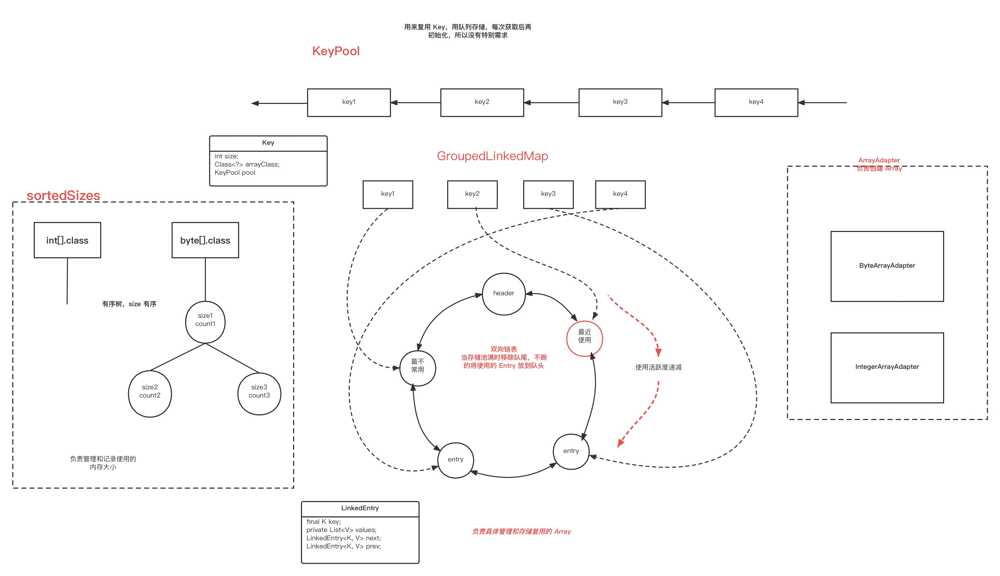

Glide 图片加载库。

本文学习的目标：
1. 缓存策略

2. 生命周期监听

3. 内存复用策略

4. 大图加载
<!--more-->

一行简单的图片请求代码
```java
Glide.with(this).load("https://himg.bdimg.com/sys/portrait/item/pp.1.1fdc338e.ric5F8oKJekRIoc8wsplCg?_t=1689664631126").into(imageView);
```

## 1.缓存策略
Glide 可以分为内存缓存、磁盘缓存两大类，其中内存缓存又可以加一级 ActiveResources ，磁盘缓存又可以加一级 ResourceCache，对变换（裁剪、裁剪等）后的图片缓存。

Glide 对数据源分了五类，在 DataSource 中有定义，有 LOCAL、REMOTE、DATA_DISK_CACHE、RESOURCE_DISK_CACHE、MEMORY_CACHE。
1. LOCAL 本地资源，如 assets、drawable 

2. REMOTE 远程资源，如网络资源

3. DATA_DISK_CACHE 磁盘缓存

4. RESOURCE_DISK_CACHE 对原数据进行处理后的磁盘缓存

5. MEMORY_CACHE 内存缓存

Glide 磁盘缓存有多种策略，所有策略都在 DiskCacheStrategy 中有定义，包括 ALL、NONE、DATA、RESOURCE、AUTOMATIC。

1. ALL 为缓存所有，包括原数据和最终显示在页面上的图片

2. NONE 不对任何资源进行磁盘缓存

3. DATA 只缓存原数据

4. RESOURCE 缓存显示的数据，同一张图片，对不同大小的 ImageView 会有多个磁盘缓存

5. AUTOMATIC 自动选择，保存原数据和变换后的数据，为 Glide 默认使用的磁盘缓存策略

### 1.1 资源缓存
本部分主要来追踪 Glide 是如何对，网络请求的数据是如何缓存的，什么是三级缓存（或称为四级缓存）。追踪的代码起点为读取远程网络的资源其主要的请求逻辑在 DecodeJob 中
```java
class DecodeJob<R> implements DataFetcherGenerator.FetcherReadyCallback,
    Runnable, Comparable<DecodeJob<?>>, Poolable {
    
    public void run() {
        runWrapped();
    }

    private void runWrapped() {
        //初始时 runReason 为 INITIALIZE
        switch (runReason) {
            case INITIALIZE:
                stage = getNextStage(Stage.INITIALIZE);
                currentGenerator = getNextGenerator();
                runGenerators();
                break;
            case SWITCH_TO_SOURCE_SERVICE:
                runGenerators();
                break;
            case DECODE_DATA:
                decodeFromRetrievedData();
                break;
            default:
                throw new IllegalStateException("Unrecognized run reason: " + runReason);
        }
    }

    private Stage getNextStage(Stage current) {
        switch (current) {
            case INITIALIZE:
                //默认磁盘缓存可以 decodeCachedResource
                return diskCacheStrategy.decodeCachedResource()
                    ? Stage.RESOURCE_CACHE
                    : getNextStage(Stage.RESOURCE_CACHE);
            case RESOURCE_CACHE:
                return diskCacheStrategy.decodeCachedData()
                    ? Stage.DATA_CACHE
                    : getNextStage(Stage.DATA_CACHE);
            case DATA_CACHE:
                // Skip loading from source if the user opted to only retrieve the resource from cache.
                return onlyRetrieveFromCache ? Stage.FINISHED : Stage.SOURCE;
            case SOURCE:
            case FINISHED:
                return Stage.FINISHED;
            default:
                throw new IllegalArgumentException("Unrecognized stage: " + current);
        }
    }

    private void runGenerators() {
        currentThread = Thread.currentThread();
        startFetchTime = LogTime.getLogTime();
        boolean isStarted = false;
        //这边的逻辑依次磁盘中获取 RESOURCE_CACHE、DATA_CACHE
        while (!isCancelled
            && currentGenerator != null
            && !(isStarted = currentGenerator.startNext())) {
            stage = getNextStage(stage);
            currentGenerator = getNextGenerator();
            //因为是第一次请求，所以最终会走到 stage == Stage.SOURCE
            if (stage == Stage.SOURCE) {
                //再次调用 DecodeJob.run()
                reschedule();
                return;
            }
        }
        // We've run out of stages and generators, give up.
        if ((stage == Stage.FINISHED || isCancelled) && !isStarted) {
            notifyFailed();
        }
    }

    public void reschedule() {
        runReason = RunReason.SWITCH_TO_SOURCE_SERVICE;
        //再次调用 DecodeJob.run()
        callback.reschedule(this);
    }

}
```

网络请求的逻辑是先去磁盘中读取 ResourceCache ，没有命中目标，再读取 DataCache，如果还是没有命中目标，则接下来会去进行网络请求。下面就进行网络请求的代码追踪，此时 runReason = RunReason.SWITCH_TO_SOURCE_SERVICE，stage = Stage.SOURCE，currentGenerator = SourceGenerator
```java
class DecodeJob<R> implements DataFetcherGenerator.FetcherReadyCallback,
    Runnable, Comparable<DecodeJob<?>>, Poolable {
    public void run() {
        runWrapped();
    }

    private void runWrapped() {
        switch (runReason) {
            case SWITCH_TO_SOURCE_SERVICE:
                runGenerators();
                break;
        }
    }

    private void runGenerators() {
        //执行 SourceGenerator.startNext();
        currentGenerator.startNext();
    }
}

class SourceGenerator implements DataFetcherGenerator, DataFetcherGenerator.FetcherReadyCallback {
    public boolean startNext() {
        //初次执行时 dataToCache 为 null
        if (dataToCache != null) {
            Object data = dataToCache;
            dataToCache = null;
            cacheData(data);
        }

        if (sourceCacheGenerator != null && sourceCacheGenerator.startNext()) {
            return true;
        }

        sourceCacheGenerator = null;
        loadData = null;
        boolean started = false;
        while (!started && hasNextModelLoader()) {
            loadData = helper.getLoadData().get(loadDataListIndex++);
            //fetcher 负责具体的加载工作，这里使用 HttpUrlFetcher 其为 DataSource.REMOTE
            if (loadData != null
                && (helper.getDiskCacheStrategy().isDataCacheable(loadData.fetcher.getDataSource())
                    || helper.hasLoadPath(loadData.fetcher.getDataClass()))) {
                started = true;
                startNextLoad(loadData);
            }
        }
        return started;
    }

    private void startNextLoad(final LoadData<?> toStart) {
        loadData.fetcher.loadData(
            helper.getPriority(),
            //会在 HttpUrlFetcher 准备好 inputStream 后回调 onDataReady()
            new DataCallback<Object>() {
                @Override
                public void onDataReady(@Nullable Object data) {
                    //这里
                    if (isCurrentRequest(toStart)) {
                        onDataReadyInternal(toStart, data);
                    }
                }

                @Override
                public void onLoadFailed(@NonNull Exception e) {
                    if (isCurrentRequest(toStart)) {
                        onLoadFailedInternal(toStart, e);
                    }
                }
            });
    }

    void onDataReadyInternal(LoadData<?> loadData, Object data) {
        DiskCacheStrategy diskCacheStrategy = helper.getDiskCacheStrategy();
        //loadData.fetcher.getDataSource() 为 DataSource.REMOTE
        if (data != null && diskCacheStrategy.isDataCacheable(loadData.fetcher.getDataSource())) {
            //需要缓存的数据
            dataToCache = data;
            //再次调用 DecodeJob.run()
            cb.reschedule();
        }
    }
}
```

去网络请求时，会先去准备输入流，然后开始准备缓存，再次调用 DecodeJob.run()
```java
class DecodeJob<R> implements DataFetcherGenerator.FetcherReadyCallback,
    Runnable, Comparable<DecodeJob<?>>, Poolable {
    public void run() {
        runWrapped();
    }

    private void runWrapped() {
        case SWITCH_TO_SOURCE_SERVICE:
            runGenerators();
    }

    private void runGenerators() {
        //currentGenerator 仍为 SourceGenerator
        currentGenerator.startNext();
    }
}

class SourceGenerator implements DataFetcherGenerator, DataFetcherGenerator.FetcherReadyCallback {
    public boolean startNext() {
        //前一次的 startNext 已经将 dataToCache 赋值为 InputStream 了，所以不为空
        if (dataToCache != null) {
            Object data = dataToCache;
            dataToCache = null;
            cacheData(data);
        }

        //调用 DataCacheGenerator.startNext()
        if (sourceCacheGenerator != null && sourceCacheGenerator.startNext()) {
            return true;
        }
    }

    private void cacheData(Object dataToCache) {
        Encoder<Object> encoder = helper.getSourceEncoder(dataToCache);
        DataCacheWriter<Object> writer =
            new DataCacheWriter<>(encoder, dataToCache, helper.getOptions());
        originalKey = new DataCacheKey(loadData.sourceKey, helper.getSignature());
        //向磁盘中缓存数据，具体存储的类为 DiskLruCacheWrapper
        helper.getDiskCache().put(originalKey, writer);

        sourceCacheGenerator = new DataCacheGenerator(Collections.singletonList(loadData.sourceKey), helper, this);
    }
}

class DataCacheGenerator implements DataFetcherGenerator, DataFetcher.DataCallback<Object> {
    public boolean startNext() {
        cacheFile = helper.getDiskCache().get(originalKey);

        //使用 ByteBufferFileLoader.ByteBufferFetcher 加载数据，加载成功之后回调 onDataReady()
        loadData.fetcher.loadData(helper.getPriority(), this);
    }

    public void onDataReady(Object data) {
        //回调 DecodeJob 的 onDataFetcherReady
        cb.onDataFetcherReady(sourceKey, data, loadData.fetcher, DataSource.DATA_DISK_CACHE, sourceKey);
    }
}


public class DiskLruCacheWrapper implements DiskCache {
    //做具体的存储任务
    public void put(Key key, Writer writer) {
        //文件名先以 .tmp 结尾
        writer.write(file);

        //重命名文件名，去掉 .tmp
        editor.commit();
    }
}
```

到这里网络请求的逻辑是，现将网络中请求的数据存储到文件中，再将文件中的文件读取到 ByteBuffer 中，之后再次回到 DecodeJob 中，回调其中的 onDataFetcherReady
```java
class DecodeJob<R> implements DataFetcherGenerator.FetcherReadyCallback,
    Runnable, Comparable<DecodeJob<?>>, Poolable {
    
    public void onDataFetcherReady(
        Key sourceKey, Object data, DataFetcher<?> fetcher, DataSource dataSource, Key attemptedKey) {
        //做一些“解码”工作，将 bytes 转换为 Bitmap，或对原图进行采样
        decodeFromRetrievedData();
    }

    private void decodeFromRetrievedData() {
        Resource<R> resource = null;

        resource = decodeFromData(currentFetcher, currentData, currentDataSource);
    }

    private <Data> Resource<R> decodeFromData(
        DataFetcher<?> fetcher, Data data, DataSource dataSource) throws GlideException {
        //解码原文件
        Resource<R> result = decodeFromFetcher(data, dataSource);
    }

    private <Data> Resource<R> decodeFromFetcher(Data data, DataSource dataSource)
        throws GlideException {
        LoadPath<Data, ?, R> path = decodeHelper.getLoadPath((Class<Data>) data.getClass());
        return runLoadPath(data, dataSource, path);
    }

    private <Data, ResourceType> Resource<R> runLoadPath(
        Data data, DataSource dataSource, LoadPath<Data, ResourceType, R> path)
        throws GlideException {
        Options options = getOptionsWithHardwareConfig(dataSource);
        DataRewinder<Data> rewinder = glideContext.getRegistry().getRewinder(data);
        return path.load(rewinder, options, width, height, new DecodeCallback<ResourceType>(dataSource));
    }

    <Z> Resource<Z> onResourceDecoded(DataSource dataSource, @NonNull Resource<Z> decoded) {
        //来判断是否需要缓存 Resource，即变换后的 bitmap
        if (diskCacheStrategy.isResourceCacheable(isFromAlternateCacheKey, dataSource, encodeStrategy)) {
            if (encoder == null) {
                throw new Registry.NoResultEncoderAvailableException(transformed.get().getClass());
            }
            final Key key;
            switch (encodeStrategy) {
                case SOURCE:
                    key = new DataCacheKey(currentSourceKey, signature);
                    break;
                case TRANSFORMED:
                    key =
                        new ResourceCacheKey(
                            decodeHelper.getArrayPool(),
                            currentSourceKey,
                            signature,
                            width,
                            height,
                            appliedTransformation,
                            resourceSubClass,
                            options);
                    break;
                default:
                    throw new IllegalArgumentException("Unknown strategy: " + encodeStrategy);
            }

            LockedResource<Z> lockedResult = LockedResource.obtain(transformed);
            //先准备好，等待后续执行缓存
            deferredEncodeManager.init(key, encoder, lockedResult);
            result = lockedResult;
        }

        return result;
    }
}

public class LoadPath<Data, ResourceType, Transcode> {
    public Resource<Transcode> load(DataRewinder<Data> rewinder, @NonNull Options options, int width,
        int height, DecodePath.DecodeCallback<ResourceType> decodeCallback) throws GlideException {
        return loadWithExceptionList(rewinder, options, width, height, decodeCallback, throwables);
    }

    private Resource<Transcode> loadWithExceptionList(DataRewinder<Data> rewinder, @NonNull Options options, int width, 
        int height, DecodePath.DecodeCallback<ResourceType> decodeCallback, List<Throwable> exceptions) throws GlideException {
        Resource<Transcode> result = null;

        result = path.decode(rewinder, width, height, options, decodeCallback);
    }
}

public class DecodePath<DataType, ResourceType, Transcode> {
    public Resource<Transcode> decode(DataRewinder<DataType> rewinder, int width, int height,
        @NonNull Options options, DecodeCallback<ResourceType> callback) throws GlideException {
        //使用 ImageView 的 width,height 来“解码” Bitmap，有可能原图很大，而要显示的 ImageView 很小，所以需要采样
        //来节约内存
        Resource<ResourceType> decoded = decodeResource(rewinder, width, height, options);

        //需要展示的 Bitmap 生成，回调解码完成的方法，最终还是会回到到 DecodeJob.onResourceDecoded()
        //会去做一些转换工作，还会判断是否会存储转换后的 Bitmap，存储策略为 ATOMIC 时，只存储修改后的图片，如裁剪、变换，不会存储采样后的图片
        //而存储策略为 ALL 时，会存储所有变换的图片
        Resource<ResourceType> transformed = callback.onResourceDecoded(decoded);

        //BitmapDrawableTranscoder
        //return LazyBitmapDrawableResource.obtain(resources, toTranscode);
        return transcoder.transcode(transformed, options);
    }
}
```

上面这部分的主要工作是对磁盘中缓存的文件进行变换，包括对原图进行采样、变换等，最终返回 LazyBitmapDrawableResource，还有就是判断是否需要缓存变化后的图片，如果需要缓存则进行初始化工作。到这里图片已经全部处理完毕了，返回的也是最终会显示在屏幕的图片。

接下来就是编码完成后的工作了，再次回到 DecodeJob，
```java
class DecodeJob<R> implements DataFetcherGenerator.FetcherReadyCallback,
    Runnable, Comparable<DecodeJob<?>>, Poolable {
    private void decodeFromRetrievedData() {
        if (resource != null) {
            notifyEncodeAndRelease(resource, currentDataSource);
        } else {
            runGenerators();
        }
    }

    private void notifyEncodeAndRelease(Resource<R> resource, DataSource dataSource) {
        //Bitmap.prepareToDraw()
        if (resource instanceof Initializable) {
            ((Initializable) resource).initialize();
        }
        //去在活动缓存中存储本次需要展示的 Bitmap，并正式展示图片
        notifyComplete(result, dataSource);

        stage = Stage.ENCODE;
        try {
            //会去磁盘缓存 Resource
            /**
             * void encode(DiskCacheProvider diskCacheProvider, Options options) {
             *       GlideTrace.beginSection("DecodeJob.encode");
             *       try {
             *         diskCacheProvider
             *             .getDiskCache()
             *             .put(key, new DataCacheWriter<>(encoder, toEncode, options));
             *       } finally {
             *         toEncode.unlock();
             *         GlideTrace.endSection();
             *       }
             *     }
             */
            if (deferredEncodeManager.hasResourceToEncode()) {
                deferredEncodeManager.encode(diskCacheProvider, options);
            }
        } finally {
            if (lockedResource != null) {
                lockedResource.unlock();
            }
        }
    }

    private void notifyComplete(Resource<R> resource, DataSource dataSource) {
        setNotifiedOrThrow();
        //回调，会调用 EngineJob.onResourceReady()
        callback.onResourceReady(resource, dataSource);
    }
}

class EngineJob<R> implements DecodeJob.Callback<R>, Poolable {
    public void onResourceReady(Resource<R> resource, DataSource dataSource) {
        notifyCallbacksOfResult();
    }

    void notifyCallbacksOfResult() {
        //回调到 Engin.onEngineJobComplete()，在活动缓存中存储数据
        engineJobListener.onEngineJobComplete(this, localKey, localResource);

        //展示图片
        for (final ResourceCallbackAndExecutor entry : copy) {
            entry.executor.execute(new CallResourceReady(entry.cb));
        }
    }

    private class CallResourceReady implements Runnable {

        private final ResourceCallback cb;

        CallResourceReady(ResourceCallback cb) {
            this.cb = cb;
        }

        @Override
        public void run() {
        // Make sure we always acquire the request lock, then the EngineJob lock to avoid deadlock
        // (b/136032534).
            synchronized (cb.getLock()) {
                synchronized (EngineJob.this) {
                    if (cbs.contains(cb)) {
                        //活动缓存计数 +1
                        engineResource.acquire();
                        //显示图片
                        callCallbackOnResourceReady(cb);
                        removeCallback(cb);
                    }
                    decrementPendingCallbacks();
                }
            }
        }
    }

    void callCallbackOnResourceReady(ResourceCallback cb) {
        //回调 SingleRequest.onResourceReady()
        cb.onResourceReady(engineResource, dataSource);
    }
}

public class Engine implements EngineJobListener, MemoryCache.ResourceRemovedListener, EngineResource.ResourceListener {
    public synchronized void onEngineJobComplete(EngineJob<?> engineJob, Key key, EngineResource<?> resource) {
        //活动缓存中存储
        if (resource != null && resource.isMemoryCacheable()) {
            activeResources.activate(key, resource);
        }

        jobs.removeIfCurrent(key, engineJob);
    }
}
```

以上部分主要工作是在活动缓存中缓存数据，展示图片，缓存 Resource，接下来是具体展示的工作
```java
public final class SingleRequest<R> implements Request, SizeReadyCallback, ResourceCallback {
    public void onResourceReady(Resource<?> resource, DataSource dataSource) {
        Object received = resource.get();
        onResourceReady((Resource<R>) resource, (R) received, dataSource);
    }

    private void onResourceReady(Resource<R> resource, R result, DataSource dataSource) {
        //调用 ImageViewtarget
        target.onResourceReady(result, animation);
    }
}

public abstract class ImageViewTarget<Z> extends ViewTarget<ImageView, Z>
    implements Transition.ViewAdapter {
    public void onResourceReady(@NonNull Z resource, @Nullable Transition<? super Z> transition) {
        if (transition == null || !transition.transition(resource, this)) {
            setResourceInternal(resource);
        } else {
            maybeUpdateAnimatable(resource);
        }
    }

    private void setResourceInternal(@Nullable Z resource) {
        //调用子类 DrawableImageViewTarget.setResource()
        setResource(resource);
        maybeUpdateAnimatable(resource);
    }
}

public class DrawableImageViewTarget extends ImageViewTarget<Drawable> {
    //展示图片
    protected void setResource(@Nullable Drawable resource) {
        view.setImageDrawable(resource);
    }
}
```

至此图片加载完毕，总结一下图片加载的流程。
1. 读取网络图片资源

2. 将读取的图片存储到磁盘中

3. 读取存储在磁盘中的图片

4. 将读取的图片进行转换，包括裁剪、采样等，转换为最终将要显示在屏幕的图片

5. 将转换的图片存储到 ActiveResources 中

6. 显示图片

7. 如有需要在磁盘中存储转换后的图片，即 ResourceCache
### 1.2 读取缓存
对第二次请求的资源会依次从内存和磁盘中读取缓存，缓存中都没有才会去网络加载资源。先从内存中读取，
```java
/** Responsible for starting loads and managing active and cached resources. */
public class Engine implements EngineJobListener, MemoryCache.ResourceRemovedListener, EngineResource.ResourceListener {
    public <R> LoadStatus load(...){
        EngineResource<?> memoryResource;
        //尝试从内存中读取资源
        memoryResource = loadFromMemory(key, isMemoryCacheable, startTime);

        if (memoryResource == null) {
            return waitForExistingOrStartNewJob(...);
        }
    }

    private EngineResource<?> loadFromMemory(EngineKey key, boolean isMemoryCacheable, long startTime) {
        //从活跃内存中获取资源
        EngineResource<?> active = loadFromActiveResources(key);
        if (active != null) {
            return active;
        }

        //从内存中获取文件
        EngineResource<?> cached = loadFromCache(key);
        if (cached != null) {
            return cached;
        }

        return null;
    }

    private EngineResource<?> loadFromActiveResources(Key key) {
        EngineResource<?> active = activeResources.get(key);
        if (active != null) {
            active.acquire();
        }
        return active;
    }

    private EngineResource<?> loadFromCache(Key key) {
        EngineResource<?> cached = getEngineResourceFromCache(key);
        if (cached != null) {
            cached.acquire();
            //将读取的资源再次存放到活跃内存中
            activeResources.activate(key, cached);
        }
        return cached;
    }

    private EngineResource<?> getEngineResourceFromCache(Key key) {
        //从内存中移除
        Resource<?> cached = cache.remove(key);
        return result;
    }
}
```

以上是从内存中获取 Resource 的流程，先去活动内存中获取，再去内存中获取，如果内存中存在则将 Resource 移除内存，并将其存入活动内存，如果内存中没有目标图片，开始去磁盘中尝试获取，
```java
public class Engine implements EngineJobListener, MemoryCache.ResourceRemovedListener, EngineResource.ResourceListener {
    private <R> LoadStatus waitForExistingOrStartNewJob(...){
        //获取调用 DecodeJob.run()
        engineJob.start(decodeJob);
    }
}

class DecodeJob<R> implements DataFetcherGenerator.FetcherReadyCallback,
    Runnable, Comparable<DecodeJob<?>>, Poolable {
    public void run() {
        runWrapped();
    }
    //会依次去 ResourceCacheGenerator、DataCacheGenerator、SourceGenerator 中获取资源
    private void runWrapped() {
        switch (runReason) {
            case INITIALIZE:
                stage = getNextStage(Stage.INITIALIZE);
                currentGenerator = getNextGenerator();
                runGenerators();
                break;
        }
    }
    private void runGenerators() {
        while (!isCancelled
            && currentGenerator != null
            && !(isStarted = currentGenerator.startNext())) {
            stage = getNextStage(stage);
            currentGenerator = getNextGenerator();
        }
    }
}

class ResourceCacheGenerator implements DataFetcherGenerator, DataFetcher.DataCallback<Object> {
    public boolean startNext() {
        cacheFile = helper.getDiskCache().get(currentKey);
    }
}

class DataCacheGenerator implements DataFetcherGenerator, DataFetcher.DataCallback<Object> {
    public boolean startNext() {
        cacheFile = helper.getDiskCache().get(originalKey);
    }
}
```

磁盘缓存会依次读取 ResourceCache、DataCache，如果还是获取不到会去网络中读取，读取完毕后还是会将图片存放到活跃内存中。从 DataCache 中读取图片后的流程，与上面的资源缓存流程一致了。

## 2.生命周期监听
当 Activity 退出时，需要及时清理 ActiveCache，应用退出时需及时清理 MemoryCache，在具体分析之前，来看一下如何构建一次请求的。

```java
Glide.with(this).load("https://himg.bdimg.com/sys/portrait/item/pp.1.1fdc338e.ric5F8oKJekRIoc8wsplCg?_t=1689664631126").into(imageView);
```

Glide.with(this) 主要是构建 RequestManager
```java
public class Glide implements ComponentCallbacks2 {
    public static RequestManager with(@NonNull FragmentActivity activity) {
        return getRetriever(activity).get(activity);
    }

    private static RequestManagerRetriever getRetriever(@Nullable Context context) {
        return Glide.get(context).getRequestManagerRetriever();
    }

    public RequestManagerRetriever getRequestManagerRetriever() {
        return requestManagerRetriever;
    }

    public static Glide get(@NonNull Context context) {
        //做一些初始化的操作
        checkAndInitializeGlide(context, annotationGeneratedModule);
        return glide;
    }

    private static void checkAndInitializeGlide(@NonNull Context context, @Nullable GeneratedAppGlideModule generatedAppGlideModule) {
        itializing = true;
        initializeGlide(context, generatedAppGlideModule);
        isInitializing = false;
    }

    private static void initializeGlide(@NonNull Context context, @Nullable GeneratedAppGlideModule generatedAppGlideModule) {
        initializeGlide(context, new GlideBuilder(), generatedAppGlideModule);
    }

    private static void initializeGlide(@NonNull Context context, @NonNull GlideBuilder builder,
        @Nullable GeneratedAppGlideModule annotationGeneratedModule) {
        //构建 Glide，其中主要关注 RequestManagerRetriever 即 RequestManager 的构建工厂，为默认的 DEFAULT_FACTORY
        Glide glide = builder.build(applicationContext);
        //注册组件，应用 onLowMemory() 时回调 Glide.onLowMemory()
        applicationContext.registerComponentCallbacks(glide);
        Glide.glide = glide;
    }
}

public class RequestManagerRetriever implements Handler.Callback {
    public RequestManager get(@NonNull FragmentActivity activity) {
        if (Util.isOnBackgroundThread()) {
            return get(activity.getApplicationContext());
        } else {
            assertNotDestroyed(activity);
            FragmentManager fm = activity.getSupportFragmentManager();
            return supportFragmentGet(activity, fm, /*parentHint=*/ null, isActivityVisible(activity));
        }
    }

    private RequestManager supportFragmentGet(@NonNull Context context, @NonNull FragmentManager fm,
        @Nullable Fragment parentHint, boolean isParentVisible) {
        SupportRequestManagerFragment current = getSupportRequestManagerFragment(fm, parentHint, isParentVisible);
        RequestManager requestManager = current.getRequestManager();
        if (requestManager == null) {
            Glide glide = Glide.get(context);
            /**
             * public class SupportRequestManagerFragment extends Fragment {
             *   private final ActivityFragmentLifecycle lifecycle;
             *   
             *   private RequestManager requestManager;
             * 
             *   public SupportRequestManagerFragment() {
             *     this(new ActivityFragmentLifecycle());
             *   }
             *
             *   public SupportRequestManagerFragment(@NonNull ActivityFragmentLifecycle lifecycle) {
             *     this.lifecycle = lifecycle;
             *   }
             *
             *   ActivityFragmentLifecycle getGlideLifecycle() {
             *     return lifecycle;
             *   }
             * }
             *
             * public class RequestManager
             *   implements ComponentCallbacks2, LifecycleListener, ModelTypes<RequestBuilder<Drawable>> {
             *   public RequestManager(...){
             *       this(
             *         glide,
             *         lifecycle,
             *         treeNode,
             *         new RequestTracker(),
             *         glide.getConnectivityMonitorFactory(),
             *         context);
             *   }
             *
             *   RequestManager(...){
             *      //由 ActivityFragmentLifecycle 管理本组件生命周期
             *      lifecycle.addListener(this);
             *   }
             * }
             * 
             * class ActivityFragmentLifecycle implements Lifecycle {
             *   private final Set<LifecycleListener> lifecycleListeners =
             *       Collections.newSetFromMap(new WeakHashMap<LifecycleListener, Boolean>());
             *   public void addListener(@NonNull LifecycleListener listener) {
             *      lifecycleListeners.add(listener);
             *   }
             * }
             */
            //到这里可以获知一个 FragmentActivity 绑定一个 SupportRequestManagerFragment，
            //一个 SupportRequestManagerFragment 有一个 RequestManager 及 ActivityFragmentLifecycle
            //RequestManager 是一个 LifecycleListener 组件，会 add 到 ActivityFragmentLifecycle 中
            requestManager =
                factory.build(
                    glide, current.getGlideLifecycle(), current.getRequestManagerTreeNode(), context);
            current.setRequestManager(requestManager);
        }
        return requestManager;
    }

    private SupportRequestManagerFragment getSupportRequestManagerFragment(
        @NonNull final FragmentManager fm, @Nullable Fragment parentHint, boolean isParentVisible) {
        //一个 FragmentActivity 绑定一个 SupportRequestManagerFragment
        //一个 SupportRequestManagerFragment 绑定一个 RequestManager
        SupportRequestManagerFragment current = (SupportRequestManagerFragment) fm.findFragmentByTag(FRAGMENT_TAG);
        if (current == null) {
             current = new SupportRequestManagerFragment();
             fm.beginTransaction().add(current, FRAGMENT_TAG).commitAllowingStateLoss();
             current.setRequestManager(requestManager);
        }
        return current;
    }
}
```

Glide.with(this) 生成一个 RequestManager，做的工作如下
1. 初始化 Glide ，初始化 RequestManagerRetriever。

2. 查看是否有调用者是否有 SupportRequestManagerFragment，没有就新建并添加到 FragmentManager 中，SupportRequestManagerFragment 可以感知 Activity 的生命周期。

3. 创建 RequestManager，并将其与 SupportRequestManagerFragment 绑定，其是一个 LifecycleListener ，会被 add 到 SupportRequestManagerFragment.ActivityFragmentLifecycle 中，

4. 到此初步的生命周期监听链形成，Activity --> SupportRequestManagerFragment --> ActivityFragmentLifecycle --> RequestManager

继续向下走，来到 Glide.with(this).load("")
```java
public class RequestManager implements ComponentCallbacks2, LifecycleListener, ModelTypes<RequestBuilder<Drawable>> {
    //构建 RequestBuilder 用来生成最终的 Request
    public RequestBuilder<Drawable> load(@Nullable String string) {
        return asDrawable().load(string);
    }

    public RequestBuilder<Drawable> asDrawable() {
        return as(Drawable.class);
    }

    public <ResourceType> RequestBuilder<ResourceType> as(@NonNull Class<ResourceType> resourceClass) {
        return new RequestBuilder<>(glide, this, resourceClass, context);
    }

}
public class RequestBuilder<TranscodeType> extends BaseRequestOptions<RequestBuilder<TranscodeType>>
    implements Cloneable, ModelTypes<RequestBuilder<TranscodeType>> {
    public RequestBuilder<TranscodeType> load(@Nullable String string) {
        return loadGeneric(string);
    }

    private RequestBuilder<TranscodeType> loadGeneric(@Nullable Object model) {
        this.model = model;
        isModelSet = true;
        return this;
    }
}
```

Glide.with(this).load("") 生成 RequestBuilder，用来生成具体负责请求的 Request，接下来到 into() 了，开始真正的请求
```java
public class RequestBuilder<TranscodeType> extends BaseRequestOptions<RequestBuilder<TranscodeType>>
    implements Cloneable, ModelTypes<RequestBuilder<TranscodeType>> {
    public ViewTarget<ImageView, TranscodeType> into(@NonNull ImageView view) {
        return into(
            glideContext.buildImageViewTarget(view, transcodeClass),
            /*targetListener=*/ null,
            requestOptions,
            Executors.mainThreadExecutor());
    }

    private <Y extends Target<TranscodeType>> Y into(
        @NonNull Y target,
        @Nullable RequestListener<TranscodeType> targetListener,
        BaseRequestOptions<?> options,
        Executor callbackExecutor) {
        //具体的生成的 Request 为 SingleRequest
        Request request = buildRequest(target, targetListener, options, callbackExecutor);
        //将新生成的 Request 交给 RequestManager 管理
        requestManager.track(target, request);
    }
}

public class RequestManager
    implements ComponentCallbacks2, LifecycleListener, ModelTypes<RequestBuilder<Drawable>> {

    private final TargetTracker targetTracker = new TargetTracker();

    synchronized void track(@NonNull Target<?> target, @NonNull Request request) {
        targetTracker.track(target);
        requestTracker.runRequest(request);
    }
}

public class RequestTracker {
    private final Set<Request> requests = Collections.newSetFromMap(new WeakHashMap<Request, Boolean>());

    public void runRequest(@NonNull Request request) {
        requests.add(request);
        //开始请求
        request.begin();
    }
}

public final class SingleRequest<R> implements Request, SizeReadyCallback, ResourceCallback {
    //Responsible for starting loads and managing active and cached resources.
    private volatile Engine engine;

    public void clear() {
        engine.release(toRelease);
    }
}
```

到这里再总结一下，每个请求会有相应的 Request 与之对应，由 RequestManager 负责管理，每个 Request 有一个 Engine（单例） 的引用，Engine 负责管理缓存和加载数据。

这里的生命周期链变为 Activity --> SupportRequestManagerFragment --> ActivityFragmentLifecycle --> RequestManager --> Request --> Engine

到这里生命周期调用链基本呈现出来了，现在看一下 Activity.onDestroy() 时，完整的执行流程
```java
public class SupportRequestManagerFragment extends Fragment {
    public void onDestroy() {
        lifecycle.onDestroy();
    }
}

class ActivityFragmentLifecycle implements Lifecycle {
    void onDestroy() {
        isDestroyed = true;
        for (LifecycleListener lifecycleListener : Util.getSnapshot(lifecycleListeners)) {
            lifecycleListener.onDestroy();
        }
    }
}

public class RequestManager
    implements ComponentCallbacks2, LifecycleListener, ModelTypes<RequestBuilder<Drawable>> {
    
    public synchronized void onDestroy() {
        requestTracker.clearRequests();
    }

    public void clearRequests() {
        for (Request request : Util.getSnapshot(requests)) {
            clearAndRemove(request);
        }
    }

    public boolean clearAndRemove(@Nullable Request request) {
        request.clear();
    }
}

public final class SingleRequest<R> implements Request, SizeReadyCallback, ResourceCallback {
    public void clear() {
        engine.release(toRelease);
    }
}

public class Engine implements EngineJobListener, MemoryCache.ResourceRemovedListener, EngineResource.ResourceListener {
    public void release(Resource<?> resource) {
        ((EngineResource<?>) resource).release();
    }
}

class EngineResource<Z> implements Resource<Z> {
    void release() {
        boolean release = false;
        synchronized (this) {
            if (acquired <= 0) {
                throw new IllegalStateException("Cannot release a recycled or not yet acquired resource");
            }
            if (--acquired == 0) {
                release = true;
            }
        }
        //最后一个引用被取消时，完全释放
        if (release) {
            listener.onResourceReleased(key, this);
        }
    }
}

public class Engine implements EngineJobListener, MemoryCache.ResourceRemovedListener, EngineResource.ResourceListener {
    
    public void onResourceReleased(Key cacheKey, EngineResource<?> resource) {
        //从活跃内存中移除
        activeResources.deactivate(cacheKey);
        //存放到内存中
        if (resource.isMemoryCacheable()) {
            cache.put(cacheKey, resource);
        } else {
            resourceRecycler.recycle(resource, /*forceNextFrame=*/ false);
        }
    }
}
```

上面就是 Activity 销毁时，内存中缓存所做的变动了，下面再来看看 APP 销毁。

APP 销毁时内存变动就比较简单粗暴了，直接全部抹除就好了，之间有看到 Glide 时实现 ComponentCallbacks2 接口的，APP 销毁时会回调  onTrimMemory(int level)
```java
public class Glide implements ComponentCallbacks2 {
    public void onTrimMemory(int level) {
        trimMemory(level);
    }

    public void trimMemory(int level) {
        // Engine asserts this anyway when removing resources, fail faster and consistently
        Util.assertMainThread();
        for (RequestManager manager : managers) {
            manager.onTrimMemory(level);
        }
        memoryCache.trimMemory(level);
        bitmapPool.trimMemory(level);
        arrayPool.trimMemory(level);
    }    
}
```

## 3.内存复用策略
Glide 特性之一就是内存复用，内存复用可以防止内存抖动的情况发生，Glide 内存复用主要为 BytePool 和 BitmapPool，先来看 BytePool 的复用。

存储网络资源到 Disk 
```java
public class StreamEncoder implements Encoder<InputStream> {
    private final ArrayPool byteArrayPool;

    public boolean encode(@NonNull InputStream data, @NonNull File file, @NonNull Options options) {
        //BytePool 中获取
        byte[] buffer = byteArrayPool.get(ArrayPool.STANDARD_BUFFER_SIZE_BYTES, byte[].class);

        boolean success = false;
        OutputStream os = null;

        try {
            os = new FileOutputStream(file);
            int read;
            while ((read = data.read(buffer)) != -1) {
                os.write(buffer, 0, read);
            }
            os.close();
            success = true;
            } catch (IOException e) {
                if (Log.isLoggable(TAG, Log.DEBUG)) {
                    Log.d(TAG, "Failed to encode data onto the OutputStream", e);
                }
            } finally {
            if (os != null) {
                try {
                os.close();
                } catch (IOException e) {
                // Do nothing.
                }
            }

            //返还给 BytePool
            byteArrayPool.put(buffer);
        }
        return success;
    }
}

public final class LruArrayPool implements ArrayPool {
    private static final int DEFAULT_SIZE = 4 * 1024 * 1024;
    //NavigableMap key 为 size，value 为 size 的计数
    private final Map<Class<?>, NavigableMap<Integer, Integer>> sortedSizes = new HashMap<>();

    private final KeyPool keyPool = new KeyPool();

    //value 为链表结构
    private final GroupedLinkedMap<Key, Object> groupedMap = new GroupedLinkedMap<>();

    public synchronized <T> T get(int size, Class<T> arrayClass) {
        //初次返回 NULL，
        //返回 >= size 的 array
        Integer possibleSize = getSizesForAdapter(arrayClass).ceilingKey(size);
        final Key key;
        //false 走 else 分支
        if (mayFillRequest(size, possibleSize)) {
            key = keyPool.get(possibleSize, arrayClass);
        } else {
            //创建Key 以 size + arrayClass 标记，equals 方法使用 size+arrayClass
            key = keyPool.get(size, arrayClass);
        }
        return getForKey(key, arrayClass);
    }

    public synchronized <T> void put(T array) {
        Class<T> arrayClass = (Class<T>) array.getClass();

        ArrayAdapterInterface<T> arrayAdapter = getAdapterFromType(arrayClass);
        int size = arrayAdapter.getArrayLength(array);
        int arrayBytes = size * arrayAdapter.getElementSizeInBytes();
        if (!isSmallEnoughForReuse(arrayBytes)) {
        return;
        }
        Key key = keyPool.get(size, arrayClass);

        groupedMap.put(key, array);
        NavigableMap<Integer, Integer> sizes = getSizesForAdapter(arrayClass);
        Integer current = sizes.get(key.size);

        //记录 size，同类型同 size，计数 +1
        sizes.put(key.size, current == null ? 1 : current + 1);
        currentSize += arrayBytes;
        evict();
    }

    //groupedMap 中存在则直接返回，不存在则新建一个 byte[]
    private <T> T getForKey(Key key, Class<T> arrayClass) {
        ......
    }

    private boolean mayFillRequest(int requestedSize, Integer actualSize) {
        return actualSize != null
            && (isNoMoreThanHalfFull() || actualSize <= (MAX_OVER_SIZE_MULTIPLE * requestedSize));
    }

    private NavigableMap<Integer, Integer> getSizesForAdapter(Class<?> arrayClass) {
        NavigableMap<Integer, Integer> sizes = sortedSizes.get(arrayClass);
        //初次获取一定为 NULL
        if (sizes == null) {
            sizes = new TreeMap<>();
            //保存
            sortedSizes.put(arrayClass, sizes);
        }
        //返回 TreeMap
        return sizes;
    }

    private static final class KeyPool extends BaseKeyPool<Key> {
        private static final int MAX_SIZE = 20;

        private final Queue<T> keyPool = Util.createQueue(MAX_SIZE);
        
        KeyPool() {}

        Key get(int size, Class<?> arrayClass) {
            Key result = get();
            result.init(size, arrayClass);
            return result;
        }

        @Override
        protected Key create() {
            return new Key(this);
        }

        T get() {
            T result = keyPool.poll();
            if (result == null) {
                result = create();
            }
            return result;
        }

        public void offer(T key) {
            if (keyPool.size() < MAX_SIZE) {
                keyPool.offer(key);
            }
        }

        protected Key create() {
            return new Key(this);
        }
    }
}

class GroupedLinkedMap<K extends Poolable, V> {
    private final LinkedEntry<K, V> head = new LinkedEntry<>();
    //Map 中的 Value 会形成一个循环双向链表
    private final Map<K, LinkedEntry<K, V>> keyToEntry = new HashMap<>();

    public void put(K key, V value) {
        LinkedEntry<K, V> entry = keyToEntry.get(key);

        if (entry == null) {
            entry = new LinkedEntry<>(key);
            //放到队尾
            makeTail(entry);
            keyToEntry.put(key, entry);
        } else {
            key.offer();
        }

        entry.add(value);
    }

    public V get(K key) {
        LinkedEntry<K, V> entry = keyToEntry.get(key);
        if (entry == null) {
            entry = new LinkedEntry<>(key);
            keyToEntry.put(key, entry);
        } else {
            key.offer();
        }
        //移到队头
        makeHead(entry);

        return entry.removeLast();
    }

    private static class LinkedEntry<K, V> {
        @Synthetic final K key;
        private List<V> values;
        LinkedEntry<K, V> next;
        LinkedEntry<K, V> prev;
    }
}
```

大概的结构如下


以 `arrayPool.get(bufferSize, byte[].class)` 为例，复用的流程为：
1. 先去 sortedSizes 中查询，key 为 arrayType，返回的是 TreeMap

2. 查询是否有 size >= bufferSize，存在则返回 possibleSize

3. 使用 possibleSize 初始化 Key

4. 依据 Key 查询是否缓存池中存在目标大小的 byte[]，不存在则新建

当然实际的逻辑还要更复杂，还要动态管理缓存池的大小，更新最近使用 Entry。

下面再来分析 BitmapPool，Bitmap 的复用。创建 Bitmap 时，可以使用 BitmapFactory.Options.inBitmap 来复用 Bitmap，来看看 Glide 如何复用 Bitmap 的
```java
public final class Downsampler {
    private static void setInBitmap(BitmapFactory.Options options, BitmapPool bitmapPool, int width, int height) {
        options.inBitmap = bitmapPool.getDirty(width, height, expectedConfig);
    }
}

public class LruBitmapPool implements BitmapPool {
    public Bitmap getDirty(int width, int height, Bitmap.Config config) {
        //获取可用 Bitmap
        Bitmap result = getDirtyOrNull(width, height, config);
        if (result == null) {
            result = createBitmap(width, height, config);
        }
        return result;
    }
    private synchronized Bitmap getDirtyOrNull(int width, int height, @Nullable Bitmap.Config config) {
        final Bitmap result = strategy.get(width, height, config != null ? config : DEFAULT_CONFIG);
        return result;
    }

    public synchronized void put(Bitmap bitmap) {
        final int size = strategy.getSize(bitmap);
        strategy.put(bitmap);
    }
}

public class SizeConfigStrategy implements LruPoolStrategy {
    public Bitmap get(int width, int height, Bitmap.Config config) {
        int size = Util.getBitmapByteSize(width, height, config);
        Key bestKey = findBestKey(size, config);

        Bitmap result = groupedMap.get(bestKey);
        if (result != null) {
        // Decrement must be called before reconfigure.
            decrementBitmapOfSize(bestKey.size, result);
            result.reconfigure(width, height, config);
        }
        return result;
    }    
}
```

核心是使用 BitmapFactory.Options.inBitmap 来复用，将使用过的 Bitmap 放进复用池，获取的时候只要获取大于目标 Bitmap 即可

## 4.大图加载
Glide 默认不会加载原图，而是依据目标 ImageView 或调用者设置的 width and height 来 decode 原图。依据原图的 originWidth, originHeight 和目标图的 width, height 来进行采样
```java
public final class Downsampler {
    private static void calculateScaling(...){
        final float exactScaleFactor = downsampleStrategy.getScaleFactor(orientedSourceWidth, orientedSourceHeight, targetWidth, targetHeight);

        int scaleFactor = rounding == SampleSizeRounding.MEMORY
                ? Math.max(widthScaleFactor, heightScaleFactor)
                : Math.min(widthScaleFactor, heightScaleFactor);
            
        int powerOfTwoSampleSize;
        //计算采样率
        powerOfTwoSampleSize = Math.max(1, Integer.highestOneBit(scaleFactor));
        if (rounding == SampleSizeRounding.MEMORY && powerOfTwoSampleSize < (1.f / exactScaleFactor)) {
            powerOfTwoSampleSize = powerOfTwoSampleSize << 1;
        }
        //设置采样率
        options.inSampleSize = powerOfTwoSampleSize;
    }
}
```

好了，到这里四个目标就全部完成了，四个目标走下来，发现 DecodeJob 是很核心中的核心，几乎所有逻辑都是通过它中转。