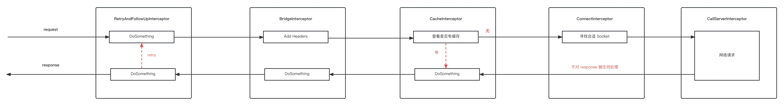

OkHttp 是当前比较热门的网络请求库，具有高可用、易拓展等特性。本次将会去学习一下这个库，学习目标如下：

1. OkHttp 的基本使用

2. 追踪一次完整的请求流程

3. OkHttp 做了哪些工作来提升性能（主要是连接池复用方面）

4. OkHttp 的责任链
<!--more-->

## 1.OKHttp 的基本使用
### 1.1 引入依赖
首先引入 okhttp，这里不引入最新版本，因为最新版本使用 Kotlin，还不是太熟悉
```xml
<dependency>
    <groupId>com.squareup.okhttp3</groupId>
    <artifactId>okhttp</artifactId>
    <version>3.14.9</version>
</dependency>
```

### 1.2 同步 GET 请求
简单的 GET 请求，获取页面
```java
private static void syncGet() throws IOException {
    OkHttpClient client = new OkHttpClient();

    Request request = new Request.Builder()
            .url("http://localhost:8080/res/index.html")
            .get()
            .build();

    try (Response response = client.newCall(request).execute()) {
        if (!response.isSuccessful()) {
            throw new IOException("UnExcepted Code " + response.code());
        }

        final Headers headers = response.headers();
        IntStream.range(0, headers.size()).forEach(index -> {
            System.out.println(headers.name(index) + ": " + headers.value(index));
        });

        System.out.println(response.body().string());
    }
}
```

### 1.3 异步 GET 请求
异步请求，主线程中不用再等待请求的结果，适用于 Android 
```java
private static void asyncGet() {
    OkHttpClient client = new OkHttpClient();

    Request request = new Request.Builder()
            .url("http://localhost:8080/res/index.html")
            .get()
            .build();

    client.newCall(request).enqueue(new Callback() {
        @Override
        public void onFailure(Call call, IOException e) {
            System.out.println("UnExcepted IOException");
        }

        @Override
        public void onResponse(Call call, Response response) throws IOException {
            final Headers headers = response.headers();
            IntStream.range(0, headers.size()).forEach(index -> {
                System.out.println(headers.name(index) + ": " + headers.value(index));
            });

            System.out.println(response.body().string());
        }
    });

    System.out.println("finish.....");
}
```

### 1.4 Header 的设置与获取
在请求时设置 Header ，在获取响应时获取 Header
```java
private static void syncGet() throws IOException {
    OkHttpClient client = new OkHttpClient();

    Request request = new Request.Builder()
            .url("http://localhost:8080/user")
            //要求服务器返回 xml 类型的数据
            .addHeader("Accept", "application/xml")
            .get()
            .build();

    try (Response response = client.newCall(request).execute()) {
        if (!response.isSuccessful()) {
            throw new IOException("UnExcepted Code " + response.code());
        }

        final Headers headers = response.headers();
        //获取 Header
        final String contentType = headers.get("Content-Type");
        System.out.println(contentType);

        System.out.println(response.body().string());
    }

    System.out.println("finish....");
}
```

### 1.5 POST 简单 Json 类型的数据
向服务器发送 json 类型的数据
```java
private static void postJson() throws IOException {
    OkHttpClient client = new OkHttpClient();
    final MediaType APPLICATION_JSON = MediaType.parse("application/json");
    Request request = new Request.Builder()
            .url("http://localhost:8080/user")
            .addHeader("Accept", "application/xml")
            .post(RequestBody.create(APPLICATION_JSON, "{\"name\":\"alamide\",\"age\":18}"))
            .build();

    readResponse(client, request);
}
```

### 1.6 POST File
向服务器发送文件
```java
private static void postAFile() throws IOException {
    final HttpLoggingInterceptor httpLoggingInterceptor = new HttpLoggingInterceptor();
    httpLoggingInterceptor.setLevel(HttpLoggingInterceptor.Level.BODY);
    OkHttpClient client = new OkHttpClient.Builder()
            .addNetworkInterceptor(httpLoggingInterceptor)
            .build();

    final MediaType MEDIA_IMAGE = MediaType.parse("image/jpeg");
    Request request = new Request.Builder()
            .url("http://localhost:8080/user/avatar")
            .post(RequestBody.create(MEDIA_IMAGE, new File(file)))
            .build();

    readResponse(client, request);
}
```

### 1.7 POST 提交表单数据
向服务器提交表单数据
```java
private static void postForm() throws IOException {
    OkHttpClient client = new OkHttpClient();

    final FormBody formBody = new FormBody.Builder()
            .add("username", "alamide")
            .add("age", "18")
            .build();
    Request request = new Request.Builder()
            .url("http://localhost:8080/user")
            .post(formBody)
            .build();

    readResponse(client, request);
}
```

### 1.8 POST Multipart
```java
private static void postMultipart() throws IOException {
    final MediaType MEDIA_IMAGE = MediaType.parse("image/jpeg");
    OkHttpClient client = new OkHttpClient();

    final MultipartBody multipartBody = new MultipartBody.Builder()
            .addFormDataPart("username", "alamide")
            .addFormDataPart("age", "18")
            .addFormDataPart("avatar",
                    "avatar.jpeg",
                    RequestBody.create(MEDIA_IMAGE, new File(file)))
            .build();
    Request request = new Request.Builder()
            .url("http://localhost:8080/user")
            .post(multipartBody)
            .build();

    readResponse(client, request);
}
```

### 1.9 Response Cache
使用缓存机制，缓存数据，需要服务端来配合，通过 Cache-Control 来控制，通常一些静态资源可以缓存，如图片、css等
```java
private static void responseCache() throws IOException {
    int cacheSize = 10 * 1024 * 1024;
    Cache cache = new Cache(new File(cache_dir), cacheSize);
    HttpLoggingInterceptor loggingInterceptor = new HttpLoggingInterceptor();
    loggingInterceptor.setLevel(HttpLoggingInterceptor.Level.BODY);
    final OkHttpClient client = new OkHttpClient.Builder()
            .addNetworkInterceptor(loggingInterceptor)
            .cache(cache)
            .build();

    Request request = new Request.Builder()
            .url("https://dss0.bdstatic.com/5aV1bjqh_Q23odCf/static/superman/img/weather/icons/a0.png")
            .get()
            .build();
    readResponse(client, request);
}
```

可以看到，第二次请求时已使用缓存，看一下存储文件中的存储头
```
https://dss0.bdstatic.com/5aV1bjqh_Q23odCf/static/superman/img/weather/icons/a0.png
GET
0
HTTP/1.1 200 
15
server: JSP3/2.0.14
date: Thu, 06 Jul 2023 04:46:49 GMT
content-type: image/png
content-length: 1496
expires: Wed, 02 Aug 2023 06:14:20 GMT
last-modified: Wed, 11 Mar 2020 05:42:17 GMT
etag: "5e687a39-5d8"
cache-control: max-age=2592000
age: 248137
```

可以看到有 cache-control 项，在超过缓存期限后，重新请求网络，缓存需要服务端配合

### 1.10 Cancel Call
取消一个未结束的请求，
```java
private static void cancelCall() {
    final ScheduledExecutorService scheduledExecutorService = Executors.newScheduledThreadPool(1);

    final OkHttpClient client = new OkHttpClient();

    Request request = new Request.Builder()
            .url("http://httpbin.org/delay/5")
            .get()
            .build();

    final Call call = client.newCall(request);

    scheduledExecutorService.schedule(() -> {
        call.cancel();
        System.out.println("cancel request");
    }, 3, TimeUnit.SECONDS);

    try (Response response = call.execute()) {
        System.out.println(response.body());
        readResponse(client, request);
    } catch (IOException e) {
        System.out.println(e);
    }
}
```

### 1.11 设置超时时间
```java
private static void timeout() throws IOException {

    final OkHttpClient client = new OkHttpClient.Builder()
            //连接超时时间
            .connectTimeout(4, TimeUnit.SECONDS)
            .writeTimeout(10, TimeUnit.SECONDS)
            //读超时时间
            .readTimeout(30, TimeUnit.SECONDS)
            .build();

    Request request = new Request.Builder()
            .url("http://httpbin.org/delay/5")
            .get()
            .build();

    readResponse(client, request);
}
```

### 1.12 定制每一次 Call
可以配置每一次 Call，使用同一个 Client 即可，这样就可以复用 Socket 连接池了
```java
private static void timeout() throws IOException {
    OkHttpClient client = new OkHttpClient();

    OkHttpClient client1 = client.newBuilder()
            .readTimeout(10, TimeUnit.SECONDS)
            .build();

    Request request = new Request.Builder()
            .url("http://httpbin.org/delay/5")
            .get()
            .build();

    readResponse(client1, request);

    OkHttpClient client2 = client.newBuilder()
            .readTimeout(3, TimeUnit.SECONDS)
            .build();

    readResponse(client2, request);
}
```

## 2.一次完整的请求
追踪一次完整的网络请求，着重点在请求头、请求体、响应头、响应体、拦截器，以及如何复用 Socket，
```java
private static void postForm() throws IOException {

    OkHttpClient client = new OkHttpClient();

    final FormBody formBody = new FormBody.Builder()
            .add("username", "alamide")
            .add("age", "18")
            .build();
    Request request = new Request.Builder()
            .url("http://localhost:8080/user")
            .addHeader("Accept", "application/json")
            .post(formBody)
            .build();

    readResponse(client, request);
}

private static void readResponse(OkHttpClient client, Request request) throws IOException {
    try (Response response = client.newCall(request).execute()) {
        if (!response.isSuccessful()) {
            throw new IOException("UnExcepted Code " + response.code());
        }

        final Headers headers = response.headers();
        final String contentType = headers.get("Content-Type");
        System.out.println(contentType);
        System.out.println(response.body().string());
    }

    System.out.println("finish....");
}
```

Request 封装请求的信息，包括请求行、请求头、请求体
```java
public final class Request {
  final HttpUrl url;
  final String method;
  final Headers headers;
  final @Nullable RequestBody body;
}
```

调用 client.newCall(request) 来封装一次请求，返回 RealCall
```java
final class RealCall implements Call {
  //client 用来执行最终的请求
  final OkHttpClient client;

  private Transmitter transmitter;
  //Request 封装请求信息的类
  final Request originalRequest;

  //标记当前 Call 是否已被执行
  private boolean executed;
}
```

开始调用 execute，开始网络请求
```java
final class RealCall implements Call {
    @Override 
    public Response execute() throws IOException {
    synchronized (this) {
      if (executed) throw new IllegalStateException("Already Executed");
      executed = true;
    }
    //下面两行不是重点，是用来检测请求是否超时的，读超时，写超时
    transmitter.timeoutEnter();
    transmitter.callStart();
    try {
      //将请求放入队列中
      client.dispatcher().executed(this);
      //重点来了，开始使用拦截器
      return getResponseWithInterceptorChain();
    } finally {
      client.dispatcher().finished(this);
    }
  }
}

public final class Dispatcher {
    private final Deque<RealCall> runningSyncCalls = new ArrayDeque<>();

    synchronized void executed(RealCall call) {
        runningSyncCalls.add(call);
    }
}
```

`getResponseWithInterceptorChain()` 开始拦截器部分
```java
final class RealCall implements Call {
    Response getResponseWithInterceptorChain() throws IOException {
    // Build a full stack of interceptors.
    List<Interceptor> interceptors = new ArrayList<>();
    //这里添加我们自己添加的拦截器，client.addInterceptor
    interceptors.addAll(client.interceptors());
    //重试
    interceptors.add(new RetryAndFollowUpInterceptor(client));
    //请求头等
    interceptors.add(new BridgeInterceptor(client.cookieJar()));
    //缓存
    interceptors.add(new CacheInterceptor(client.internalCache()));
    //连接
    interceptors.add(new ConnectInterceptor(client));
    if (!forWebSocket) {
      //网络
      interceptors.addAll(client.networkInterceptors());
    }
    interceptors.add(new CallServerInterceptor(forWebSocket));

    Interceptor.Chain chain = new RealInterceptorChain(interceptors, transmitter, null, 0,
        originalRequest, this, client.connectTimeoutMillis(),
        client.readTimeoutMillis(), client.writeTimeoutMillis());

    boolean calledNoMoreExchanges = false;
    try {
      Response response = chain.proceed(originalRequest);
      if (transmitter.isCanceled()) {
        closeQuietly(response);
        throw new IOException("Canceled");
      }
      return response;
    } catch (IOException e) {
      calledNoMoreExchanges = true;
      throw transmitter.noMoreExchanges(e);
    } finally {
      if (!calledNoMoreExchanges) {
        transmitter.noMoreExchanges(null);
      }
    }
  }
}
```

重点看看这几行代码，这是 OkHttp 责任链的具体实现，看一下具体怎么操作的
```java
Interceptor.Chain chain = new RealInterceptorChain(interceptors, transmitter, null, 0,
        originalRequest, this, client.connectTimeoutMillis(),
        client.readTimeoutMillis(), client.writeTimeoutMillis());

Response response = chain.proceed(originalRequest);

public final class RealInterceptorChain implements Interceptor.Chain {
    private final int index;

    private final List<Interceptor> interceptors;

    @Override 
    public Response proceed(Request request) throws IOException {
        return proceed(request, transmitter, exchange);
    }

    public Response proceed(Request request, Transmitter transmitter, @Nullable Exchange exchange)
        throws IOException {
        ......

        // Call the next interceptor in the chain.
        RealInterceptorChain next = new RealInterceptorChain(interceptors, transmitter, exchange,
            index + 1, request, call, connectTimeout, readTimeout, writeTimeout);
        Interceptor interceptor = interceptors.get(index);
        Response response = interceptor.intercept(next);

        ......
        return response;
    }
}
```

使用拦截链来处理正式请求，来看第一个拦截器 `RetryAndFollowUpInterceptor` 和最后一个拦截器 `CallServerInterceptor`，
```java
public final class RetryAndFollowUpInterceptor implements Interceptor {
    @Override 
    public Response intercept(Chain chain) throws IOException {
        Request request = chain.request();
        //此时 realChain 的 index = 1，而且每一次调用  realChain.proceed() index 都要加一
        RealInterceptorChain realChain = (RealInterceptorChain) chain;
        ......
        while (true) {
            ......
            //可以看看上面 RealInterceptorChain.proceed()，会新建一个 RealInterceptorChain，并且 index = index + 1
            //就按照此种方式一直向后执行，直到最后一个拦截器 
            response = realChain.proceed(request, transmitter, null);
        }
        ......
    }
}
```

来看最后一个拦截器，intercept 中不再调用 realChain.proceed()，调用链结束
```java
public final class CallServerInterceptor implements Interceptor {
    public Response intercept(Chain chain) throws IOException {
        ......
    }
}
```

所以根据上述分析，自定义 Interceptor 时，一定要调用 realChain.proceed()，否则拦截链断裂。

再来看看每个拦截器的具体职责

RetryAndFollowUpInterceptor，负责重试

BridgeInterceptor，主要是用来添加一些通用的 Header，如 Content-Type、Host 等

CacheInterceptor，缓存，查看是否存在缓存数据，如果有缓存数据则调用链结束，不再执行后续拦截器，直接返回缓存数据

ConnectInterceptor，寻找合适的连接，有可复用的就复用，没有就创建新连接

CallServerInterceptor 执行网络请求，并结束调用链，返回请求结果



到这里 OkHttp 的拦截器链就学习完毕了，下面再来看看，请求头与请求体

请求头是在 BridgeInterceptor 中设置的，
```java
public final class BridgeInterceptor implements Interceptor {
    @Override 
    public Response intercept(Chain chain) throws IOException {
        Request userRequest = chain.request();
        //此时的 requestBuilder 是含有我们设置的 Header 的，即通过 Request.addHeader() 设置的
        Request.Builder requestBuilder = userRequest.newBuilder();

        RequestBody body = userRequest.body();
        //依据 RequestBody 的类型来设置 Content 相关
        if (body != null) {
            //如我们的测试，使用的是 FormBody 其 Content-Type 为 application/x-www-form-urlencoded
            //我们使用 FormBody 时，不需要自己添加头信息，OkHttp 会自动添加
            MediaType contentType = body.contentType();
            if (contentType != null) {
                requestBuilder.header("Content-Type", contentType.toString());
            }

            //写入 Content-Length
            long contentLength = body.contentLength();
            if (contentLength != -1) {
                requestBuilder.header("Content-Length", Long.toString(contentLength));
                requestBuilder.removeHeader("Transfer-Encoding");
            } else {
                requestBuilder.header("Transfer-Encoding", "chunked");
                requestBuilder.removeHeader("Content-Length");
            }
        }
        //主机名
        if (userRequest.header("Host") == null) {
            requestBuilder.header("Host", hostHeader(userRequest.url(), false));
        }

        //默认Connnection 为 keep-alive 即要求保持长连接，因为 OkHttp 希望能够复用 Socket
        if (userRequest.header("Connection") == null) {
            requestBuilder.header("Connection", "Keep-Alive");
        }
        ......
        //自动添加 Agent，默认为 okhttp/3.14.9，最好自行添加
        if (userRequest.header("User-Agent") == null) {
            requestBuilder.header("User-Agent", Version.userAgent());
        }
    }
}
```

请求体存放在 RequestBody 中，在向服务器发送数据时 writeTo，具体看看怎么执行写入到 Socket 的 OutputStream 的
```java
public final class CallServerInterceptor implements Interceptor {
    @Override 
    public Response intercept(Chain chain) throws IOException {
        //写入请求头
        exchange.writeRequestHeaders(request);

        //写入请求体
        BufferedSink bufferedRequestBody = Okio.buffer(
              exchange.createRequestBody(request, false));
        //写数据
        request.body().writeTo(bufferedRequestBody);
        bufferedRequestBody.close();
    }
}
```

具体的写入在 Http1ExchangeCodec 中，按照指定格式写入就可以了，`sink = Okio.buffer(Okio.sink(rawSocket));` 在 RealConnection 中，其实就是对 `Socket.getInputStream()` 的封装，所以向 sink 中写数据，也就是向 Socket 中写数据
```java
public final class Http1ExchangeCodec implements ExchangeCodec {
    @Override 
    public void writeRequestHeaders(Request request) throws IOException {
        String requestLine = RequestLine.get(
            request, realConnection.route().proxy().type());
        writeRequest(request.headers(), requestLine);
    }

    //写头部信息
    public void writeRequest(Headers headers, String requestLine) throws IOException {
        if (state != STATE_IDLE) throw new IllegalStateException("state: " + state);
            sink.writeUtf8(requestLine).writeUtf8("\r\n");
            for (int i = 0, size = headers.size(); i < size; i++) {
            sink.writeUtf8(headers.name(i))
                .writeUtf8(": ")
                .writeUtf8(headers.value(i))
                .writeUtf8("\r\n");
        }
        sink.writeUtf8("\r\n");
        state = STATE_OPEN_REQUEST_BODY;
    }

    @Override 
    public Sink createRequestBody(Request request, long contentLength) throws IOException {
        if (contentLength != -1L) {
            // Stream a request body of a known length.
            return newKnownLengthSink();
        }
    }

    private final class KnownLengthSink implements Sink {
        ......
        @Override public void write(Buffer source, long byteCount) throws IOException {
            if (closed) throw new IllegalStateException("closed");
            checkOffsetAndCount(source.size(), 0, byteCount);
            //直接向 Socket 中写数据
            sink.write(source, byteCount);
        }
        ......
    }
}
```

再来看看响应头，响应体，读取服务器返回的内容，还是使用 Http1ExchangeCodec，来读取
```java
public final class CallServerInterceptor implements Interceptor {
    @Override 
    public Response intercept(Chain chain) throws IOException {
        if (responseBuilder == null) {
            responseBuilder = exchange.readResponseHeaders(false);
        }

        //这里主要写入响应头等信息
        Response response = responseBuilder
            .request(request)
            .handshake(exchange.connection().handshake())
            .sentRequestAtMillis(sentRequestMillis)
            .receivedResponseAtMillis(System.currentTimeMillis())
            .build();
        
        //这里将响应体封装，这里还没有开始读取响应体，只是将获取的接口封装在这里，
        //只有调用 response.body().string() 时，才会正式读取
        response = response.newBuilder()
          .body(exchange.openResponseBody(response))
          .build();
    }
}

public final class Http1ExchangeCodec implements ExchangeCodec {
    @Override 
    public Response.Builder readResponseHeaders(boolean expectContinue) throws IOException {
        ......
        try {
            //读取响应行
            StatusLine statusLine = StatusLine.parse(readHeaderLine());

            Response.Builder responseBuilder = new Response.Builder()
                .protocol(statusLine.protocol)
                .code(statusLine.code)
                .message(statusLine.message)
                //读取响应头
                .headers(readHeaders());
            ......
            return responseBuilder;
        }
        ......
    }
}
```

最后来到 OkHttp 的核心了，Socket 的复用，这是 OkHttp 高性能的关键所在

## 3.Socket 的复用
OkHttp 维持一个 Socket 连接池，来复用 Socket 来提高性能，为什么要复用？因为 TCP 的连接与释放，分别需要三次握手和四次挥手，这是很消耗性能的。

具体的连接相关在 ConnectInterceptor 中，来看看 OkHttp 如何做到复用的

### 3.1 首次获取连接
首次获取连接，连接池中不存在连接，需要新建连接，并存入到 RealConnectionPool 中

方法调用链 
```
ConnectInterceptor.intercept() 
-> Transmitter.newExchange() 
-> ExchangeFinder.find() 
-> ExchangeFinder.findHealthyConnection()
-> ExchangeFinder.findConnection()
-> RealConnectionPool.transmitterAcquirePooledConnection()
``` 

来到 RealConnectionPool.transmitterAcquirePooledConnection() 
```java
 synchronized (connectionPool) {
    if (transmitter.isCanceled()) throw new IOException("Canceled");

    if (newRouteSelection) {
        // Now that we have a set of IP addresses, make another attempt at getting a connection from
        // the pool. This could match due to connection coalescing.
        routes = routeSelection.getAll();
        if (connectionPool.transmitterAcquirePooledConnection(
            address, transmitter, routes, false)) {
                foundPooledConnection = true;
                result = transmitter.connection;
            }
    }

    if (!foundPooledConnection) {
        if (selectedRoute == null) {
            selectedRoute = routeSelection.next();
        }

        //首次请求需要创建新的 RealConnection，此时线程池是空的，
        result = new RealConnection(connectionPool, selectedRoute);
        connectingConnection = result;
    }
    
    //连接 Socket
    result.connect(connectTimeout, readTimeout, writeTimeout, pingIntervalMillis,
        connectionRetryEnabled, call, eventListener);

    synchronized (connectionPool) {
        //存放入连接池
        connectionPool.put(result);
    }

    return result;
}
```

来到 RealConnection
```java
public void connect(int connectTimeout, int readTimeout, int writeTimeout,
    int pingIntervalMillis, boolean connectionRetryEnabled, Call call,
    EventListener eventListener) {
    ......
    connectSocket(connectTimeout, readTimeout, call, eventListener);
    ......
}

private void connectSocket(int connectTimeout, int readTimeout, Call call,
    EventListener eventListener) throws IOException {
    ......
    Platform.get().connectSocket(rawSocket, route.socketAddress(), connectTimeout);
    ......
    //封装 Socket.getInputStream() 
    source = Okio.buffer(Okio.source(rawSocket));
    //封装 Socket.getOutputStream()
    sink = Okio.buffer(Okio.sink(rawSocket));
}
```

在 Platform 中的 connect ，就是直接连接 Socket 没有特别处理的
```java
public void connectSocket(Socket socket, InetSocketAddress address, int connectTimeout)
    throws IOException {
    socket.connect(address, connectTimeout);
}
```

### 3.2 非首次获取连接
为方便测试进行如下请求
```java
 private static void postForm() throws IOException {

    OkHttpClient client = new OkHttpClient();

    final FormBody formBody = new FormBody.Builder()
            .add("username", "alamide")
            .add("age", "18")
            .build();
    Request request = new Request.Builder()
            .url("http://localhost:8080/user")
            .addHeader("Accept", "application/json")
            .post(formBody)
            .build();

    System.out.println("count = " + client.connectionPool().connectionCount());
        
    readResponse(client, request);
    System.out.println("count = " + client.connectionPool().connectionCount());
    
    readResponse(client, request);
    System.out.println("count = " + client.connectionPool().connectionCount());

    readResponse(client, request);
    System.out.println("count = " + client.connectionPool().connectionCount());
}

private static void readResponse(OkHttpClient client, Request request) throws IOException {
    Response response = client.newCall(request).execute();
    if (!response.isSuccessful()) {
        throw new IOException("UnExcepted Code " + response.code());
    }

    response.close();
}
```

output:
```
0
1
1
1
```

因为三次请求的 URL 一致，所以会复用同一个 Socket，下面就来看看具体怎么复用的，

```java
final class ExchangeFinder {
    private RealConnection findHealthyConnection(int connectTimeout, int readTimeout,
        int writeTimeout, int pingIntervalMillis, boolean connectionRetryEnabled,
        boolean doExtensiveHealthChecks) throws IOException {
        while (true) {
            //寻找合适的连接，有可以复用的就选可复用的，没有就新建
            RealConnection candidate = findConnection(connectTimeout, readTimeout, writeTimeout,
                pingIntervalMillis, connectionRetryEnabled);

            // If this is a brand new connection, we can skip the extensive health checks.
            synchronized (connectionPool) {
                if (candidate.successCount == 0 && !candidate.isMultiplexed()) {
                    return candidate;
                }
            }

            //判断当前连接是否健康
            //什么意思呢？因为上面的代码只是寻找有没有 Host 一致的 Socket，
            //有可能获取的 Socket 已关闭，或则其它原因不可用c de
            //如果不健康的话继续请求新的 connection
            if (!candidate.isHealthy(doExtensiveHealthChecks)) {
                candidate.noNewExchanges();
                continue;
            }

            return candidate;
        }
    }
    private RealConnection findConnection(int connectTimeout, int readTimeout, int writeTimeout,
        int pingIntervalMillis, boolean connectionRetryEnabled) throws IOException {
        ......
        //尝试获取 Connection
        if (connectionPool.transmitterAcquirePooledConnection(address, transmitter, null, false)) {
            foundPooledConnection = true;
            result = transmitter.connection;
        }

        if (result != null) {
            // If we found an already-allocated or pooled connection, we're done.
            return result;
        }   
    }
}

public final class RealConnectionPool {
    boolean transmitterAcquirePooledConnection(Address address, Transmitter transmitter,
        @Nullable List<Route> routes, boolean requireMultiplexed) {
        assert (Thread.holdsLock(this));
        //非空
        for (RealConnection connection : connections) {
            if (requireMultiplexed && !connection.isMultiplexed()) continue;
            //判断是否可用
            if (!connection.isEligible(address, routes)) continue;
            //将当前的 connection 赋值给 transmitter
            transmitter.acquireConnectionNoEvents(connection);
            return true;
        }
        return false;
    }
}

public final class RealConnection extends Http2Connection.Listener implements Connection {
    private int allocationLimit = 1;

    boolean isEligible(Address address, @Nullable List<Route> routes) {
        // 如果绑定当前 Connection 的 transmitter，超过限制，则返回 false
        // 非 Http2 请求，allocationLimit 为 1，所以只有前一个请求释放 Connnection 后，才可以被其它请求复用
        if (transmitters.size() >= allocationLimit || noNewExchanges) return false;

        if (!Internal.instance.equalsNonHost(this.route.address(), address)) return false;

        if (address.url().host().equals(this.route().address().url().host())) {
            return true; // This connection is a perfect match.
        }

        return true; // The caller's address can be carried by this connection.
    }
}

public final class Transmitter {
    void acquireConnectionNoEvents(RealConnection connection) {
        assert (Thread.holdsLock(connectionPool));

        if (this.connection != null) throw new IllegalStateException();
        this.connection = connection;
        //transmitters 表示当前 connection 正在被哪些 Transmitter 使用
        connection.transmitters.add(new TransmitterReference(this, callStackTrace));
    }
}
```

非首次请求，会先去 ConnectionPool 中查找是否有可能用的 Connnection，一定要是未被占用的

再来做如下请求，就可以看到，虽然三个请求 Url 一致，但是不可以复用，将上面的请求，readResponse 修改一下，不再请求完就关闭 response
```java
private static void readResponse(OkHttpClient client, Request request) throws IOException {
    Response response = client.newCall(request).execute();
    if (!response.isSuccessful()) {
        throw new IOException("UnExcepted Code " + response.code());
    }
}
```

ouput:
```
0
1
2
3
```

这就是因为每次请求完，Connection 没有及时释放，可以推断出 response.close() 会去释放连接，来看一下 close() 时究竟做了什么
```java
public final class Response implements Closeable {
    @Override 
    public void close() {
        if (body == null) {
            throw new IllegalStateException("response is not eligible for a body and must not be closed");
        }
        body.close();
    }
}
```

body 在 CallServerInterceptor 里被封装了一次
```java
public final class CallServerInterceptor implements Interceptor {
    @Override 
    public Response intercept(Chain chain) throws IOException {
        response = response.newBuilder()
            .body(exchange.openResponseBody(response))
            .build();
    }
}

public final class Exchange {
    public ResponseBody openResponseBody(Response response) throws IOException {
        try {
            eventListener.responseBodyStart(call);
            String contentType = response.header("Content-Type");
            long contentLength = codec.reportedContentLength(response);
            Source rawSource = codec.openResponseBodySource(response);
            ResponseBodySource source = new ResponseBodySource(rawSource, contentLength);
            return new RealResponseBody(contentType, contentLength, Okio.buffer(source));
        } catch (IOException e) {
            eventListener.responseFailed(call, e);
            trackFailure(e);
            throw e;
        }
    }

    IOException bodyComplete(long bytesRead, boolean responseDone, boolean requestDone, @Nullable IOException e) {
        if (e != null) {
            trackFailure(e);
        }
        if (requestDone) {
            if (e != null) {
                eventListener.requestFailed(call, e);
            } else {
                eventListener.requestBodyEnd(call, bytesRead);
            }
        }
        if (responseDone) {
            if (e != null) {
                eventListener.responseFailed(call, e);
            } else {
                eventListener.responseBodyEnd(call, bytesRead);
            }
        }
        return transmitter.exchangeMessageDone(this, requestDone, responseDone, e);
    }

    final class ResponseBodySource extends ForwardingSource {
        public long read(Buffer sink, long byteCount) throws IOException {
            if (newBytesReceived == contentLength) {
                complete(null);
            }
        }

        public void close() throws IOException {
            complete(null);
        }

        IOException complete(@Nullable IOException e) {
        if (completed) return e;
            completed = true;
            return bodyComplete(bytesReceived, true, false, e);
        }
    }
}
```

在 response 读取完毕或关闭后，都回去执行 bodyComplete，最终调用 transmitter.exchangeMessageDone()
```java
public final class Transmitter {
    IOException exchangeMessageDone(
        Exchange exchange, boolean requestDone, boolean responseDone, @Nullable IOException e) {
        e = maybeReleaseConnection(e, false);
    }

    IOException maybeReleaseConnection(@Nullable IOException e, boolean force) {
        releaseConnectionNoEvents();
    }

    Socket releaseConnectionNoEvents() {
        int index = -1;
        for (int i = 0, size = this.connection.transmitters.size(); i < size; i++) {
            Reference<Transmitter> reference = this.connection.transmitters.get(i);
            if (reference.get() == this) {
                index = i;
                break;
            }
        }

        if (index == -1) throw new IllegalStateException();

        RealConnection released = this.connection;
        //释放，当前 Transmitter 与 Connection 解除绑定
        released.transmitters.remove(index);
    }
}
```

得出结论，在数据读取完毕或主动关闭 response 后，connection 可用

## 4.Socket 的清理
虽然 Socket 复用会节省一定的资源，但是 Socket 本身也暂用较多的资源，需要及时关闭不可用 Socket 或 长时间未使用的 Socket 以释放资源，
```java
public final class RealConnectionPool {
    /**
     * 核心线程数设置为 0，表示没有处理任务时销毁线程池，即不保留核心线程
     **/
    private static final Executor executor = new ThreadPoolExecutor(0 /* corePoolSize */,
        Integer.MAX_VALUE /* maximumPoolSize */, 60L /* keepAliveTime */, TimeUnit.SECONDS,
        new SynchronousQueue<>(), Util.threadFactory("OkHttp ConnectionPool", true));

    //最多空闲的线程数 5
    private final int maxIdleConnections;

    //存活时长 5 minutes
    private final long keepAliveDurationNs;

    private final Runnable cleanupRunnable = () -> {
        while (true) {
            long waitNanos = cleanup(System.nanoTime());
            if (waitNanos == -1) return;
            if (waitNanos > 0) {
                long waitMillis = waitNanos / 1000000L;
                waitNanos -= (waitMillis * 1000000L);
                synchronized (RealConnectionPool.this) {
                    try {
                        //等待指定时间唤醒，释放锁
                        RealConnectionPool.this.wait(waitMillis, (int) waitNanos);
                    } catch (InterruptedException ignored) {
                    }
                }
            }
        }
    };

    //连接池
    private final Deque<RealConnection> connections = new ArrayDeque<>();

    //是否正在清理
    boolean cleanupRunning;

    //向连接池中新增连接时，开启清理工作
    void put(RealConnection connection) {
        assert (Thread.holdsLock(this));
        if (!cleanupRunning) {
            //标记为正在清理
            cleanupRunning = true;
            executor.execute(cleanupRunnable);
        }
        connections.add(connection);
    }

    long cleanup(long now) {
        int inUseConnectionCount = 0;
        int idleConnectionCount = 0;
        RealConnection longestIdleConnection = null;
        long longestIdleDurationNs = Long.MIN_VALUE;

        // Find either a connection to evict, or the time that the next eviction is due.
        synchronized (this) {
            for (Iterator<RealConnection> i = connections.iterator(); i.hasNext(); ) {
                RealConnection connection = i.next();

                // If the connection is in use, keep searching.
                if (pruneAndGetAllocationCount(connection, now) > 0) {
                    inUseConnectionCount++;
                    continue;
                }

                idleConnectionCount++;

                // If the connection is ready to be evicted, we're done.
                long idleDurationNs = now - connection.idleAtNanos;
                if (idleDurationNs > longestIdleDurationNs) {
                    longestIdleDurationNs = idleDurationNs;
                    longestIdleConnection = connection;
                }
            }

            //如果最长空闲 Connection 的空闲时长 > 5 minutes
            //或空闲的 Connection 数 > 5
            if (longestIdleDurationNs >= this.keepAliveDurationNs
                || idleConnectionCount > this.maxIdleConnections) {
                //移除 connection
                connections.remove(longestIdleConnection);
            } else if (idleConnectionCount > 0) {//没有立即要清理的 Connection
                // 返回下一需要清理的 Connection 的等待时间
                return keepAliveDurationNs - longestIdleDurationNs;
            } else if (inUseConnectionCount > 0) {//没有需要清理的 Connection，也没有空闲的 Connection
                return keepAliveDurationNs;
            } else {
                // 没有 Connection 
                cleanupRunning = false;
                return -1;
            }
        }

        closeQuietly(longestIdleConnection.socket());

        // Cleanup again immediately.
        return 0;
    }
    
    //查看 Connection 是否绑定有效的 Transmitter
    private int pruneAndGetAllocationCount(RealConnection connection, long now) {
        List<Reference<Transmitter>> references = connection.transmitters;
        for (int i = 0; i < references.size(); ) {
            //弱引用，可能被 GC 回收
            Reference<Transmitter> reference = references.get(i);

            if (reference.get() != null) {
                i++;
                continue;
            }

            // We've discovered a leaked transmitter. This is an application bug.
            TransmitterReference transmitterRef = (TransmitterReference) reference;
            String message = "A connection to " + connection.route().address().url()
                + " was leaked. Did you forget to close a response body?";
            Platform.get().logCloseableLeak(message, transmitterRef.callStackTrace);

            references.remove(i);
            connection.noNewExchanges = true;

            // If this was the last allocation, the connection is eligible for immediate eviction.
            if (references.isEmpty()) {
                connection.idleAtNanos = now - keepAliveDurationNs;
                return 0;
            }
        }

        return references.size();
    }
}
``` 

清理工作的流程是开启线程，判断是否有空闲且超时的 Connection，如就移除连接池，并关闭

## 5.异步执行
逻辑比较简单，这里就直接贴一下代码执行流程

```java
final class RealCall implements Call {
    @Override 
    public void enqueue(Callback responseCallback) {
        synchronized (this) {
        if (executed) throw new IllegalStateException("Already Executed");
            executed = true;
        }
        transmitter.callStart();
        client.dispatcher().enqueue(new AsyncCall(responseCallback));
    }
}

public final class Dispatcher {
    private final Deque<AsyncCall> readyAsyncCalls = new ArrayDeque<>();


    void enqueue(AsyncCall call) {
        synchronized (this) {
            readyAsyncCalls.add(call);

            // Mutate the AsyncCall so that it shares the AtomicInteger of an existing running call to
            // the same host.
            if (!call.get().forWebSocket) {
                AsyncCall existingCall = findExistingCallWithHost(call.host());
                if (existingCall != null) call.reuseCallsPerHostFrom(existingCall);
            }
        }
        promoteAndExecute();
    }

    public synchronized ExecutorService executorService() {
        if (executorService == null) {
            //核心线程数为 0
            executorService = new ThreadPoolExecutor(0, Integer.MAX_VALUE, 60, TimeUnit.SECONDS,
                new SynchronousQueue<>(), Util.threadFactory("OkHttp Dispatcher", false));
        }
        return executorService;
    }

    private boolean promoteAndExecute() {
        assert (!Thread.holdsLock(this));

        List<AsyncCall> executableCalls = new ArrayList<>();
        boolean isRunning;
        synchronized (this) {
            for (Iterator<AsyncCall> i = readyAsyncCalls.iterator(); i.hasNext(); ) {
                AsyncCall asyncCall = i.next();

                if (runningAsyncCalls.size() >= maxRequests) break; // Max capacity.
                if (asyncCall.callsPerHost().get() >= maxRequestsPerHost) continue; // Host max capacity.

                i.remove();
                asyncCall.callsPerHost().incrementAndGet();
                executableCalls.add(asyncCall);
                runningAsyncCalls.add(asyncCall);
            }
            isRunning = runningCallsCount() > 0;
        }

        for (int i = 0, size = executableCalls.size(); i < size; i++) {
            AsyncCall asyncCall = executableCalls.get(i);
            asyncCall.executeOn(executorService());
        }

        return isRunning;
    }
}

final class RealCall implements Call {

    public abstract class NamedRunnable implements Runnable {
        protected final String name;

        public NamedRunnable(String format, Object... args) {
            this.name = Util.format(format, args);
        }

        public final void run() {
            String oldName = Thread.currentThread().getName();
            Thread.currentThread().setName(name);
            try {
                execute();
            } finally {
                Thread.currentThread().setName(oldName);
            }
        }

        protected abstract void execute();
    }
    final class AsyncCall extends NamedRunnable {
        void executeOn(ExecutorService executorService) {
            ......
            executorService.execute(this);
            ......
        }

        protected void execute() {
            //这里与同步请求流程一致
            Response response = getResponseWithInterceptorChain();
            responseCallback.onResponse(RealCall.this, response);
        }
    }
}
```

## 6.小结
本次学习主要着重点在 Socket 的复用与释放，东西有点多，后面再从架构方面分析一下，相关类的职责。


