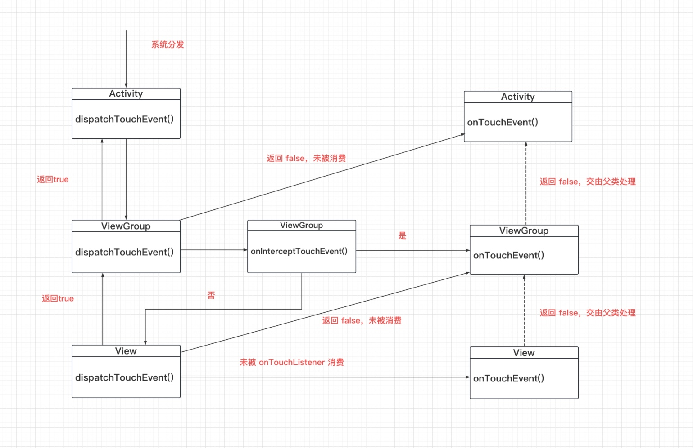

Android 事件分发及处理机制。

本文学习目标：
1. TouchEvent 如何分发，一个界面 View 那么多，怎么就能准确响应到目标 View ？

2. TouchEvent 的分发机制

3. 为什么 ChildView.onTouchEvent() 返回 false 之后，后续无法收到 ACTION_MOVE 事件？
<!--more-->

Android 事件分发的起点，这里从 Activity 的 dispatchTouchEvent 来开始看起，具体事件分发的源头是系统底层，这里只关注 Activity。

```java
public class Activity extends ContextThemeWrapper{
    public boolean dispatchTouchEvent(MotionEvent ev) {
        if (ev.getAction() == MotionEvent.ACTION_DOWN) {
            //空方法，用户可以自己监听点击发生
            onUserInteraction();
        }

        if (getWindow().superDispatchTouchEvent(ev)) {
            return true;
        }
        return onTouchEvent(ev);
    }
}
```

getWindow 获取的是 PhoneWindow 这也是 Window 接口的唯一实现类，Window 负责管理 View，将 View 从 Activity 中剥离开来，便于维护管理，减轻 Activity 的任务量。

```java
public class PhoneWindow extends Window implements MenuBuilder.Callback {
    private DecorView mDecor;

    public boolean superDispatchTouchEvent(MotionEvent event) {
        return mDecor.superDispatchTouchEvent(event);
    }
}
```

DecorView 是具体显示在页面上的顶层 ViewGroup，这里将事件正式分发到 ViewGroup

```java
public class DecorView extends FrameLayout implements RootViewSurfaceTaker, WindowCallbacks {
    public boolean superDispatchTouchEvent(MotionEvent event) {
        return super.dispatchTouchEvent(event);
    }
}

public abstract class ViewGroup extends View implements ViewParent, ViewManager {


    public boolean dispatchTouchEvent(MotionEvent ev) {
        final boolean intercepted;
        //DOWN 事件
        if (actionMasked == MotionEvent.ACTION_DOWN || mFirstTouchTarget != null) {
            final boolean disallowIntercept = (mGroupFlags & FLAG_DISALLOW_INTERCEPT) != 0;

            //没有设置为拦截，调用 onInterceptTouchEvent() 由子类决定是否需要拦截点击事件
            if (!disallowIntercept) {
                intercepted = onInterceptTouchEvent(ev);
            } else {
                intercepted = false;
            }
        } else {
            intercepted = true;
        }

        //不拦截处理事件分发
        if (!canceled && !intercepted) {
            final float x = ev.getX(actionIndex);
            final float y = ev.getY(actionIndex);

            final View[] children = mChildren;
            for (int i = childrenCount - 1; i >= 0; i--) {
                //寻找坐标在哪个 ChildView
                if (!child.canReceivePointerEvents() || !isTransformedTouchPointInView(x, y, child, null)) {
                    ev.setTargetAccessibilityFocus(false);
                    continue;
                }
                //处理 MotionEvent，并分发给目标 View
                if (dispatchTransformedTouchEvent(ev, false, child, idBitsToAssign)) {
                    ......
                }
            }
        }
    }

    private boolean dispatchTransformedTouchEvent(MotionEvent event, boolean cancel,
            View child, int desiredPointerIdBits) {
        
        //转换，因为 event.getX() 返回的 X，是以 View 的左上角为原点，即坐标系发生变化
        final float offsetX = mScrollX - child.mLeft;
        final float offsetY = mScrollY - child.mTop;
        transformedEvent.offsetLocation(offsetX, offsetY);

        //向下分发
        handled = child.dispatchTouchEvent(transformedEvent);

        return handled;
    }
}

public class View implements Drawable.Callback, KeyEvent.Callback, AccessibilityEventSource {
    public boolean dispatchTouchEvent(MotionEvent event) {
        boolean result = false;
        if (onFilterTouchEventForSecurity(event)) {
            if ((mViewFlags & ENABLED_MASK) == ENABLED && handleScrollBarDragging(event)) {
                result = true;
            }
            ListenerInfo li = mListenerInfo;

            //是否设置了 setOnTouchListener()
            if (li != null && li.mOnTouchListener != null
                    && (mViewFlags & ENABLED_MASK) == ENABLED
                    && li.mOnTouchListener.onTouch(this, event)) {
                result = true;
            }

            //处理 onTouchEvent，这里的 onTouchEvent 会由我们自定义的 View 实现
            if (!result && onTouchEvent(event)) {
                result = true;
            }
        }

        return result;
    }
}
```

到这里可以回答第一个问题了，一个界面 View 那么多，怎么就能准确响应到目标 View？

获取点击事件的坐标，依次遍历 childView，判断是否在自身区域内，是则向 childView 分发点击事件。

总结一下点击事件分发的流程，这里先对点击事件为 Down，且存在最终消费点击事件的 View 进行分析。

Activity.dispatchTouchEvent() --> PhoneWinow.superDispatchKeyEvent --> DocorView.superDispatchTouchEvent --> ViewGroup.dispatchTouchEvent() --> View.dispatchTouchEvent() --> View.onTouchEvent()



ViewGroup 有是否拦截点击事件的职责，View 负责消费 Event，ViewGroup 向下分发事件之前先判断是否需要拦截。

可以这么理解 TouchEvent 的分发机制，按下屏幕，产生一个点击事件，这个点击事件的目的是要被消费的，否则这个点击事件毫无意义。

事件就是用来被消费的，否则产生这个事件的意义是啥？

既然事件需要被消费，那么接下来就是需要被谁消费的问题了。一个界面那么多 View，那么多层级的 View，怎么准确无误的分发到 TargetView？

Android 的 View 结构是树形结构，View 为叶子结点，每一个 View 都依附于一个 ViewGroup，ViewGroup 负责管理 View，事件的分发也由 ViewGroup 来实现。在分发点击事件之前需要判断是否需要拦截事件。有些 ViewGroup 不允许 ChildView 消费点击事件，如 ScrollView 需要自己处理 ACTION_MOVE ，所以需要有拦截事件的接口。

再来解答最后一个问题，为什么 ChildView.onTouchEvent() 返回 false 之后，后续无法收到 ACTION_MOVE 事件？

要解答这个问题，要先理解点击事件序列，从 ACTION_DOWN 到 ACTION_UP 可以理解为一个事件序列，手指按下，手指抬起，中间可能包含手指滑动。来看代码，
```java
public abstract class ViewGroup extends View implements ViewParent, ViewManager {
    public boolean dispatchTouchEvent(MotionEvent ev) {
        boolean handled = false;
        if (onFilterTouchEventForSecurity(ev)) {
            final int action = ev.getAction();
            final int actionMasked = action & MotionEvent.ACTION_MASK;

            final boolean intercepted;

            //点击事件为 ACTION_MOVE 且 mFirstTouchTarget 为空时，intercepted = true，拦截点击事件
            if (actionMasked == MotionEvent.ACTION_DOWN || mFirstTouchTarget != null) {
                final boolean disallowIntercept = (mGroupFlags & FLAG_DISALLOW_INTERCEPT) != 0;
                if (!disallowIntercept) {
                    intercepted = onInterceptTouchEvent(ev);
                    ev.setAction(action); 
                } else {
                    intercepted = false;
                }
            } else {
                intercepted = true;
            }

            if (!canceled && !intercepted) {
                if (newTouchTarget == null && childrenCount != 0) {
                    for (int i = childrenCount - 1; i >= 0; i--) {
                        //只有 Event 被消费时，才会走这个分支
                        if (dispatchTransformedTouchEvent(ev, false, child, idBitsToAssign)) {
                            mLastTouchDownTime = ev.getDownTime();
                            if (preorderedList != null) {
                                for (int j = 0; j < childrenCount; j++) {
                                    if (children[childIndex] == mChildren[j]) {
                                        mLastTouchDownIndex = j;
                                        break;
                                    }
                                }
                            } else {
                                mLastTouchDownIndex = childIndex;
                            }
                            mLastTouchDownX = ev.getX();
                            mLastTouchDownY = ev.getY();
                            //设置 mFirstTouchTarget
                            newTouchTarget = addTouchTarget(child, idBitsToAssign);
                            alreadyDispatchedToNewTouchTarget = true;
                            break;
                        }
                    }
                }
            }
        }
    }
}
```

当 onTouchEvent 返回 false 时，mFirstTouchTarget 为 NULL，当 ACTION_MOVE 发生时，由于不为 ACTION_DOWN 及 mFirstTouchTarget == null，拦截点击事件，所以 childView 无法收到 ACTION_MOVE 事件。

