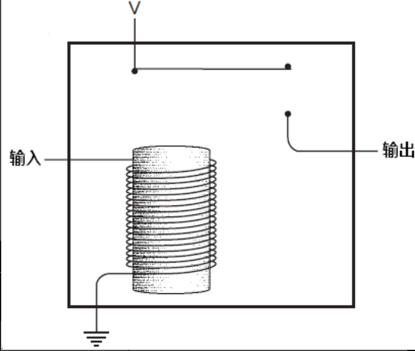
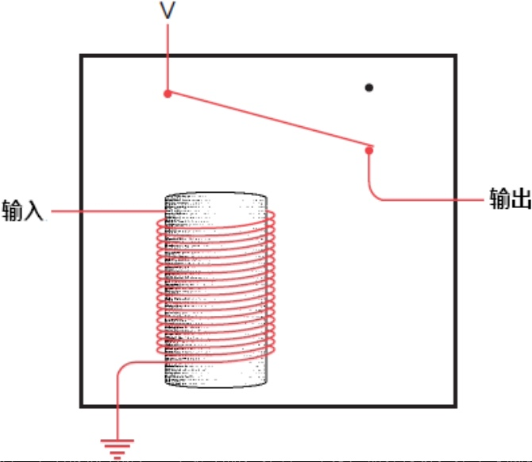
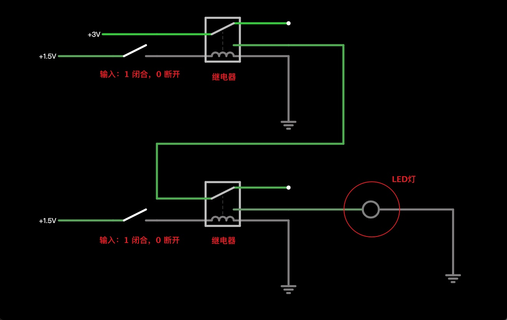
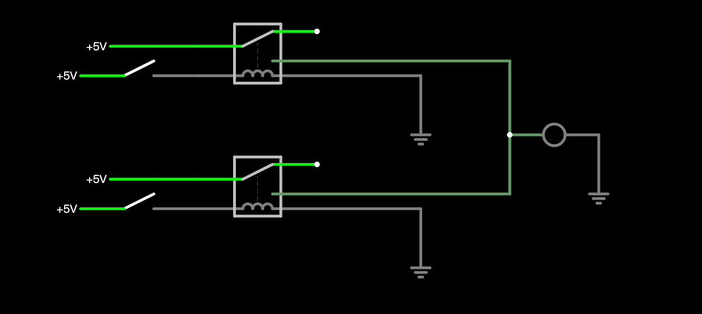
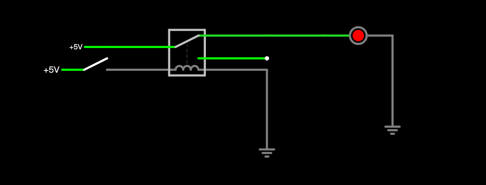
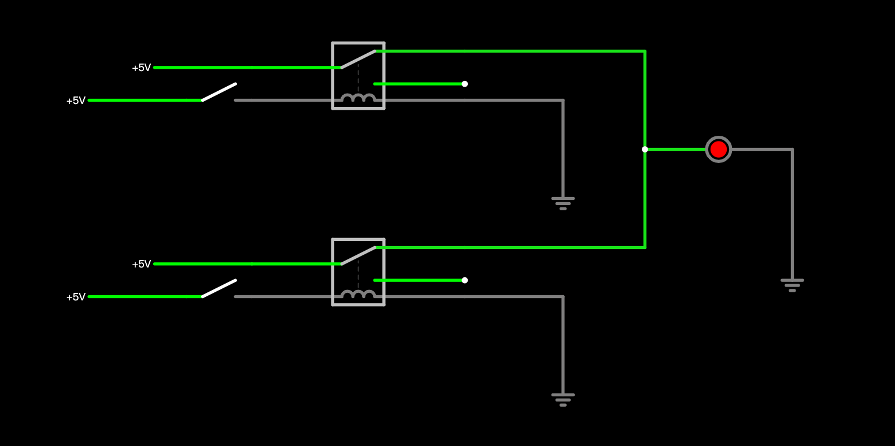
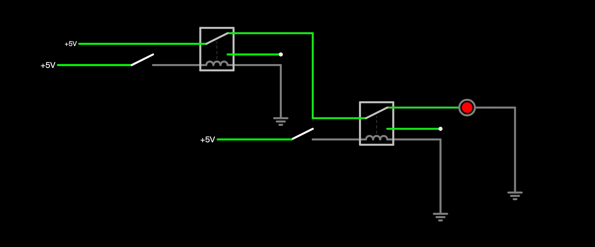
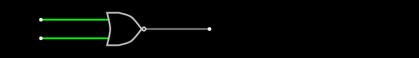
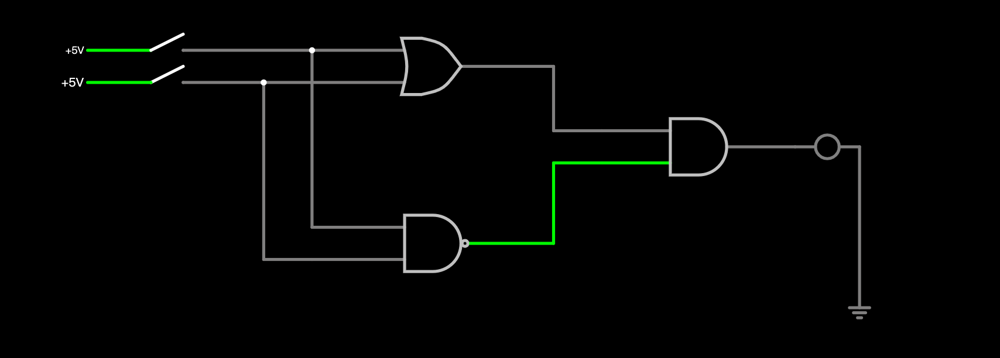

计算机组成原理，基础的门电路的逻辑及实现。
<!--more-->

在开始之前，首先要简单介绍一下继电器，以下解释来自维基百科。
>继电器（Relay），也称电驿，是一种电子控制器件，它具有控制系统（又称输入回路）和被控制系统（又称输出回路），通常应用于自动控制电路中，它实际上是用较小的电流去控制较大电流的一种“自动开关”。故在电路中起着自动调节、安全保护、转换电路等作用。

初中物理学过，通电螺线管可以产生磁场，而磁对铁有吸引力，所以使用这一原理可以实现继电器。

    

其实现原理，如下图，一般来说，开关会用弹性金属或弹簧来提供牵引力，在未通电时，由于弹性牵引力，开关保持原始状态，即水平，电路断开。

    

通电后，螺线管产生磁场，吸引金属片，电路导通。

    

这就是继电器的工作原理，很简单。有了继电器，就可以做一些有趣的事情了。

## 1.与门（AND）
计算机的事件中只有 0 和 1，1 表示高电平，0 表示低电平。我们这里可以简单理解为开关的闭合与断开，1 表示开关闭合，0 表示开关断开。

来看下面的逻辑电路，其中方形元器件表示继电器，可以对照上面的图联想一下。两个开关表示输入端。

只有当两个开关都闭合时，LED 灯才会被点亮。之前说过，用 1 表示开关闭合，0 表示断开。输出用 LED 的状态来表示，亮为 1，熄灭为 0。所以可以得到如下公式：
<table>
  <tr>
    <th>上/下</th>
    <th>0</th>
    <th>1</th>
  </tr>
  <tr>
    <td>0</td>
    <td>0</td>
    <td>0</td>
  </tr>
  <tr>
    <td>1</td>
    <td>0</td>
    <td>1</td>
  </tr>
</table>

上面实现的就是与门，为了简化表示，可以直接用专门的符号表示与门。

    

## 2.或门（OR）
或门的逻辑表达式如下。
<table>
  <tr>
    <th>上/下</th>
    <th>0</th>
    <th>1</th>
  </tr>
  <tr>
    <td>0</td>
    <td>0</td>
    <td>1</td>
  </tr>
  <tr>
    <td>1</td>
    <td>1</td>
    <td>1</td>
  </tr>
</table>

其实现原理图如下

任意一个开关闭合时，灯泡点亮。

上面实现的就是或门，为了简化表示，可以直接用专门的符号表示或门。

    

## 3.非门（NOT）
非门的逻辑是，将输出取反，0 变为 1，1 变为 0。

其实现原理如下。

开关闭合时，LED 熄灭，打开时 LED 点亮。

简化符号如下。

    

## 4.与非门（NADN）
与非门的本质是对与门的输出取反，其逻辑表达式如下，可以对照与门的逻辑表对比一下，只是对输出取反。

<table>
  <tr>
    <th>上/下</th>
    <th>0</th>
    <th>1</th>
  </tr>
  <tr>
    <td>0</td>
    <td>1</td>
    <td>1</td>
  </tr>
  <tr>
    <td>1</td>
    <td>1</td>
    <td>0</td>
  </tr>
</table>

其原理图如下。

只有当两个开关都闭合时，LED 灯才会熄灭。

其简化表示的符号如下，在与门前端加上一个 ⭕️

    

## 5.或非门（NOR）
或非门的本质是对或门的输出取反，其逻辑表达式如下，可以对照或门的逻辑表对比一下，只是对输出取反。
<table>
  <tr>
    <th>上/下</th>
    <th>0</th>
    <th>1</th>
  </tr>
  <tr>
    <td>0</td>
    <td>1</td>
    <td>0</td>
  </tr>
  <tr>
    <td>1</td>
    <td>0</td>
    <td>0</td>
  </tr>
</table>

其实现原理图如下。

只有当两个开关都断开时，LED 点亮，否则熄灭。

其简化表示的符号为如下，在或门输出端加上一个 ⭕️

    

## 5.异或门（XOR）
输入不一致时，输出为 1；输入一致时，输出为 0。
<table>
  <tr>
    <th>上/下</th>
    <th>0</th>
    <th>1</th>
  </tr>
  <tr>
    <td>0</td>
    <td>0</td>
    <td>1</td>
  </tr>
  <tr>
    <td>1</td>
    <td>1</td>
    <td>0</td>
  </tr>
</table>

对照其逻辑表，可以设计其原理图。利用我们已有的或门、与门、与非门可以实现。

当任意一个开关闭合时，LED 点亮。都闭合或都打开，LED 熄灭。

其简化表示的符号为如下。

    

有了这些基础的门电路，我们就可以做更多，更好玩的事情啦，如实现加法器。CPU 就是靠这些简单的门电路来实现，不可思议吧！