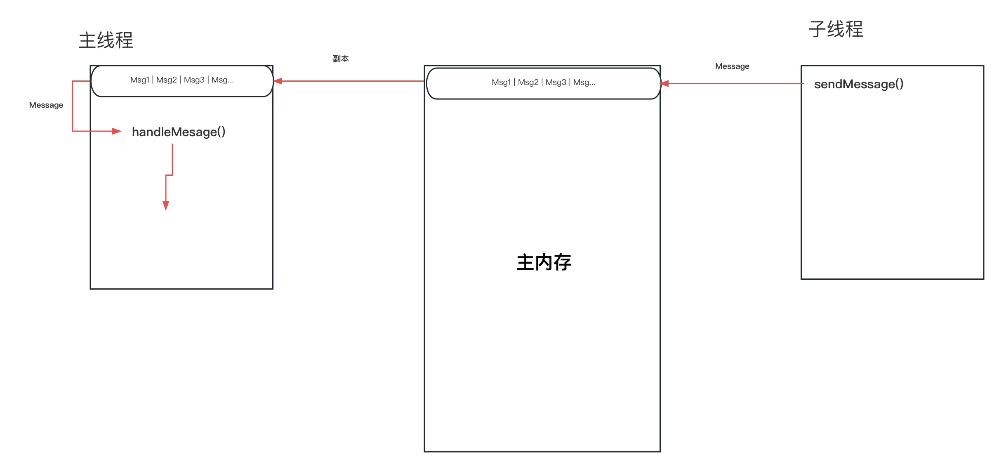

Android 的 Handler 机制分析，基于 Android10(API 29)。本次学习目标：
1. Handler 的使用

2. Handler 的实现原理

3. Handler 内存泄漏场景，为什么会发生内存泄漏

4. Message 该如何创建
<!--more-->

## 1.Handler 的使用
Handler 是 Android 的线程通信机制，由于 Android 的主线程负责更新 UI ，所以不能在主线程中做耗时操作，如 IO 请求等。所以耗时操作需要放在工作线程中执行，任务完成后再将结果返回到主线程。因为 Android 是不支持在子线程中操作 UI 的，所以需要 Handler 来辅助。

Handler 的常用使用场景，就是请求网络数据，然后将请求到的数据回显。
```java
public class TestActivity extends Activity {

    private Handler tHandler;

    @Override
    protected void onCreate(@Nullable Bundle savedInstanceState) {
        super.onCreate(savedInstanceState);
        setContentView(R.layout.main_layout);

        tHandler = new Handler();
        TextView textView = findViewById(R.id.tv_content);

        //子线程执行
        AppExecutor.execute(() -> {
            //网络请求获取百度首页，耗时 IO 操作
            String baidu = getBaidu();
            //使用 Handler 来更新 UI
            tHandler.post(() -> textView.setText(baidu));
        });
    }
}
```

网络请求操作需要放到子线程中执行，否则会报 `android.os.NetworkOnMainThreadException`

子线程中不能不能直接操作 UI，否则会报 `android.view.ViewRootImpl$CalledFromWrongThreadException: Only the original thread that created a view hierarchy can touch its views.`

必须要借助 Handler 才能正确的更新 UI

## 2.Handler 的实现原理
首先要理解 Handler 到底是什么，是一个线程间通信的工具。看下面的例子，
```java
public class TestActivity extends Activity {
    private Handler tHandler;

    @Override
    protected void onCreate(@Nullable Bundle savedInstanceState) {
        super.onCreate(savedInstanceState);
        setContentView(R.layout.main_layout);

        TextView textView = findViewById(R.id.tv_content);

        Thread thread1 = new Thread() {

            @Override
            public void run() {
                Looper.prepare();

                tHandler = new Handler(Looper.myLooper()) {
                    @Override
                    public void handleMessage(@NonNull Message msg) {
                        super.handleMessage(msg);
                        Log.i(TAG, "getMsg");
                    }
                };

                Looper.loop();
            }
        };

        thread1.start();

        textView.setOnClickListener(v -> tHandler.sendEmptyMessage(0));
    }
}
```

这个例子可以实现主线程向子线程中传递数据，只不过我们常用的是子线程传递数据给主线程。

一些题外的东西，还记得早先学习 Android 时，把耗时操作放在子线程中，然后使用回调函数操作 UI，还写的洋洋得意... 不过好像系统也没报错... 

回调能做到线程切换吗？当然不能，那时代码是这么写的，
```java
public class TestActivity extends Activity {
    protected void onCreate(@Nullable Bundle savedInstanceState) {
        super.onCreate(savedInstanceState);
        setContentView(R.layout.main_layout);

        TextView textView = findViewById(R.id.tv_content);
        request("http://www.baidu.com", textView::setText);
    }

    public void request(String url, Consumer<String> consumer){
        Thread thread = new Thread(() -> {
            String content = getPageContent(url);
            consumer.accept(content);
        });

        thread.start();
    }
}
```

并不是代码写在主线程中，最终就会在主线程中执行，回调只是简单的方法调用，实际执行还是在调用方法的线程执行。

下面来看一下 Handler 是如何做到线程间通信的，Handler 使用前的准备工作，
```java
Looper.prepare();

Looper.loop();
```

`Looper.prepare()` 是做准备工作，`Looper.loop()` 是开启队列轮询且阻止线程结束，`loop()` 后的代码永远不会被执行。你可能会说我使用 Handler 时并没有调用这两行代码阿，不需的原因是 `ActivityThread` 中，系统已经帮我们调用过了，
```java
public final class ActivityThread extends ClientTransactionHandler {
    public static void main(String[] args) {
        ......
        Looper.prepareMainLooper();
        ......
        Looper.loop();
        throw new RuntimeException("Main thread loop unexpectedly exited");
    }
}
``` 

下面来看看 `Looper.prepare()` 究竟做了些什么事情，
```java
public final class Looper {

    static final ThreadLocal<Looper> sThreadLocal = new ThreadLocal<Looper>();
    private static Looper sMainLooper; 

    final MessageQueue mQueue;
    final Thread mThread;

    private Looper(boolean quitAllowed) {
        mQueue = new MessageQueue(quitAllowed);
        mThread = Thread.currentThread();
    }

    public static void prepare() {
        prepare(true);
    }

    private static void prepare(boolean quitAllowed) {
        //每个线程只能调用一次
        if (sThreadLocal.get() != null) {
            throw new RuntimeException("Only one Looper may be created per thread");
        }
        //在当前线程中存储 Looper
        sThreadLocal.set(new Looper(quitAllowed));
    }

    public static void prepareMainLooper() {
        prepare(false);
        synchronized (Looper.class) {
            //只能调用一次
            if (sMainLooper != null) {
                throw new IllegalStateException("The main Looper has already been prepared.");
            }
            sMainLooper = myLooper();
        }
    }

    public static @Nullable Looper myLooper() {
        return sThreadLocal.get();
    }
}
```

`Looper.prepare()` 的功能是在当前线程中存储一个 `Looper` 对象，且每个线程只能保存一次，不能替换

再来看看 `Looper.loop()` 做了哪些工作，

```java
public final class Looper {
    public static void loop() {
        final Looper me = myLooper();
        //调用 loop() 之前，必须先调用 prepare()
        if (me == null) {
            throw new RuntimeException("No Looper; Looper.prepare() wasn't called on this thread.");
        }

        final MessageQueue queue = me.mQueue;
        //无限循环
        for (;;) {
            Message msg = queue.next(); // might block
            if (msg == null) {
                // No message indicates that the message queue is quitting.
                return;
            }
            ......
            msg.target.dispatchMessage(msg);
            ......
            msg.recycleUnchecked();
        }
    }
}
```

`loop()` 的作用是从 `MessageQueue` 中获取 `Message`，无限循环，无消息时就阻塞，`queue.next()` 可能会发生阻塞，

先来看一下 `Message` 的具体结构，

```java
public final class Message implements Parcelable {
    //何种类型的数据，用来区分不同 Message 类型，一个 Handler 可能需要处理多种类型的 Message
    public int what;
    //可以传递一些简单的 Integer 类型数据，低损耗
    public int arg1;
    public int arg2;
    public Object obj;

    //和 Message 绑定的 Handler，
    Handler target;

    //dispatchMessage 时回调
    Runnable callback;

    //链表结构，MessageQueue 使用链表来存储 Message
    Message next;

    //Message 缓冲池相关，复用 Message 避免内存抖动
    public static final Object sPoolSync = new Object();
    private static Message sPool;
    private static int sPoolSize = 0;
    private static final int MAX_POOL_SIZE = 50;
}
```

`Message` 中可以存储一些必要的数据，如：Handler、传递的数据、next 指针、Message 缓存池等。

再来瞧瞧 `MessageQueue`，其是一个消息队列，先来看看消息是如何存放到消息队列的，调用 `Handler.sendMessage()` 时，就会向队列中添加消息，

```java
tHandler.sendMessage(msg);

public class Handler {
    public final boolean sendMessage(@NonNull Message msg) {
        return sendMessageDelayed(msg, 0);
    }

    public final boolean sendMessageDelayed(@NonNull Message msg, long delayMillis) {
        if (delayMillis < 0) {
            delayMillis = 0;
        }
        return sendMessageAtTime(msg, SystemClock.uptimeMillis() + delayMillis);
    }

    public boolean sendMessageAtTime(@NonNull Message msg, long uptimeMillis) {
        MessageQueue queue = mQueue;
        if (queue == null) {
            RuntimeException e = new RuntimeException(
                    this + " sendMessageAtTime() called with no mQueue");
            Log.w("Looper", e.getMessage(), e);
            return false;
        }
        return enqueueMessage(queue, msg, uptimeMillis);
    }

    //向队列中添加消息
    private boolean enqueueMessage(@NonNull MessageQueue queue, @NonNull Message msg,
            long uptimeMillis) {
        //赋值 target 为当前 handler
        msg.target = this;
        msg.workSourceUid = ThreadLocalWorkSource.getUid();

        if (mAsynchronous) {
            msg.setAsynchronous(true);
        }
        return queue.enqueueMessage(msg, uptimeMillis);
    }
}

public final class MessageQueue {
    boolean enqueueMessage(Message msg, long when) {
        if (msg.target == null) {
            throw new IllegalArgumentException("Message must have a target.");
        }

        if (msg.isInUse()) {
            throw new IllegalStateException(msg + " This message is already in use.");
        }

        synchronized (this) {
            //标记正在使用
            msg.markInUse();
            //标记执行时刻
            msg.when = when;
            //首次调用时为 null
            Message p = mMessages;
            boolean needWake;
            //消息队列为空，或当前消息指定的时刻小于表头时刻，将当前消息存放到队列头部。
            //这里可以得知，消息队列是按执行时间存放的
            if (p == null || when == 0 || when < p.when) {
                //将 msg 存放到队头
                msg.next = p;
                mMessages = msg;
                //如果队列已经阻塞，则需要唤醒
                needWake = mBlocked;
            } else {
                //通常不需要唤醒，因为队列中仍有未处理的 Message，
                needWake = mBlocked && p.target == null && msg.isAsynchronous();
                Message prev;
                //找到链表中何时的插入位置，使得链表中所有元素按时间顺序排列
                for (;;) {
                    prev = p;
                    p = p.next;
                    //寻找合适的插入位置
                    if (p == null || when < p.when) {
                        break;
                    }
                    if (needWake && p.isAsynchronous()) {
                        needWake = false;
                    }
                }
                
                //将 msg 添加指定位置
                msg.next = p; // invariant: p == prev.next
                prev.next = msg;
            }

            //是否需要唤醒
            if (needWake) {
                nativeWake(mPtr);
            }
        }
    }
}
```

好了，现在可以瞧一瞧如何获取消息了，获取消息使用 `next()`

```java
public final class MessageQueue {
    //链表头/消息队列头
    Message mMessages;

    private final boolean mQuitAllowed;

    Message next() {
        for (;;) {
            //阻塞指定“时长”
            nativePollOnce(ptr, nextPollTimeoutMillis);

            synchronized (this) {
                final long now = SystemClock.uptimeMillis();
                Message prevMsg = null;
                Message msg = mMessages;
                //是否有未处理的 Message ，且绑定的 Handler 不为空
                if (msg != null && msg.target == null) {
                    // Stalled by a barrier.  Find the next asynchronous message in the queue.
                    do {
                        prevMsg = msg;
                        msg = msg.next;
                    } while (msg != null && !msg.isAsynchronous());
                }
                if (msg != null) {
                    //未到指定时刻时，指定下次唤醒时刻
                    if (now < msg.when) {
                        // Next message is not ready.  Set a timeout to wake up when it is ready.
                        nextPollTimeoutMillis = (int) Math.min(msg.when - now, Integer.MAX_VALUE);
                    } else {
                        //标记为 未阻塞状态
                        mBlocked = false;


                        if (prevMsg != null) {
                            prevMsg.next = msg.next;
                        } else {
                            //将表头后移一位，即剔除表头
                            mMessages = msg.next;
                        }
                        //将 Message 脱离链表
                        msg.next = null;
                        if (DEBUG) Log.v(TAG, "Returning message: " + msg);
                        //标记为正在使用
                        msg.markInUse();
                        //返回队列中的 Message
                        return msg;
                    }
                } else {//如果消息队列中没有 Message，则无限期阻塞，等待被唤醒，添加消息后会被唤醒
                    // No more messages.
                    nextPollTimeoutMillis = -1;
                }
            }
        }
    }
}
```

`next()` 从消息队列中获取 `Message`，没有消息时线程发生阻塞，当前时间没有到队列头部的消息指定的时间，则阻塞到指定时间再执行。


再回到 `Looper.loop()`，

```java
public final class Looper {
    public static void loop() {
        final Looper me = myLooper();
        //调用 loop() 之前，必须先调用 prepare()
        if (me == null) {
            throw new RuntimeException("No Looper; Looper.prepare() wasn't called on this thread.");
        }

        final MessageQueue queue = me.mQueue;
        //无限循环
        for (;;) {
            Message msg = queue.next(); // might block
            if (msg == null) {
                // No message indicates that the message queue is quitting.
                return;
            }
            ......
            msg.target.dispatchMessage(msg);
            ......
            //回收
            msg.recycleUnchecked();
        }
    }
}
```

`loop()` 的作用就是不断的从消息队列中获取消息，没有消息或消息执行时间未到时，则线程阻塞。调用 `Handler.sendMessage()` 时，会向消息队列中存放消息，消息会按时间存放。

获取到消息之后，调用 `msg.target.dispatchMessage(msg);`，`target` 为调用 `sendMessage` 的 `Handler`，所以代码回到 `Handler`

```java
public class Handler {
    public void dispatchMessage(@NonNull Message msg) {
        if (msg.callback != null) {
            handleCallback(msg);
        } else {
            if (mCallback != null) {
                if (mCallback.handleMessage(msg)) {
                    return;
                }
            }
            handleMessage(msg);
        }
    }

    public void handleMessage(@NonNull Message msg) {

    }
}
```

最终调用到我们自己定义的 `Handler` ，那么问题来了，之前说的回调并不能实现线程切换，Handler 实现了吗？实现了，因为是在主线程中执行 `dispatchMessage` 的。那么 Handler 实现的原理是什么，来张图吧，




## 3.Handler 内存泄漏
由于 Message 会持有 Handler 对象的引用，而如果在 Activity 销毁时，消息队列中仍然有未处理的 Message ，那么就有可能发生内存泄漏，看下面的例子,
```java
public class TestActivity extends Activity {

    private class THandler extends Handler {
        @Override
        public void handleMessage(@NonNull Message msg) {
            doSomething();
        }
    }
    private THandler tHandler;

    @Override
    protected void onCreate(@Nullable Bundle savedInstanceState) {
        super.onCreate(savedInstanceState);
        setContentView(R.layout.main_layout);

        tHandler = new THandler();
        Message obtain = Message.obtain();
        tHandler.sendMessageDelayed(obtain, TimeUnit.SECONDS.toMillis(1800));
    }
}
```

由于 Message 的 target 持有 tHandler 引用，而 THandler 是一个内部类，持有 TextActivity 对象的引用。打开 TestActivity 之后立即退出，退出后应该对 Activity 对象进行回收操作，但是由于 Looper 持有 MessageQueue，而 MessageQueue 持有 Message，而 Message 持有 THandler，THandler 持有 Activity，所以依据 Java 虚拟机 GC 机制，Activity 无法得到及时回收。

这里产生内存泄漏的原因是 THandler 持有 TestActivity 引用，所以可以做如下改进，
```java
private static class THandler extends Handler {
    private final WeakReference<TestActivity> mActivityRef;

    public THandler(TestActivity activity){
        mActivityRef = new WeakReference<>(activity);
    }

    @Override
    public void handleMessage(@NonNull Message msg) {
        Optional.of(mActivityRef.get()).ifPresent(TestActivity::doSomething);
    }
}
```

## 4.Message 该如何创建
Message 在整个应用的声明周期中会被大量频繁使用，每次使用时都新建对象，可能会造成频繁 GC，发生内存抖动现象。Message 每次使用完就可以被释放了，所以可以使用 Message 对象池来复用。设计者在设计的时候已经考虑到这一点了，也提供了相应的方法 `Message.obtain()`

```java
public final class Message implements Parcelable {
    private static Message sPool;

    public static Message obtain() {
        synchronized (sPoolSync) {
            if (sPool != null) {
                //取出表头
                Message m = sPool;
                sPool = m.next;
                m.next = null;
                //赋值为0，表示可用
                m.flags = 0; // clear in-use flag
                sPoolSize--;
                return m;
            }
        }
        //对象池为空时，需要新创建 Message
        return new Message();
    }
}
```

在 `Looper.loop()` 中，调用完 `msg.target.dispatchMessage(msg)` 后都会调用 `msg.recycleUnchecked()` 来回收 Message，

```java
public final class Message implements Parcelable {
    private static Message sPool;
    Message next;

    void recycleUnchecked() {
        // Mark the message as in use while it remains in the recycled object pool.
        // Clear out all other details.
        flags = FLAG_IN_USE;
        what = 0;
        arg1 = 0;
        arg2 = 0;
        obj = null;
        replyTo = null;
        sendingUid = UID_NONE;
        workSourceUid = UID_NONE;
        when = 0;
        target = null;
        callback = null;
        data = null;

        synchronized (sPoolSync) {
            if (sPoolSize < MAX_POOL_SIZE) {
                //添加到表头
                next = sPool;
                sPool = this;
                sPoolSize++;
            }
        }
    }
}
```

我们每次使用 Message 时，调用 `Message.obtain()` 就可以了。

## 5.Handler 的一些其它 API
```java
public class Handler {
    //直接向队列中存放一个带有 callback 的 Message
    public final boolean post(@NonNull Runnable r){
       return  sendMessageDelayed(getPostMessage(r), 0);
    }

    //指定时刻执行
    public final boolean postAtTime(@NonNull Runnable r, long uptimeMillis) {
        return sendMessageAtTime(getPostMessage(r), uptimeMillis);
    }

    private static Message getPostMessage(Runnable r){
        Message m = Message.obtain();
        m.callback = r;
        return m;
    }

    //只发送一条带有 what 的 Message
    public final boolean sendEmptyMessage(int what){
        return sendEmptyMessageDelayed(what, 0);
    }

    //延迟指定时间执行
    public final boolean sendEmptyMessageDelayed(int what, long delayMillis) {
        Message msg = Message.obtain();
        msg.what = what;
        return sendMessageDelayed(msg, delayMillis);
    }

    //在当前线程则直接执行，否则入列
    public final boolean executeOrSendMessage(@NonNull Message msg) {
        if (mLooper == Looper.myLooper()) {
            dispatchMessage(msg);
            return true;
        }
        return sendMessage(msg);
    }
}
```
