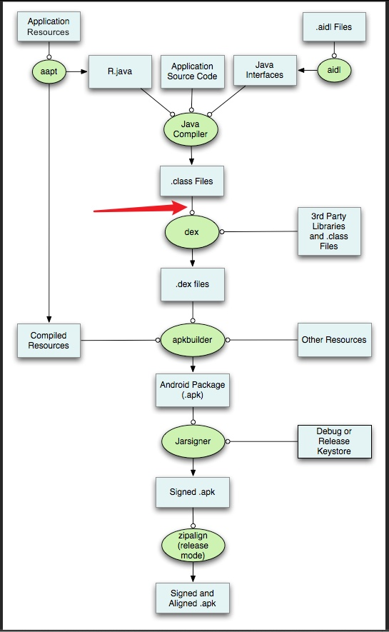
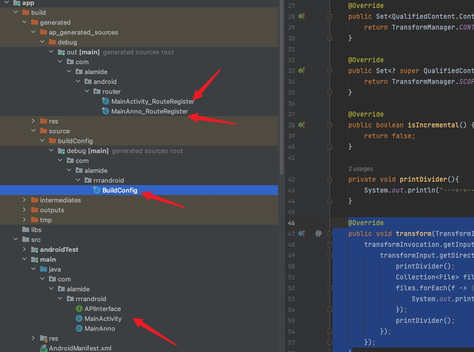
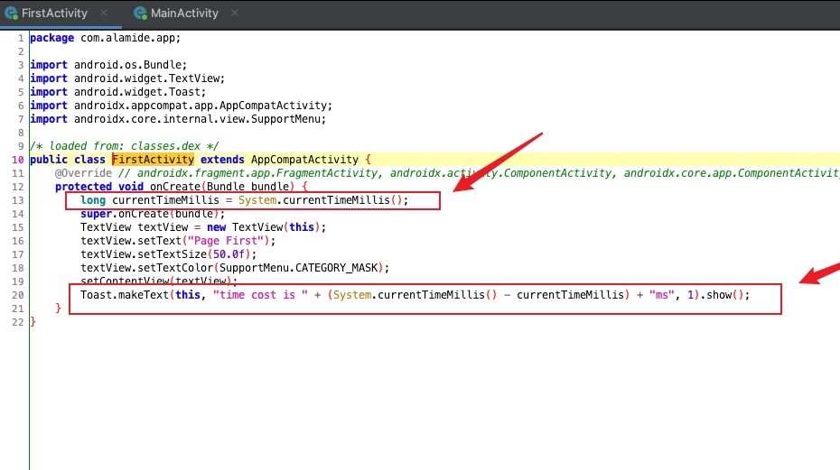
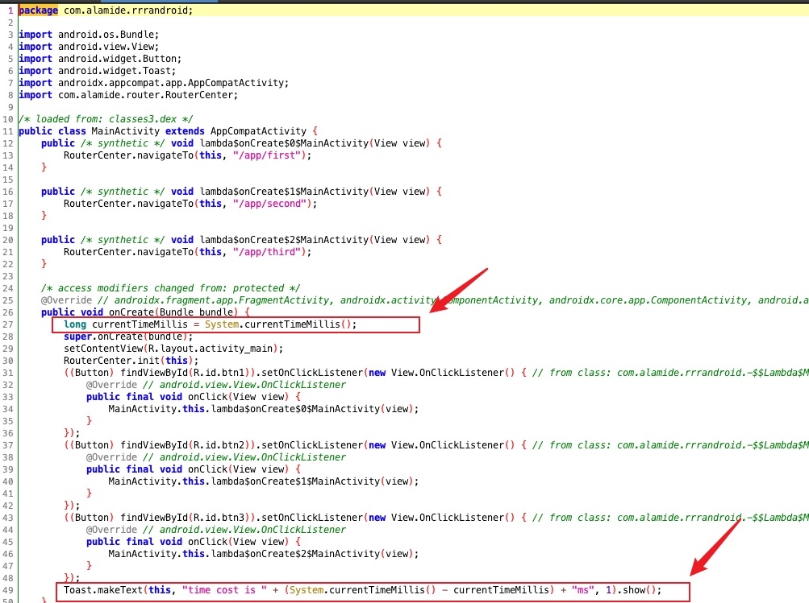

Android Gradle 提供了 Transform API 工具，它可以在将 .class 文件转换为 dex 文件之前对其进行操作。可以通过自定义 Gradle 插件来注册自定义的 Transform，通过注册的 Transform 可以对 .class 文件来做一些操作。
<!--more-->

Transform 的作用位置在在如图位置



## 1.定义插件
插件可以在 buildSrc 中直接定义，定义完后可以在工程模块中直接使用，注意 buildSrc 目录名不能错

```java
public class MyPlugin implements Plugin<Project> {
    @Override
    public void apply(Project project) {
        System.out.println("-=--=-=-=Plugin-=-=-=-=-=-=");
        project.getPlugins().forEach(System.out::println);

    }
}
```

要使定义的插件被发现，还需要在 `resources/META-INF/gradle-plugins/` 目录中定义 `xxx.properties` 配置文件，`xxx` 为插件 `id` 。配置文件中配置具体的插件类：
```properties
implementation-class=com.alamide.gradle.MyPlugin
```

引用插件，在 `app` 模块的 `build.gradle` 中引用
```groovy
plugins {
    id 'com.android.application'
    id 'xxx'
}
```

重新构建项目，可以看到输出要打印的内容

## 2.注册 Transform
```java
public class MyPlugin implements Plugin<Project> {
    @Override
    public void apply(Project project) {
        boolean isApp = project.getPlugins().hasPlugin(AppPlugin.class);
        if(isApp) {
            AppExtension android = project.getExtensions().getByType(AppExtension.class);

            android.registerTransform(new MyTransform());
        }
    }
}

public class MyTransform extends Transform {
    @Override
    public String getName() {
        return "com.alamide.xxx";
    }

    @Override
    public Set<QualifiedContent.ContentType> getInputTypes() {
        return TransformManager.CONTENT_CLASS;
    }

    @Override
    public Set<? super QualifiedContent.Scope> getScopes() {
        return TransformManager.SCOPE_FULL_PROJECT;
    }

    @Override
    public boolean isIncremental() {
        return false;
    }

    private void printDivider(){
        System.out.println("---=-=----=-=-=-=-=----=-=-=-=-=-=-==-=-=-=");
    }

    @Override
    public void transform(TransformInvocation transformInvocation) throws TransformException, InterruptedException, IOException {
        super.transform(transformInvocation);
    }
}
```

其中方法 `transform(TransformInvocation transformInvocation)` 为我们要操作 .class 文件的地方

## 3.TransformInvocation 的一些 API
### 3.1 transformInvocation.getInputs()->getDirectoryInputs()
为具体输入的内容，当输入类型为 `CONTENT_CLASS` 时，输入的内容为 jar 和 引用插件工程的 `build/intermediates/javac/debug/classes` 目录。Jar 文件为其它模块的 jar 文件，及引用的第三方工程。有点绕，具体看代码，

引用插件的工程有如下的 Class 文件




```java
@Override
public void transform(TransformInvocation transformInvocation) {
    transformInvocation.getInputs().forEach( transformInput -> {
        transformInput.getDirectoryInputs().forEach(directoryInput -> {
            printDivider();
            Collection<File> files = FileUtils.listFiles(directoryInput.getFile(), null, true);
            files.forEach(f -> {
                System.out.println(f.getName());
            });
            printDivider();
        });
    });
}
```

输出：
```
---=-=----=-=-=-=-=----=-=-=-=-=-=-==-=-=-=
MainActivity.class
MainAnno.class
BuildConfig.class
APIInterface.class
MainAnno_RouteRegister.class
MainActivity_RouteRegister.class
---=-=----=-=-=-=-=----=-=-=-=-=-=-==-=-=-=
```

DirectoryInputs 输出本工程的所有编译后的 Class 文件
### 3.2 transformInvocation.getInputs()->getJarInputs()
```java
public void transform(TransformInvocation transformInvocation) {
    transformInvocation.getInputs().forEach(transformInput -> {
        printDivider();
        transformInput.getJarInputs().forEach(jarInput -> {
            System.out.println(jarInput.getFile().getAbsolutePath().substring(18));
        });
        printDivider();
    });
}
```

输出：
```
---=-=----=-=-=-=-=----=-=-=-=-=-=-==-=-=-=
......
.gradle/caches/modules-2/files-2.1/androidx.lifecycle/lifecycle-common/2.4.0/1fdb7349701e9cf2f0a69fc10642b6fef6bb3e12/lifecycle-common-2.4.0.jar
.gradle/caches/transforms-3/014f9ec8829ee24d4e7888e04bc3a29f/transformed/jetified-okhttp-3.14.9.jar
.gradle/caches/transforms-3/193a6746e66b6c261483446bc75f8b6e/transformed/jetified-okio-1.17.2.jar
---=-=----=-=-=-=-=----=-=-=-=-=-=-==-=-=-=
---=-=----=-=-=-=-=----=-=-=-=-=-=-==-=-=-=
AndroidStudioProjects/RRRAndroid/m_first/build/intermediates/runtime_library_classes_jar/debug/classes.jar
AndroidStudioProjects/RRRAndroid/m_second/build/intermediates/runtime_library_classes_jar/debug/classes.jar
AndroidStudioProjects/RRRAndroid/m_third/build/intermediates/runtime_library_classes_jar/debug/classes.jar
AndroidStudioProjects/RRRAndroid/m_login/build/intermediates/runtime_library_classes_jar/debug/classes.jar
AndroidStudioProjects/RRRAndroid/router_api/build/intermediates/runtime_library_classes_jar/debug/classes.jar
AndroidStudioProjects/RRRAndroid/router_annotation/build/.transforms/e7e597def674fada74d3d517fe8267c6/transformed/jetified-router_annotation.jar
---=-=----=-=-=-=-=----=-=-=-=-=-=-==-=-=-=
```

可以看到输出的都是其他模块的 Jar 包和引入的第三方 Jar 包

### 3.3 transformInvocation.isIncremental()
是否是增量更新，不是增量更新时，需要清除所有内容
```java
@Override
public void transform(TransformInvocation transformInvocation) throws IOException {
    boolean incremental = transformInvocation.isIncremental();
    if (!incremental){
        transformInvocation.getOutputProvider().deleteAll();
    }
}
```

### 3.4 transformInvocation.getOutputProvider().getContentLocation()
获取处理后的文件存放位置，这是一定要实现的，否则处理的文件将会丢失，无法生成可运行的 APK 。知道这一点，我们就可以自己处理 Jar 包或 Directory 中的 Class 文件了。
```java
@Override
public void transform(TransformInvocation transformInvocation) throws IOException {
    boolean incremental = transformInvocation.isIncremental();
    if (!incremental){
        transformInvocation.getOutputProvider().deleteAll();
    }

    transformInvocation.getInputs().forEach( transformInput -> {
        transformInput.getDirectoryInputs().forEach(directoryInput -> {
            try {
                File contentLocation = transformInvocation.getOutputProvider().getContentLocation(directoryInput.getName(),  directoryInput.getContentTypes(), directoryInput.getScopes(), Format.DIRECTORY);
                FileUtils.copyDirectory(directoryInput.getFile(), contentLocation);
            } catch (IOException e) {
                throw new RuntimeException(e);
            }
        });

        transformInput.getJarInputs().forEach(jarInput -> {
            try {
                File contentLocation = transformInvocation.getOutputProvider().getContentLocation(jarInput.getName(), jarInput.getContentTypes(), jarInput.getScopes(), Format.JAR);
                FileUtils.copyFile(jarInput.getFile(), contentLocation);
            } catch (IOException e) {
                throw new RuntimeException(e);
            }
        });
    });
}
```

## 4.小实验
Transform 的作用是什么，可以简单理解为一个对接器或一个滤网，我们可以在过滤的时候处理 Class 文件。

实验目标：统计本项目中每个 Activity 类 onCreate 方法的执行时间，例如如下的 Activity
```java
public class MainActivity extends AppCompatActivity {

    @Override
    protected void onCreate(Bundle savedInstanceState) {
        super.onCreate(savedInstanceState);
        setContentView(R.layout.activity_main);

        Button btn1 = findViewById(R.id.btn1);

        btn1.setOnClickListener(v -> {
            RouterCenter.navigateTo(MainActivity.this, "/app/first");
        });
    }
}
```

修改后代码为
```java
public class MainActivity extends AppCompatActivity {
    @Override
    protected void onCreate(@Nullable Bundle savedInstanceState) {
        long startMillis = System.currentTimeMillis();
        super.onCreate(savedInstanceState);
        setContentView(R.layout.activity_main);

        Button btn1 = findViewById(R.id.btn1);

        btn1.setOnClickListener(v -> {
            RouterCenter.navigateTo(MainActivity.this, "/app/first");
        });

        long duration = System.currentTimeMillis() - startMillis;
        Toast.makeText(this, "time cost is " + duration + "ms", Toast.LENGTH_LONG).show();
    }
}
```

先编写 ASM 代码，由于修改增加了局部变量，会造成本地变量栈的变动，所以使用 `GeneratorAdapter` 来辅助添加局部变量
```java
private byte[] insertCode(InputStream is) {
    try {
        ClassReader cr = new ClassReader(is);
        ClassWriter cw = new ClassWriter(ClassWriter.COMPUTE_FRAMES);
        ClassVisitor cv = new ClassVisitor(Opcodes.ASM5, cw) {
            private boolean isActivity;

            @Override
            public void visit(int version, int access, String name, String signature, String superName, String[] interfaces) {
                super.visit(version, access, name, signature, superName, interfaces);
                if (name.startsWith("com/alamide") && superName.endsWith("Activity")) {
                    isActivity = true;
                }
            }

            @Override
            public MethodVisitor visitMethod(int access, String name, String descriptor, String signature, String[] exceptions) {
                MethodVisitor methodVisitor = super.visitMethod(access, name, descriptor, signature, exceptions);
                if (isActivity && name.equals("onCreate")) {
                    methodVisitor = new CostTimeMethodAdapter(Opcodes.ASM5, methodVisitor, access, name, descriptor);
                }
                return methodVisitor;
            }
        };

        cr.accept(cv, ClassReader.SKIP_DEBUG | ClassReader.SKIP_FRAMES);
        return cw.toByteArray();
    } catch (IOException e) {
        throw new RuntimeException(e);
    }

}

private byte[] insertCode(File file) {
    try (InputStream is = new BufferedInputStream(Files.newInputStream(file.toPath()))) {
        return insertCode(is);
    } catch (IOException e) {
        throw new RuntimeException(e);
    }
}

private static class CostTimeMethodAdapter extends GeneratorAdapter {

    private int start;

    protected CostTimeMethodAdapter(int api, MethodVisitor methodVisitor, int access, String name, String descriptor) {
        super(api, methodVisitor, access, name, descriptor);
    }

    @Override
    public void visitCode() {
        super.visitCode();
        super.visitMethodInsn(INVOKESTATIC, "java/lang/System", "currentTimeMillis", "()J", false);
        start = newLocal(Type.LONG_TYPE);
        storeLocal(start);
    }

    @Override
    public void visitInsn(int opcode) {
        if (opcode == Opcodes.RETURN) {
            super.visitMethodInsn(INVOKESTATIC, "java/lang/System", "currentTimeMillis", "()J", false);
            loadLocal(start);
            super.visitInsn(LSUB);
            int duration = newLocal(Type.LONG_TYPE);
            storeLocal(duration);
            super.visitVarInsn(ALOAD, 0);
            super.visitTypeInsn(NEW, "java/lang/StringBuilder");
            super.visitInsn(DUP);
            super.visitMethodInsn(INVOKESPECIAL, "java/lang/StringBuilder", "<init>", "()V", false);
            super.visitLdcInsn("time cost is ");
            super.visitMethodInsn(INVOKEVIRTUAL, "java/lang/StringBuilder", "append", "(Ljava/lang/String;)Ljava/lang/StringBuilder;", false);
            loadLocal(duration);
            super.visitMethodInsn(INVOKEVIRTUAL, "java/lang/StringBuilder", "append", "(J)Ljava/lang/StringBuilder;", false);
            super.visitLdcInsn("ms");
            super.visitMethodInsn(INVOKEVIRTUAL, "java/lang/StringBuilder", "append", "(Ljava/lang/String;)Ljava/lang/StringBuilder;", false);
            super.visitMethodInsn(INVOKEVIRTUAL, "java/lang/StringBuilder", "toString", "()Ljava/lang/String;", false);
            super.visitInsn(ICONST_1);
            super.visitMethodInsn(INVOKESTATIC, "android/widget/Toast", "makeText", "(Landroid/content/Context;Ljava/lang/CharSequence;I)Landroid/widget/Toast;", false);
            super.visitMethodInsn(INVOKEVIRTUAL, "android/widget/Toast", "show", "()V", false);
        }
        super.visitInsn(opcode);
    }
}
```

有了这个类就可以修改目标类了

先来修改目录中的 Class 文件，目录文件的修改简单点，直接修改替换，再输出就可以了
```java
transformInvocation.getInputs().forEach(transformInput -> {
    transformInput.getDirectoryInputs().forEach(directoryInput -> {
        try {
            File contentLocation = transformInvocation.getOutputProvider().getContentLocation(directoryInput.getName(), directoryInput.getContentTypes(), directoryInput.getScopes(), Format.DIRECTORY);

            Collection<File> files = FileUtils.listFiles(directoryInput.getFile(), null, true);
            for (File file : files) {
                FileUtils.writeByteArrayToFile(file, insertCode(file), false);
            }

            FileUtils.copyDirectory(directoryInput.getFile(), contentLocation);
        } catch (IOException e) {
            throw new RuntimeException(e);
        }
    });
});
```

再来修改 Jar 包中的目标类
```java
transformInvocation.getInputs().forEach(transformInput -> {
    transformInput.getJarInputs().forEach(jarInput -> {
        File file = jarInput.getFile();
        File contentLocation = transformInvocation.getOutputProvider().getContentLocation(jarInput.getName(), jarInput.getContentTypes(), jarInput.getScopes(), Format.JAR);

        try (JarFile jarFile = new JarFile(file); JarOutputStream jarOutputStream = new JarOutputStream(Files.newOutputStream(contentLocation.toPath()))) {
            Enumeration<JarEntry> entries = jarFile.entries();
            while (entries.hasMoreElements()) {
                JarEntry jarEntry = entries.nextElement();
                String entryName = jarEntry.getName();
                jarOutputStream.putNextEntry(new ZipEntry(entryName));

                if (entryName.contains("com/alamide") && entryName.endsWith("Activity.class")) {
                    byte[] bytes = insertCode(jarFile.getInputStream(jarEntry));
                    jarOutputStream.write(bytes);
                } else {
                    IOUtils.copy(jarFile.getInputStream(jarEntry), jarOutputStream);
                }
            }

        } catch (IOException e) {
            throw new RuntimeException(e);
        }
    });
});
```

反编译 APK 包中的 Dex 文件，查看是否修改成功

主模块


模块一


修改成功
