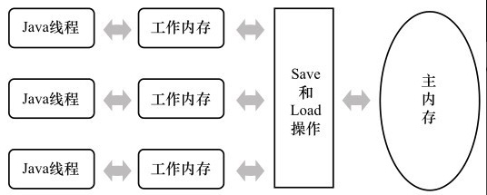

Java 基础语法 Thread，学习内容来自 《Java 编程的逻辑》
<!--more-->
## 1.开启线程
```java
Thread thread1 = new Thread(() -> {
    System.out.println(Thread.currentThread().getName() + " : start a thread");
});
Thread thread2 = new Thread(() -> {
    System.out.println(Thread.currentThread().getName() + " : start a thread");
});

thread1.start();
thread2.start();
```

## 2.join
Thread有一个join方法，可以让调用join的线程等待该线程结束
```java
Thread[] threads = new Thread[1000];
for (int i = 0; i < 1000; i++) {
    threads[i] = new Thread(() -> {
        try {
            Thread.sleep(100);
        } catch (InterruptedException e) {
            throw new RuntimeException(e);
        }
    });
    threads[i].start();
}

//        for (Thread t : threads) {
//            t.join();
//        }

final Map<String, Long> collect = IntStream.rangeClosed(1, threads.length)
        .boxed()
        .map(i -> threads[i - 1].getState())
        .collect(Collectors.groupingBy(Enum::toString, Collectors.counting()));
System.out.println(collect);
```

output:
```
{TERMINATED=424, TIMED_WAITING=576}
```

打开注释，使用 `join`

output:
```
{TERMINATED=1000}
```

可以看到调用 `join` ，会等待该线程结束
## 3.多线程共享内存的问题
当多个线程共享数据时，可能会出现线程安全问题，Java 线程模型如下，模型图片来自深入理解 Java 虚拟机

在 Java 内存模型中，分为主内存和线程工作内存，每条线程都有自己的工作内存，线程使用共享数据时，都是先从主存拷贝到工作内存，线程对该变量的所有操作都必须在工作内存中进行，而不能直接读写主内存中的变量，操作完成后再写回主内存。不能线程之间不能互相访问对方的工作内存，必须通过主内存来完成。多线程操作同一变量时会发生数据不一致，出现线程安全问题。

```java
public class ThreadTest {
    public static int sharedInt = 0;
    @Test
    public void testSharedVariable() throws InterruptedException {
        Thread[] threads = new Thread[1000];
        for (int i = 0; i < 1000; i++) {
            threads[i] = new Thread(() -> {
                IntStream.rangeClosed(1, 10000).forEach(t -> sharedInt++);
            });
            threads[i].start();
        }

        for (Thread t : threads) {
            t.join();
        }

        System.out.println(sharedInt);
    }
}
```

output:
```
9567011
```

输出结果不是预想的 `10000000`

可以如下解决
```java
public static AtomicInteger sharedInt = new AtomicInteger(0);
@Test
public void testSharedVariable() throws InterruptedException {
    Thread[] threads = new Thread[1000];
    for (int i = 0; i < 1000; i++) {
        threads[i] = new Thread(() -> {
            IntStream.rangeClosed(1, 1000000).forEach(t -> sharedInt.addAndGet(1));
        });
        threads[i].start();
    }

    for (Thread t : threads) {
        t.join();
    }

    System.out.println(sharedInt.get());
}
```

## 4.volatile (内存可见性)
```java
private boolean shutdown = false;
@Test
public void testVolatile() throws InterruptedException {
    Thread thread = new Thread(() -> {
        while (!shutdown){

        }
        System.out.println("exit " + Thread.currentThread().getName());
    });

    thread.start();
    Thread.sleep(1000);
    shutdown = true;
    Thread.sleep(1000);

    System.out.println("exit " + Thread.currentThread().getName());
}
```

output:
```
exit main
```

当 shutdown 修改为 true 时，对 thread 线程不可见，可以改为 `private volatile boolean shutdown = false;`
```java
exit Thread-0
exit main
```

## 5.synchronized 同步
synchronized 可以用于修饰类的实例方法、静态方法和代码块

## 6.死锁
任务可以变成阻塞状态，所以可能会出现这种情况：某个任务在等待别的任务，而后者又在等待别的任务，这样一直下去，直到这个链条上的任务又在等待第一个任务释放锁。这得到
一个任务之间相互等待的连续循环，没有哪个线程能继续，这就称之为死锁。

死锁需要满足四个条件：
1. 互斥条件，任务中使用的资源至少有一个是不能共享的。

2. 至少有一个任务它必须持有一个资源且正在获取一个当前被别的任务持有的资源。

3. 资源不能被任务抢占，一个任务等待其它任务持有的资源。

4. 必须循环等待，这时，一个任务等待其它任务所持有的资源，后者又在等待另一个任务所持有的资源，这样一直下去，直到有一个任务在等待第一个任务持有的资源，使得大家都被锁住。

```java
public static class Resources {
    private static final Object resA = new Object();
    private static final Object resB = new Object();

    public static void startThreadA() throws InterruptedException {
        Thread threadA = new Thread(() -> {
            synchronized (resB) {
                try {
                    System.out.println("threadA working...");
                    Thread.sleep(1000);
                } catch (InterruptedException e) {
                    e.printStackTrace();
                }
                synchronized (resA) {
                }
            }
        });

        threadA.start();
    }

    public static void startThreadB() throws InterruptedException {
        Thread threadB = new Thread(() -> {
            synchronized (resA) {
                try {
                    System.out.println("threadB working...");
                    Thread.sleep(1000);
                } catch (InterruptedException e) {
                    e.printStackTrace();
                }
                synchronized (resB) {
                }
            }
        });

        threadB.start();
        threadB.join();
    }
}

@Test
public void testDeadLock() throws InterruptedException {
    Resources.startThreadA();
    Resources.startThreadB();
}
```

经典死锁，哲学家就餐问题，五个哲学家，他们很穷，只能买得起五根筷子，他们围坐在桌子周围，每人之间放一根筷子。当一个哲学家就餐的时候，必须同时得到
左边和右边的筷子。如果一个哲学家左边或右边已经有人在使用筷子了，那么这个哲学家就必须等待，直到可得到必须的筷子。

```java
public static class Chopstick {
    private boolean isTaken = false;

    public synchronized void take() throws InterruptedException {
        while (isTaken) {
            wait();
        }
        isTaken = true;
    }

    public synchronized void drop() {
        notifyAll();
        isTaken = false;
    }
}

public static class Philosopher implements Runnable {
    private final Chopstick left;
    private final Chopstick right;
    private final int id;
    private final int ponderFactor;
    private final Random random = new Random(47);

    public Philosopher(Chopstick left, Chopstick right, int id, int ponderFactor) {
        this.left = left;
        this.right = right;
        this.id = id;
        this.ponderFactor = ponderFactor;
    }

    private void pause() {
        if (ponderFactor == 0) return;
        try {
            TimeUnit.MILLISECONDS.sleep(random.nextInt(ponderFactor * 250));
        } catch (InterruptedException e) {
            throw new RuntimeException(e);
        }
    }

    @Override
    public void run() {
        try {
            while (!Thread.interrupted()) {
                System.out.println("Philosopher " + id + " is thinking...");
                pause();

                System.out.println("Philosopher " + id + " taking left chopstick");
                left.take();
                System.out.println("Philosopher " + id + " take right chopstick");
                right.take();

                System.out.println("Philosopher " + id + " is eating...");
                pause();

                left.drop();
                right.drop();
            }
        } catch (InterruptedException e) {
            System.out.println("Philosopher " + id + " exiting via interrupt");
        }
    }
}

@Test
public void testPhilosopher() {
    Chopstick[] chopsticks = new Chopstick[5];
    Philosopher[] philosophers = new Philosopher[5];

    for (int i = 0; i < chopsticks.length; i++) {
        chopsticks[i] = new Chopstick();
    }
    int chopsticksNum = chopsticks.length;
    for (int i = 0; i < philosophers.length; i++) {
        philosophers[i] = new Philosopher(chopsticks[i], chopsticks[(i + 1) % chopsticksNum], i, 0);
    }

    final ExecutorService executorService = Executors.newFixedThreadPool(5);
    for (Philosopher philosopher : philosophers) {
        executorService.execute(philosopher);
    }

    try {
        TimeUnit.SECONDS.sleep(10);
    } catch (InterruptedException e) {
        throw new RuntimeException(e);
    }
    executorService.shutdownNow();
}
```

解决死锁，破除循环等待
```java
for (int i = 0; i < philosophers.length - 1; i++) {
    philosophers[i] = new Philosopher(chopsticks[i], chopsticks[i + 1], i, 0);
}

philosophers[chopsticksNum - 1] = new Philosopher(chopsticks[0], chopsticks[chopsticksNum - 1], chopsticksNum - 1, 0);
```

## 7.线程的基本协作 wait、notify
wait 是在获取对象🔒之后才可以调用，下面的调用是错误的
```java
@Test
public void testWait() throws InterruptedException {
    wait();
}
```

正确用法，在加锁的对象上调用
```java
@Test
public void testWait() throws InterruptedException {
    Object locker = new Object();
    synchronized (locker){
        locker.wait();
    }
}
```

在 wait 期间对象锁是释放的，可以通过 notify、notifyAll，或令时间到期，从 wait 中恢复执行

线程协作
```java
public static class WaitThread extends Thread {
    private volatile boolean isPrepared = false;

    @Override
    public void run() {
        synchronized (this) {
            try {
                while (!isPrepared) {
                    wait();
                }
                System.out.println("begin execute....");
            } catch (InterruptedException e) {
                throw new RuntimeException(e);
            }
        }
    }

    public synchronized void prepared() {
        isPrepared = true;
        notify();
    }
}

@Test
public void testWait() throws InterruptedException {
    WaitThread waitThread = new WaitThread();
    waitThread.start();

    Thread.sleep(1000);
    waitThread.prepared();
    System.out.println("prepared...");
}
```

生产者消费者
```java
public static class Producer {
    private volatile boolean isConsumed = true;
    private int productId = 0;
    public synchronized void produce() {
        try {
            while (!Thread.interrupted()) {
                if (isConsumed) {
                    productId++;
                    System.out.println("producing productId: " + productId + " ...");
                    Thread.sleep(100);
                    System.out.println("produced productId: " + productId + " ...");
                    isConsumed = false;
                    notifyAll();
                } else {
                    wait();
                }
            }
        } catch (InterruptedException e) {
            throw new RuntimeException(e);
        }
    }

    public synchronized void consume(int consumerId) {
        while (isConsumed) {
            try {
                wait();

            } catch (InterruptedException e) {
                throw new RuntimeException(e);
            }
        }
        System.out.println("consumerId: " + consumerId + " consumed");
        isConsumed = true;
        notify();
    }
}

public static class Consumer implements Runnable {

    private final Producer producer;
    private final Integer id;

    public Consumer(Producer producer, Integer id) {
        this.producer = producer;
        this.id = id;
    }

    @Override
    public void run() {
        producer.consume(id);
    }
}

@Test
public void testConsume() throws IOException, InterruptedException {
    Producer producer = new Producer();

    final ExecutorService executorService = Executors.newFixedThreadPool(11);
    executorService.execute(producer::produce);

    for (int i = 0; ;i++) {
        Thread.sleep(50);
        executorService.execute(new Consumer(producer, i));
    }
}
```

## 8.异步结果
```java
Callable<String> callable = () -> {
    Thread.sleep(10000);
    return "complete!";
};

final ExecutorService executorService = Executors.newFixedThreadPool(1);
final Future<String> submit = executorService.submit(callable);
System.out.println(submit.get());
```

## 9.线程中断
很多线程的运行模式是死循环，如生产者/消费者模式中，消费者主体就是一个死循环，在程序停止时，我们需要有一种优雅的方式关闭该线程。

Thread 定义了如下线程中断的方法：
```java
public boolean isInterrupted()
public void interrupt()
public static boolean interrupted()
```

一般我们的线程使用 Executor 管理，调用 shutdown/shutdownNow。调用线程中断方法后，不一定立即结束线程。

线程的状态有：
1. RUNNABLE：线程在运行或具备运行条件只是在等待操作系统调度。

2. WAITING/TIMED_WAITING：线程在等待某个条件或超时。

3. BLOCKED：线程在等待锁，试图进入同步块。

4. NEW/TERMINATED：线程还未启动或已结束。

## 10.原子变量和CAS
对于以下形式的代码，synchronized 成本有点太高了，需要先获取锁，最后再释放锁，获取不到锁的时候还要等待，还有线程的上下文切换
```java
private int count;
public synchronized void incr() {
    count++;
}
public synchronized int getCount() {
    return count;
}
```

可以做一下性能测试对比一下，测试数据 8 线程，每个线程 1000_0000 次 incr
```java
public class SynchronizedCounter implements ICounter{
    private int count;
    @Override
    public synchronized void incr() {
        count++;
    }
    @Override
    public synchronized int getCount() {
        return count;
    }
}

public class AtomicIntegerCounter implements ICounter{
    private final AtomicInteger counter = new AtomicInteger(0);
    @Override
    public void incr(){
        counter.incrementAndGet();
    }
    @Override
    public int getCount(){
        return counter.get();
    }
}

@State(Scope.Thread)
@BenchmarkMode(Mode.AverageTime)
@OutputTimeUnit(TimeUnit.MILLISECONDS)
@Fork(value = 2, jvmArgs = {"-Xms4G", "-Xmx4G"})
public class CounterBenchMark {

    @Benchmark
    public void atomic() throws InterruptedException {
        count(new AtomicIntegerCounter());
    }
    
    @Benchmark
    public void synch() throws InterruptedException {
        count(new SynchronizedCounter());
    }

    private void count(ICounter counter) throws InterruptedException {
        final ExecutorService executorService = Executors.newFixedThreadPool(8);
        CountDownLatch countDownLatch = new CountDownLatch(8);

        for (int i = 0; i < 8; i++) {
            executorService.execute(() -> {
                IntStream.rangeClosed(1, 10000000).forEach(n -> counter.incr());
                countDownLatch.countDown();
            });
        }

        countDownLatch.await();
        executorService.shutdownNow();

        assert counter.getCount() == 8000_0000;
    }

    public static void main(String[] args) throws RunnerException {
        Options opt = new OptionsBuilder()
                .include(CounterBenchMark.class.getSimpleName())
                .warmupIterations(5)
                .measurementIterations(5)
                .build();

        new Runner(opt).run();
    }
}
```

测试结果，可以看出性能差距还是蛮大的
```
Benchmark                Mode  Cnt     Score     Error  Units
CounterBenchMark.atomic  avgt   10  2257.037 ± 244.928  ms/op
CounterBenchMark.synch   avgt   10  5586.794 ± 735.329  ms/op
```

Java 包中提供的原子变量类型有 `AtomicBoolean`、`AtomicInteger`、`AtomicLong`、`AtomicReference`

AtomicInteger 主要方法有
```java
//构造方法
public AtomicInteger(int initialValue)
public AtomicInteger()

//实例方法
//以原子方式获取旧值并设置新值
public final int getAndSet(int newValue)
//以原子方式获取旧值并给当前值加1
public final int getAndIncrement()
//以原子方式获取旧值并给当前值减1
public final int getAndDecrement()
//以原子方式获取旧值并给当前值加delta
public final int getAndAdd(int delta)
//以原子方式给当前值加1并获取新值
public final int incrementAndGet()
//以原子方式给当前值减1并获取新值
public final int decrementAndGet()
//以原子方式给当前值加delta并获取新值
public final int addAndGet(int delta)
```

所有这些方法都依赖 `compareAndSet` 简称 `CAS`，书上有写实现原理，但是在 Java17 中，已经使用本地方法实现了，所以就先不去扒源码了

## 11.显式锁
显式锁的接口为 `Lock`
```java
public interface Lock {
    //获取锁，会阻塞
    void lock();
    //获取锁，可以响应中断
    void lockInterruptibly() throws InterruptedException;
    //尝试获取锁，立即返回，不阻塞，如果成功返回 true，失败返回 false
    boolean tryLock();
    //先尝试获取锁，如果成功立即返回 true，否则阻塞等待，等待的时长由参数指定，等待的同时响应中断，如果发生中断抛出 InterruptedException
    //如果在等待时长内获取了锁，返回 true，否则返回 false
    boolean tryLock(long time, TimeUnit unit) throws InterruptedException;
    //释放锁
    void unlock();
    //新建一个条件
    Condition newCondition();
}
```

Lock 的主要实现类为 ReentrantLock，其构造方法为
```java
public ReentrantLock()
//参数为是否保证公平，默认为 false，公平是指等待时间最长的线程优先获得锁，保证公平会影响性能，所以默认不保证，synchronized 为不公平
public ReentrantLock(boolean fair)
```

基本用法如下
```java
public class LockCounter implements ICounter {
    private final ReentrantLock lock = new ReentrantLock();
    private volatile int count;

    @Override
    public void incr() {
        lock.lock();
        try {
            count++;
        } finally {
            lock.unlock();
        }
    }

    @Override
    public int getCount() {
        return count;
    }
}
```

可以使用 tryLock 来避免死锁，将上面的死锁代码修改一下，就可以避免死锁了
```java
public static class Resources {
    private static final ReentrantLock resA = new ReentrantLock();
    private static final ReentrantLock resB = new ReentrantLock();

    public static void startThreadA() throws InterruptedException {
        Thread threadA = new Thread(() -> {
            resB.tryLock();
            try {
                System.out.println("threadA working...");
                Thread.sleep(1000);
            } catch (InterruptedException e) {
                e.printStackTrace();
            } finally {
                resB.unlock();
            }
            resA.tryLock();

        });

        threadA.start();
    }

    public static void startThreadB() throws InterruptedException {
        Thread threadB = new Thread(() -> {
            resA.tryLock();
            try {
                System.out.println("threadB working...");
                Thread.sleep(1000);
            } catch (InterruptedException e) {
                e.printStackTrace();
            } finally {
                resA.unlock();
            }
            resB.tryLock();
        });

        threadB.start();
        threadB.join();
    }
}
```

一般情况下能用 `synchronized` 就用 `synchronized`，不满足要求时再考虑使用 `ReentrantLock`。

## 12.显式条件
锁用于解决竞态条件问题，条件是线程间的协作机制，显式锁与 `synchronized` 对应，而显式条件与 `wait/notify` 相对应。`wait/notify` 与 `synchronized` 配合使用，显式条件与显式锁配合使用。条件与锁相关连，创建条件变量需要通过显式锁。
```java
Condition newCondition();
```

Condition 表示变量，是一个接口，它的定义为：
```java
public interface Condition {
    //等待，与 synchronized 对应，等待时释放锁，调用 await 前需要先获取锁
    void await() throws InterruptedException;
    //响应中断，如果发生中断，抛出 InterruptedException
    void awaitUninterruptibly();
    long awaitNanos(long nanosTimeout) throws InterruptedException;
    boolean await(long time, TimeUnit unit) throws InterruptedException;
    //等待的时间是绝对时间，如果由于等待超时返回，返回值为 false，否则为 true
    boolean awaitUntil(Date deadline) throws InterruptedException;
    //与 notify 对应
    void signal();
    //与 notifyAll 对应
    void signalAll();
}
```

应用示例
```java
private static class ConditionThread extends Thread {
    private volatile boolean isFire = false;
    private final Lock lock = new ReentrantLock();
    private final Condition condition = lock.newCondition();

    @Override
    public void run() {
        try {
            lock.lock();
            while (!isFire) {
                condition.await();
            }
            System.out.println("fired");
        } catch (InterruptedException e) {
            Thread.interrupted();
        } finally {
            lock.unlock();
        }
    }
    public void fire() {
        lock.lock();
        isFire = true;
        try {
            condition.signal();
        } finally {
            lock.unlock();
        }
    }
}

@Test
public void testCondition() throws InterruptedException {
    ConditionThread conditionThread = new ConditionThread();
    conditionThread.start();
    Thread.sleep(1000);
    System.out.println("fire");
    conditionThread.fire();
    conditionThread.join();
}
```

利用 `Condition` 实现 `BlockingQueue` 
```java
private static class MyBlockingQueue<E> {
    private final ReentrantLock lock = new ReentrantLock();
    private final Condition notFull = lock.newCondition();
    private final Condition notEmpty = lock.newCondition();
    private final int limit;
    private final Queue<E> queue;

    public MyBlockingQueue(int limit) {
        this.limit = limit;
        queue = new ArrayDeque<>(limit);
    }

    public void put(E e) {
        try {
            lock.lockInterruptibly();
            if (queue.size() == limit) {
                notFull.await();
            }
            queue.add(e);
            System.out.println("put " + e + ", size = " + queue.size());
            notEmpty.signal();
        } catch (InterruptedException ex) {
            throw new RuntimeException(ex);
        }finally {
            lock.unlock();
        }
    }

    public E take(){
        try {
            lock.lockInterruptibly();
            while (queue.isEmpty()){
                notEmpty.await();
            }
            System.out.println("take , size = " + queue.size());

            return queue.poll();
        } catch (InterruptedException e) {
            throw new RuntimeException(e);
        }finally {
            notFull.signal();
            lock.unlock();
        }
    }
}

@Test
public void testBlockingQueue() throws IOException {
    MyBlockingQueue<Integer> blockingQueue = new MyBlockingQueue<>(5);
    final ExecutorService executorService = Executors.newFixedThreadPool(5);
    executorService.execute(() -> {
        while (true){
            try {
                Thread.sleep(500);
                blockingQueue.put(new Random().nextInt(10, 20));
            } catch (InterruptedException e) {
                throw new RuntimeException(e);
            }
        }
    });

    for (int i=0; i<4; i++){
        executorService.execute(() -> {
            while (true){
                try {
                    Thread.sleep(3000);
                    final Integer take = blockingQueue.take();
                    System.out.println(Thread.currentThread().getName() + " consume " + take);
                } catch (InterruptedException e) {
                    throw new RuntimeException(e);
                }
            }
        });
    }

    System.in.read();
}
```

## 13.并发容器
### 13.1 CopyOnWriteArrayList、CopyOnWriteArraySet
线程安全容器，修改操作加锁，读不加，适用于写少，读多的场景
```java
public boolean add(E e) {
    synchronized (lock) {
        Object[] es = getArray();
        int len = es.length;
        es = Arrays.copyOf(es, len + 1);
        es[len] = e;
        setArray(es);
        return true;
    }
}

public E get(int index) {
    return elementAt(getArray(), index);
}
```

### 13.2 ConcurrentHashMap
HashMap 对应的并发版本
### 13.3 ConcurrentSkipListMap、ConcurrentSkipListSet
TreeMap 和 TreeSet 对应的并发版本
### 13.4 ConcurrentLinkedQueue、ConcurrentLinkedDeque
无锁非阻塞并发队列 
### 13.5 ArrayBlockingQueue、LinkedBlockingQueue、LinkedBlockingDeque
普通阻塞队列
### 13.6 PriorityBlockingQueue
优先阻塞队列
### 13.7 DelayQueue
延时阻塞队列
### 13.8 SynchronousQueue、LinkedTransferQueue
其它阻塞队列
## 14.线程池
线程池的优点是：
1. 它可以重用线程，避免线程创建的开销

2. 任务过多时，通过排队避免创建过多线程，减少系统资源消耗和竞争，确保任务有效完成

3. 更好的管理线程

官方提供的线程池为 `ThreadPoolExecutor` ，使用时可以通过 `Executors` 提供的静态方法
```java
//固定线程数
public static ExecutorService newFixedThreadPool(int nThreads);

//单线程
public static ExecutorService newSingleThreadExecutor();

//有空闲时复用空闲线程，没有时新创建
public static ExecutorService newCachedThreadPool();
```

`ExecutorService` 提供的方法有
```java
public interface ExecutorService extends Executor {
    //不再接受新任务，但已提交的任务会继续执行
    void shutdown();
    //不接受新任务，而且会终止已提交但尚未执行的任务，对于正在执行的任务，一般会调用线程的interrupt方法尝试中断，
    //不过，线程可能不响应中断，shutdownNow会返回已提交但尚未执行的任务列表
    List<Runnable> shutdownNow();
    boolean isShutdown();
    boolean isTerminated();
    boolean awaitTermination(long timeout, TimeUnit unit)
        throws InterruptedException;
    //等待所有任务执行成功，返回的 Future 列表中，每个 Future 的 isDone 都是 true，不过 true 不一定代表任务执行成功
    //也有可能是被取消，可以指定超时时间，超时后还有任务未完成，则取消
    <T> List<Future<T>> invokeAll(Collection<? extends Callable<T>> tasks)
        throws InterruptedException;
    <T> List<Future<T>> invokeAll(Collection<? extends Callable<T>> tasks,
                                    long timeout, TimeUnit unit)
        throws InterruptedException;
    //只要有一个任务在限定时间内完成，就会返回该任务的执行结果，如果没有任务在限定时间内完成，则抛出异常
    <T> T invokeAny(Collection<? extends Callable<T>> tasks)
        throws InterruptedException, ExecutionException;
    <T> T invokeAny(Collection<? extends Callable<T>> tasks,
                    long timeout, TimeUnit unit)
        throws InterruptedException, ExecutionException, TimeoutException;
}
```

利用 `invokeAll` 可以将前文的 `CountdownLatch` 替换，所有任务完成后再退出主线程
```java
@Test
public void atomic() throws InterruptedException {
    ICounter counter = new LockCounter();
    final ExecutorService executorService = Executors.newFixedThreadPool(8);
    List<Callable<Void>> list = new ArrayList<>();
    for (int i = 0; i < 8; i++) {
        list.add(() -> {
            IntStream.rangeClosed(1, 10000000).forEach(n -> counter.incr());
            return null;
        });
    }

    executorService.invokeAll(list);
    System.out.println(counter.getCount());
}
```

## 15.任务
`Runnable` 和 `Callable` 表示要执行的异步任务，`Future` 表示异步执行的结果
```java
@FunctionalInterface
public interface Callable<V> {

    V call() throws Exception;
}

public interface Future<V> {
    //cancel用于取消异步任务，如果任务已完成、或已经取消、或由于某种原因不能取消，cancel返回false，否则返回true。
    //如果任务还未开始，则不再运行。但如果任务已经在运行，则不一定能取消
    boolean cancel(boolean mayInterruptIfRunning);
    boolean isCancelled();
    boolean isDone();
    //获取异步任务最终的结果，如果任务未完成成，则阻塞等待
    V get() throws InterruptedException, ExecutionException;
    V get(long timeout, TimeUnit unit) throws InterruptedException,
        ExecutionException, TimeoutException;
}
```

使用示例
```java
@Test
public void testFuture() throws ExecutionException, InterruptedException {
    final ExecutorService executorService = Executors.newFixedThreadPool(1);
    final Future<String> submit = executorService.submit(() -> {
        try {
            Thread.sleep(1000);
            return "Hallo";
        } catch (InterruptedException e) {
            throw new RuntimeException(e);
        }
    });

    //阻塞等待
    final String s = submit.get();
    System.out.println(s);
}
```

## 16.定时任务
`ScheduledExecutorService` 

```java
public interface ScheduledExecutorService extends ExecutorService {
    //等待指定时长后，执行，执行一次
    public ScheduledFuture<?> schedule(Runnable command,
                                       long delay, TimeUnit unit);
    
    public <V> ScheduledFuture<V> schedule(Callable<V> callable,
                                           long delay, TimeUnit unit);

    //等待指定时长后，按照周期 period 执行
    public ScheduledFuture<?> scheduleAtFixedRate(Runnable command,
                                                  long initialDelay,
                                                  long period,
                                                  TimeUnit unit);
    
    //在前一个任务完成后，再间隔 period 后执行
    public ScheduledFuture<?> scheduleWithFixedDelay(Runnable command,
                                                     long initialDelay,
                                                     long delay,
                                                     TimeUnit unit);
}
```

`scheduleWithFixedDelay` 示例
```java
@Test
public void testScheduled() throws IOException {
    final ScheduledExecutorService scheduledExecutorService = Executors.newScheduledThreadPool(10);
    scheduledExecutorService.scheduleWithFixedDelay(() -> {
        System.out.println(DateTimeFormatter.ofPattern("HH:mm:ss").format(LocalDateTime.now()) + "--scheduleWithFixedDelay--execute");
        try {
            Thread.sleep(2000);
        } catch (InterruptedException e) {
            throw new RuntimeException(e);
        }
    }, 0, 1, TimeUnit.SECONDS);

    System.in.read();
}
```

output:
```
17:55:55--scheduleWithFixedDelay--execute
17:55:58--scheduleWithFixedDelay--execute
17:56:01--scheduleWithFixedDelay--execute
17:56:04--scheduleWithFixedDelay--execute
```

可以看到间隔时间为 3s ，每次任务完成后再等待 1s ，所以每次间隔为 1+2=3s。修改为 `scheduleAtFixedRate`
```java
scheduledExecutorService.scheduleAtFixedRate(...)
```

output:
```
18:01:21--scheduleWithFixedDelay--execute
18:01:23--scheduleWithFixedDelay--execute
18:01:25--scheduleWithFixedDelay--execute
```

每次间隔 2s ，按指定间隔执行
## 17.同步和协作工具类
### 17.1 读写锁 ReentrantReadWriteLock
对于 `synchronized` 和 `ReentrantLock` ，对同一受保护的对象，无论是读和写，它们都要求获得相同的锁。在一些场景中这是没有必要的，我们可以多个线程读并行。可以使用 `ReentrantReadWriteLock`。

示例：构建一个可并发容器
```java
public class DiyConcurrentList<E> extends ArrayList<E> {
    private ReentrantReadWriteLock lock = new ReentrantReadWriteLock();
    private final Lock readLock = lock.readLock();
    private final Lock writeLock = lock.writeLock();

    public DiyConcurrentList() {
    }

    public DiyConcurrentList(Collection<? extends E> c) {
        super(c);
    }

    public boolean add(E e) {
        try {
            writeLock.lock();
            super.add(e);
            return true;
        } finally {
            writeLock.unlock();
        }
    }

    public E get(int index) {
        try {
            readLock.lock();
            return super.get(index);
        } finally {
            readLock.unlock();
        }
    }

    public int size() {
        try {
            readLock.lock();
            return super.size();
        } finally {
            readLock.unlock();
        }
    }
}
```

### 17.2 信号量Semaphore
可以限制对资源的并发访问数
```java
//允许的并发访问数
public Semaphore(int permits)
public Semaphore(int permits, boolean fair)

//阻塞获取许可
public void acquire() throws InterruptedException
//阻塞获取许可，不响应中断
public void acquireUninterruptibly()
//批量获取多个许可
public void acquire(int permits) throws InterruptedException
public void acquireUninterruptibly(int permits)
//尝试获取
public boolean tryAcquire()
//限定等待时间获取
public boolean tryAcquire(int permits, long timeout,
    TimeUnit unit) throws InterruptedException
//释放许可，任意线程都可以调用，不一定是调用 acquire 的线程
public void release()
```

小示例：
```java
private static class SharedResource {
    private final Semaphore semaphore = new Semaphore(3);

    public void drink(){
        try {
            semaphore.acquire();
            System.out.println(Thread.currentThread().getName() + " is drinking...");
            Thread.sleep(5000);
            semaphore.release();
        } catch (InterruptedException e) {
            throw new RuntimeException(e);
        }
    }
}

@Test
public void testSemaphore() throws InterruptedException {
    final ExecutorService executorService = Executors.newFixedThreadPool(10);
    SharedResource sharedResource = new SharedResource();
    for (int i = 0; i < 10; i++) {
        executorService.execute(sharedResource::drink);
    }

    executorService.shutdown();
    executorService.awaitTermination(Integer.MAX_VALUE, TimeUnit.SECONDS);
}
```

### 17.3 CountDownLatch
等待所有线程都完成，例如上面 Semaphore 的 executorService.awaitTermination 可以使用 CountdownLatch 来替换
```java
@Test
public void testSemaphore() throws InterruptedException {
    final ExecutorService executorService = Executors.newFixedThreadPool(10);
    CountDownLatch countDownLatch = new CountDownLatch(10);
    SharedResource sharedResource = new SharedResource();
    for (int i = 0; i < 10; i++) {
        executorService.execute(() -> {
            try {
                sharedResource.drink();
            }finally {
                countDownLatch.countDown();
            }
        });
    }

    countDownLatch.await();
    executorService.shutdownNow();
}
```

### 17.4 循环栅栏CyclicBarrier
所有线程到达该栅栏后都需要等待其它线程，等待所有线程都通过后，再一起通过，它是循环的，可以重复的同步，赛马小游戏
```java
private static class Horse implements Runnable {
    private static int counter = 0;
    private final int id = counter++;
    private int strides = 0;
    private final static Random random = new Random(47);
    private final CyclicBarrier cyclicBarrier;

    private Horse(CyclicBarrier cyclicBarrier) {
        this.cyclicBarrier = cyclicBarrier;
    }

    public synchronized int getStrides() {
        return strides;
    }

    @Override
    public void run() throws RuntimeException {
        while (!Thread.interrupted()) {
            this.strides += random.nextInt(3);
            try {
                cyclicBarrier.await();
            } catch (InterruptedException | BrokenBarrierException e) {
                throw new RuntimeException(e);
            }
        }
    }

    public String tracks() {
        return "*".repeat(Math.max(0, getStrides())) + id;
    }

    @Override
    public String toString() {
        return "Horse " + id + " ";
    }
}

private static class HorseRace {
    static final int FINISH_LINE = 75;
    private final List<Horse> horses = new ArrayList<>();
    private final ExecutorService executorService = Executors.newCachedThreadPool();
    public HorseRace(int nHorses, int pause) {
        CyclicBarrier barrier = new CyclicBarrier(nHorses, () -> {
            System.out.println("=".repeat(FINISH_LINE));
            for (Horse horse : horses) {
                System.out.println(horse.tracks());
            }

            for (Horse horse : horses) {
                if (horse.getStrides() >= FINISH_LINE) {
                    System.out.println(horse + " win!");
                    executorService.shutdownNow();
                    return;
                }
            }

            try {
                Thread.sleep(pause);
            } catch (InterruptedException e) {
                throw new RuntimeException(e);
            }
        });

        for (int i = 0; i < nHorses; i++) {
            Horse horse = new Horse(barrier);
            horses.add(horse);
            executorService.execute(horse);
        }
    }
}

@Test
public void testHorseRace() throws IOException {
    new HorseRace(5, 1000);
    System.in.read();
}
```

## 18.ThreadLocal
线程本地变量，可以用于线程上下文信息传递，例如在 JavaWeb 开发中，可以将用户 ID 保存在 ThreadLocal 中。具体操作是，用户登录之后将 UserId 存储在 Seesion 中，后续请求使用 Filter ，先从 Session 中查出 UserId，再将 UserId 存放在 ThreadLocal 中，后续操作可以直接从 ThreadLocal 中获取 UserId。
```java
public class BaseContext {
    private static final ThreadLocal<Long> employeeId = new ThreadLocal<>();

    public static void setCurrentId(Long id) {
        employeeId.set(id);
    }

    public static Long getCurrentId() {
        return employeeId.get();
    }
}

@Override
public void doFilter(ServletRequest servletRequest, ServletResponse servletResponse, FilterChain filterChain) throws IOException, ServletException {

    HttpServletRequest request = (HttpServletRequest) servletRequest;
    HttpServletResponse response = (HttpServletResponse) servletResponse;

    final String requestURI = request.getRequestURI();

    log.info("request uri: {}", requestURI);
    String[] urls = new String[]{
    };

    //登陆页和静态资源等不需要拦截
    if (isMatch(urls, requestURI)) {
        log.info("本次请求不需要处理 {}", requestURI);
        filterChain.doFilter(request, response);
        return;
    }

    final Long userId = (Long) request.getSession().getAttribute("userId");

    if (userId != null) {
        log.info("前台用户：{}, 已登录", userId);
        BaseContext.setCurrentId(userId);
        filterChain.doFilter(request, response);
        return;
    }

    response.getWriter().write(new ObjectMapper().writeValueAsString(R.error("NOTLOGIN")));
}
```


