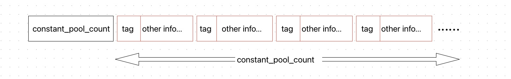
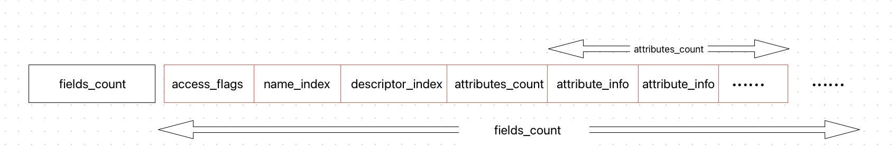
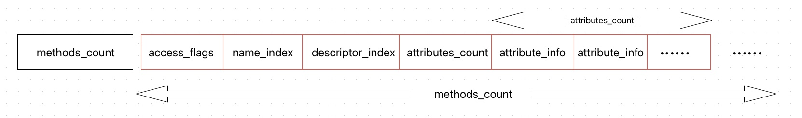

Java 字节码的一些笔记。
<!--more-->

本项内容学习于 《深入理解 Java 虚拟机》

Class 文件是以一组以 8 位字节为基础单位的二进制流，各个数据项目严格按照顺序紧凑的排列在文件之中，中间没有添加任何分隔符，这使得整个 Class 文件中存储的内容几乎都是程序运行的必要数据，没有空隙存在。

Class 文件格式采用一种类似于 C 语言结构体的伪结构来存储数据，这种伪结构中只有两种数据类型：`无符号数` 和 `表`。

无符号数属于基本的数据类型，以 u1 、u2 、u4 、u8 来分别代表 1 个字节、2 个字节、4 个字节、8 个字节。

表是由多个无符号数或者其他表作为数据项构成的复合数据类型，所有表都习惯性地以“_info”结尾。

Class 文件结构的定义文档 [在这里](https://docs.oracle.com/javase/specs/jvms/se8/html/jvms-4.html)

本项目的代码在 [这里](https://github.com/alamide/JVMInfo)

## 1.Class 文件结构
<table>
<tr><th>类型</th><th>名称</th><th>数量</th></tr>
<tr><td>u4</td><td>magic</td><td>1</td></tr>
<tr><td>u2</td><td>minor_version</td><td>1</td></tr>
<tr><td>u2</td><td>major_version</td><td>1</td></tr>
<tr><td>u2</td><td>constant_pool_count</td><td>1</td></tr>
<tr><td>cp_info</td><td>constant_pool</td><td>constant_pool_count-1</td></tr>
<tr><td>u2</td><td>access_flags</td><td>1</td></tr>
<tr><td>u2</td><td>this_class</td><td>1</td></tr>
<tr><td>u2</td><td>super_class</td><td>1</td></tr>
<tr><td>u2</td><td>interfaces_count</td><td>1</td></tr>
<tr><td>u2</td><td>interfaces</td><td>interfaces_count</td></tr>
<tr><td>u2</td><td>fields_count</td><td>1</td></tr>
<tr><td>field_info</td><td>fields</td><td>fields_count</td></tr>
<tr><td>u2</td><td>methods_count</td><td>1</td></tr>
<tr><td>method_info</td><td>methods</td><td>methods_count</td></tr>
<tr><td>u2</td><td>attributes_count</td><td>1</td></tr>
<tr><td>attribute_info</td><td>attributes</td><td>attributes_count</td></tr>
</table>

Class 文件是严格按照特定格式排列的，虚拟机解析 Class 文件时，是按照指定格式解析。可以把 Class 文件分为这几个部分：
1. 基础信息（magic + minor_version + major_version），包括文件标志和版本信息，这是最简单的信息

2. 常量池，包含常量信息，下文的每个部分会反复应用这个部分的内容

3. 类信息，包含本类文件的声明信息，如类名、父类、实现的接口、类修饰符

4. 字段信息，本类包含的字段信息，包含类变量和对象变量

5. 方法信息，本类含有的所有方法的信息，包括默认的初始化函数

6. 属性表

为了更好的理解类文件结构，下面开始自己编写读取类信息的工具类，本次目标读取 `Hello.class` 

```java
public class HelloWorld implements Serializable, Cloneable {
    private static final int TAG = 1;

    private int count = 0;

    public static void sayHello(){
        System.out.println("Say Hello!");
    }

    public int getCount() {
        return count;
    }
}
```

## 2.工具类设计
因为是按字节顺序读，可以使用 `ByteBuffer` 来包裹 `Class` 文件的字节数组。可以思考一下，其实解析的过程很简单，就是读读读，解解解。所以可以先定义 `Read` 接口，作为每个部分需要实现的接口。
```java
public interface Read {
    /**
     *
     * @param byteBuffer
     * @return 读取的字节数
     */
    int read(ByteBuffer byteBuffer);
}
```

其次读取的过程中需要记录每个部分在字节数组中的起始位置，方便对比，纠错，所以定义抽象类 `BaseInfo` ，作为基础类
```java
public abstract class BaseInfo implements Read {
    protected int startIndex = -1;
    protected int endIndex = -1;

    protected abstract void readInternal(ByteBuffer byteBuffer);

    @Override
    public final int read(ByteBuffer byteBuffer) {
        startIndex = byteBuffer.position();
        readInternal(byteBuffer);
        endIndex = byteBuffer.position();
        return endIndex - startIndex;
    }
}
```

再实现一个工具类，来打印 `Class` 文件的字节内容，方便读取查看比较，当然也可以使用插件工具来查看，我是想锻炼一下编程能力，所以撸了一下...
```java
public static void printByteCode(String classFile) throws IOException {
    final byte[] bytes = readClassFileBytes(classFile);
    //Print Header
    System.out.printf("%8s ", "Offset");
    for (int j = 0; j < 16; j++) {
        System.out.print(String.format("%2s ", Integer.toHexString(j)).toUpperCase());
    }
    for (int i = 0; i < bytes.length; i++) {
        if (i % 16 == 0) {
            System.out.println();
            String offset = String.format("%8s", Integer.toHexString(i / 16 * 16)).replace(" ", "0");
            System.out.print(offset.toUpperCase());
            System.out.print(" ");
        }
        //无符号整形
        String formatByte = String.format("%2s", Integer.toHexString(bytes[i] & 0xFF)).replace(" ", "0");
        System.out.print(formatByte.toUpperCase());
        System.out.print(" ");
    }
}
```

读取的效果如下：
```
  Offset  0  1  2  3  4  5  6  7  8  9  A  B  C  D  E  F 
00000000 CA FE BA BE 00 00 00 3D 00 2C 0A 00 02 00 03 07 
00000010 00 04 0C 00 05 00 06 01 00 10 6A 61 76 61 2F 6C 
00000020 61 6E 67 2F 4F 62 6A 65 63 74 01 00 06 3C 69 6E 
00000030 69 74 3E 01 00 03 28 29 56 09 00 08 00 09 07 00 
00000040 0A 0C 00 0B 00 0C 01 00 1A 63 6F 6D 2F 61 6C 61 
```

## 3.基础信息
### 3.1 magic
可以查看一下 Class 文件结构，magic 类型为 u4，数量为 1，所以直接读四个字节就可以了，注意 Class 文件中所有字节都是无符号的，所以转换为 Int 时要 `& 0xFF`

```java
public class MagicInfo extends BaseInfo {

    private String magic = null;

    @Override
    protected void readInternal(ByteBuffer byteBuffer) {
        magic = Integer.toHexString(byteBuffer.get() & 0xFF) +
                Integer.toHexString(byteBuffer.get() & 0xFF) +
                Integer.toHexString(byteBuffer.get() & 0xFF) +
                Integer.toHexString(byteBuffer.get() & 0xFF);
    }
}
```

### 3.2 Verison
本小部分包含 minor_version 和 major_verison，都为 u2 型，且数量都为 1，直接读
```java
public class VersionInfo extends BaseInfo {
    private int minorVersion;
    private int majorVersion;

    @Override
    protected void readInternal(ByteBuffer byteBuffer) {
        minorVersion = Integer.parseInt(Integer.toHexString(byteBuffer.get() << 8 | byteBuffer.get() & 0xFFFF), 16);
        majorVersion = Integer.parseInt(Integer.toHexString(byteBuffer.get() << 8 | byteBuffer.get() & 0xFFFF), 16);
    }
}
```

## 4.常量池
常量池是 Class 文件的资源库，其主要包含两大类常量：字面量和符号引用，字面量存放具体的值，符号引用指向字面量。常量池的结构为先是用一个 u2 表示常量池中常量项数。后面紧密排列常量项。结构如下：



常量池中有多种常量类型，具体的类型如下：
<table>
<tr><th>类型</th><th>标志</th><th>描述</th></tr>
<tr><td>CONSTANT_Utf8_info</td><td>1</td><td>UTF-8 编码的字符串</td></tr>
<tr><td>CONSTANT_Integer_info</td><td>3</td><td>整型字面量</td></tr>
<tr><td>CONSTANT_Float_info</td><td>4</td><td>浮点型字面量</td></tr>
<tr><td>CONSTANT_Long_info</td><td>5</td><td>长整型字面量</td></tr>
<tr><td>CONSTANT_Double_info</td><td>6</td><td>双精度浮点型字面量</td></tr>
<tr><td>CONSTANT_Class_info</td><td>7</td><td>类或接口的符号引用</td></tr>
<tr><td>CONSTANT_String_info</td><td>8</td><td>字符串类型字面量</td></tr>
<tr><td>CONSTANT_Fieldref_info</td><td>9</td><td>字段的符号引用</td></tr>
<tr><td>CONSTANT_Methodref_info</td><td>10</td><td>类中方法的符号引用</td></tr>
<tr><td>CONSTANT_InterfaceMethodref_info</td><td>11</td><td>接口中方法的符号引用</td></tr>
<tr><td>CONSTANT_NameAndType_info</td><td>12</td><td>字段或方法部分的符号引用</td></tr>
<tr><td>CONSTANT_MethodHandle_info</td><td>15</td><td>表示方法句柄</td></tr>
<tr><td>CONSTANT_MethodType_info</td><td>16</td><td>标识方法类型</td></tr>
<tr><td>CONSTANT_InvokeDynamic_info</td><td>18</td><td>表示一个动态方法的调用点</td></tr>
</table>

下面就依据要解析的 `Hello.class` 文件来逐步定义具体的常量项，只定义用到的。

此项的程序设计的思路，先分析一下需求：
1. 常量池中包含多个不同的常量项，依据 tag 来区分

2. 常量池中有的项是需要引用其它常量项的

可以用一个 `HashMap` 来存放所有已定义的常量类，依据获取的 tag 来查询对应的类。
```java
 Map<Integer, Class<?>> cache = new HashMap<>();
final Class<?> aClass = cache.get(1);
aClass.newInstance();
......
```

当然可以设计的更优雅一点，每个具体的常量项应该自己保存 tag，结合以上代码，设计如下基础类
```java
public abstract class ConstantBaseInfo extends BaseInfo {

    public abstract int tag();

    public boolean isMatch(byte byteTag) {
        return (byteTag & 0xFF) == tag();
    }
}

public class ConstantPoolInfo extends BaseInfo {

    private static final List<ConstantBaseInfo> CONSTANT_BASE_INFO_LIST = new ArrayList<>();

    @Override
    protected void readInternal(ByteBuffer byteBuffer) {
        final int constantPoolCount = Integer.parseInt(Integer.toHexString(byteBuffer.get() << 8 | byteBuffer.get() & 0xFFFF), 16);
        int count = 1;
        while (count < constantPoolCount) {
            byte tag = byteBuffer.get();
            for (ConstantBaseInfo baseInfo : CONSTANT_BASE_INFO_LIST) {
                //判断是否符合
                if (baseInfo.isMatch(tag)) {
                    baseInfo.read(byteBuffer);
                    CONSTANT_POOL_INFOS.add(baseInfo.cloneBean());
                    break;
                }
            }
            count++;
        }
    }
}
```
### 4.1 CONSTANT_Methodref_info
类中方法的符号引用，此项结构为：
<table>
<tr><th>项目</th><th>类型</th><th>描述</th></tr>
<tr><td>tag</td><td>u1</td><td>值为 10 </td></tr>
<tr><td>index</td><td>u2</td><td>指向声明方法的接口描述符 CONSTANT_Class_info 的索引项</td></tr>
<tr><td>index</td><td>u2</td><td>指向名称及类型描述符 CONSTANT_NameAndType_info 的索引项</td></tr>
</table>

此项设计如下：
```java
public class ConstantMethodRefInfo extends ConstantBaseInfo {
    /**
     * 指向类描述符 Constant_Class_Info
     */
    private int constantClassInfoIndex;
    /**
     * 指向名称及类型描述符 Constant_Class_Info
     */
    private int constantNameAndTypeInfoIndex;

    @Override
    protected void readInternal(ByteBuffer byteBuffer) {
        this.constantClassInfoIndex = twoBytesToInteger(byteBuffer.get(), byteBuffer.get());
        this.constantNameAndTypeInfoIndex = twoBytesToInteger(byteBuffer.get(), byteBuffer.get());
    }

    @Override
    public int tag() {
        return 0x0A;
    }
}
```

### 4.2 CONSTANT_Class_info
<table>
<tr><th>项目</th><th>类型</th><th>描述</th></tr>
<tr><td>tag</td><td>u1</td><td>值为 7 </td></tr>
<tr><td>index</td><td>u2</td><td>指向全限定名常量项的索引</td></tr>
</table>

```java
public class ConstantClassInfo extends ConstantBaseInfo {
    
    private int index = 0;

    @Override
    protected void readInternal(ByteBuffer byteBuffer) {
        this.index = twoBytesToInteger(byteBuffer.get(), byteBuffer.get());
    }

    @Override
    public int tag() {
        return 0x07;
    }
}
```

### 4.3 CONSTANT_NameAndType_info
<table>
<tr><th>项目</th><th>类型</th><th>描述</th></tr>
<tr><td>tag</td><td>u1</td><td>值为 12 </td></tr>
<tr><td>index</td><td>u2</td><td>指向该字段或方法名称常量项的索引</td></tr>
<tr><td>index</td><td>u2</td><td>指向该字段或方法描述符常量项的索引</td></tr>
</table>

```java
public class ConstantNameAndTypeInfo extends ConstantBaseInfo {

    private int nameIndex;

    private int descIndex;

    @Override
    protected void readInternal(ByteBuffer byteBuffer) {
        this.nameIndex = twoBytesToInteger(byteBuffer.get(), byteBuffer.get());
        this.descIndex = twoBytesToInteger(byteBuffer.get(), byteBuffer.get());
    }

    @Override
    public int tag() {
        return 0x0C;
    }
}
```

### 4.4 CONSTANT_Utf8_info
<table>
<tr><th>项目</th><th>类型</th><th>描述</th></tr>
<tr><td>tag</td><td>u1</td><td>值为 1 </td></tr>
<tr><td>length</td><td>u2</td><td>UTF-8 编码的字符串占用的字节数</td></tr>
<tr><td>bytes</td><td>u1</td><td>长度为 length 的 UTF-8 编码的字符串</td></tr>
</table>

```java
public class ConstantUTF8Info extends ConstantBaseInfo {
    
    private int length;
    
    private byte[] bytes;

    @Override
    protected void readInternal(ByteBuffer byteBuffer) {
        this.length = twoBytesToInteger(byteBuffer.get(), byteBuffer.get());
        this.bytes = new byte[this.length];
        byteBuffer.get(bytes);
    }

    @Override
    public int tag() {
        return 0x01;
    }
}
```

### 4.5 CONSTANT_Fieldref_info
类中字段的引用
<table>
<tr><th>项目</th><th>类型</th><th>描述</th></tr>
<tr><td>tag</td><td>u1</td><td>值为 9 </td></tr>
<tr><td>index</td><td>u2</td><td>指向声明字段的类或者接口描述符 CONSTANT_Class_info 的索引项</td></tr>
<tr><td>index</td><td>u2</td><td>指向字段描述符 CONSTANT_NameAndType_info 的索引项</td></tr>
</table>

由数据结构，如下设计
```java
public class ConstantFieldRefIInfo extends ConstantBaseInfo {
    
    private int constantClassInfoIndex;
    
    private int constantNameAndTypeIndex;

    @Override
    protected void readInternal(ByteBuffer byteBuffer) {
        this.constantClassInfoIndex = twoBytesToInteger(byteBuffer.get(), byteBuffer.get());
        this.constantNameAndTypeIndex = twoBytesToInteger(byteBuffer.get(), byteBuffer.get());
    }

    @Override
    public int tag() {
        return 0x09;
    }
}
```

### 4.6 CONSTANT_String_info
<table>
<tr><th>项目</th><th>类型</th><th>描述</th></tr>
<tr><td>tag</td><td>u1</td><td>值为 8 </td></tr>
<tr><td>index</td><td>u2</td><td>指向字符串字面量的索引</td></tr>
</table>

```java
public class ConstantStringInfo extends ConstantBaseInfo {
    
    private int index;

    @Override
    protected void readInternal(ByteBuffer byteBuffer) {
        this.index = twoBytesToInteger(byteBuffer.get(), byteBuffer.get());
    }

    @Override
    public int tag() {
        return 0x08;
    }
}
```

### 4.7 CONSTANT_Integer_info
<table>
<tr><th>项目</th><th>类型</th><th>描述</th></tr>
<tr><td>tag</td><td>u1</td><td>值为 3 </td></tr>
<tr><td>bytes</td><td>u4</td><td>高位在前存储的 int 值</td></tr>
</table>

```java
public class ConstantIntegerInfo extends ConstantBaseInfo {
    
    private byte[] bytes;

    @Override
    protected void readInternal(ByteBuffer byteBuffer) {
        this.bytes = new byte[4];
        byteBuffer.get(bytes);
    }

    @Override
    public int tag() {
        return 0x03;
    }
}
```

### 4.8 注册
```java
public class ConstantPoolInfo extends BaseInfo {
    ......
    static {
        CONSTANT_BASE_INFO_LIST.add(new ConstantMethodRefInfo());
        CONSTANT_BASE_INFO_LIST.add(new ConstantFieldRefIInfo());
        CONSTANT_BASE_INFO_LIST.add(new ConstantClassInfo());
        CONSTANT_BASE_INFO_LIST.add(new ConstantUTF8Info());
        CONSTANT_BASE_INFO_LIST.add(new ConstantNameAndTypeInfo());
        CONSTANT_BASE_INFO_LIST.add(new ConstantStringInfo());
        CONSTANT_BASE_INFO_LIST.add(new ConstantIntegerInfo());
    }
    ....
}
```

## 5.类信息
此项包含的信息如下，因为以下几个部分都与类定义相关，所以归为一类
<table>
<tr><th>类型</th><th>名称</th><th>数量</th></tr>
<tr><td>u2</td><td>access_flags</td><td>1</td></tr>
<tr><td>u2</td><td>this_class</td><td>1</td></tr>
<tr><td>u2</td><td>super_class</td><td>1</td></tr>
<tr><td>u2</td><td>interfaces_count</td><td>1</td></tr>
<tr><td>u2</td><td>interfaces</td><td>interfaces_count</td></tr>
</table>

次项直接读就行了，只有 interfaces 部分需要注意一下，每个 u2 代表在常量池中的索引
```java
protected void readInternal(ByteBuffer byteBuffer) {
    this.interfaceCount = ByteUtils.twoBytesToInteger(byteBuffer.get(), byteBuffer.get());
    if(interfaceCount > 0){
        //解析 Interface
        interfaces = new ArrayList<>(interfaceCount);
        for(int i=0; i<interfaceCount; i++){
            final String interfaceName = readConstantPool(byteBuffer.get(), byteBuffer.get());
            interfaces.add(interfaceName);
        }

        interfaceConcat = String.join(", ", interfaces);
    }
}
```

## 6.字段信息
本项在 Class 文件中的定义格式，代码就不在这里写了，具体代码可以看项目，[FieldsInfo.java](https://github.com/alamide/JVMInfo/blob/master/src/main/java/com/alamide/jvm/clazz/fieldinfo/FieldsInfo.java)

<table>
<tr><th>类型</th><th>名称</th><th>数量</th></tr>
<tr><td>u2</td><td>fields_count</td><td>1</td></tr>
<tr><td>field_info</td><td>fields</td><td>fields_count</td></tr>
</table>

field_info 的格式
<table>
<tr><th>类型</th><th>名称</th><th>数量</th></tr>
<tr><td>u2</td><td>access_flags</td><td>1</td></tr>
<tr><td>u2</td><td>name_index</td><td>1</td></tr>
<tr><td>u2</td><td>descriptor_index</td><td>1</td></tr>
<tr><td>u2</td><td>attributes_count</td><td>1</td></tr>
<tr><td>attribute_info</td><td>attributes</td><td>attributes_count</td></tr>
</table>



## 7.方法信息
本项在 Class 文件中的定义格式，结构与 field_info 一致，代码就不在这里写了，具体代码可以看项目，[MethodsInfo.java](https://github.com/alamide/JVMInfo/blob/master/src/main/java/com/alamide/jvm/clazz/methodinfo/MethodsInfo.java)

<table>
<tr><th>类型</th><th>名称</th><th>数量</th></tr>
<tr><td>u2</td><td>methods_count</td><td>1</td></tr>
<tr><td>method_info</td><td>methods</td><td>methods_count</td></tr>
</table>

方法表的结构如下
<table>
<tr><th>类型</th><th>名称</th><th>数量</th></tr>
<tr><td>u2</td><td>access_flags</td><td>1</td></tr>
<tr><td>u2</td><td>name_index</td><td>1</td></tr>
<tr><td>u2</td><td>descriptor_index</td><td>1</td></tr>
<tr><td>u2</td><td>attributes_count</td><td>1</td></tr>
<tr><td>attribute_info</td><td>attributes</td><td>attributes_count</td></tr>
</table>



## 8.属性信息
本项代码为 [LastPartAttrInfo.java](https://github.com/alamide/JVMInfo/blob/master/src/main/java/com/alamide/jvm/clazz/attributeinfo/LastPartAttrInfo.java)
<table>
<tr><th>类型</th><th>名称</th><th>数量</th></tr>
<tr><td>u2</td><td>attributes_count</td><td>1</td></tr>
<tr><td>attribute_info</td><td>attributes</td><td>attributes_count</td></tr>
</table>


