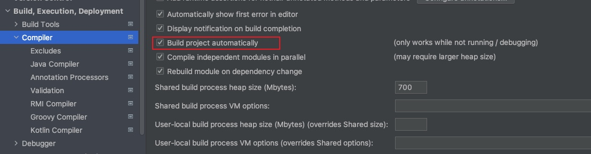
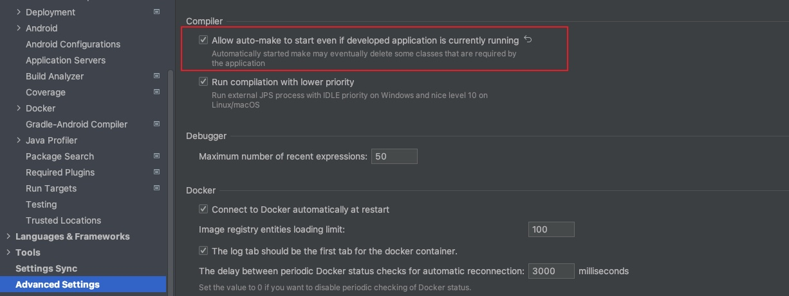

SpringBoot 的引入，配置
<!--more-->
## 1.引入依赖
```xml
<parent>
    <groupId>org.springframework.boot</groupId>
    <artifactId>spring-boot-starter-parent</artifactId>
    <version>3.1.0</version>
</parent>

<!--引入 web 模块-->
<dependencies>
    <dependency>
        <groupId>org.springframework.boot</groupId>
        <artifactId>spring-boot-starter-web</artifactId>
    </dependency>
</dependencies>
```

## 2.启动
```java
@RestController
@SpringBootApplication
public class MainApplication {

    @RequestMapping("/")
    String hello(){
        return "Hello World!";
    }
    public static void main(String[] args) {
        SpringApplication.run(MainApplication.class, args);
    }
}
```

## 3.打成可执行 JAR 包
```xml
<build>
    <plugins>
        <plugin>
            <groupId>org.springframework.boot</groupId>
            <artifactId>spring-boot-maven-plugin</artifactId>
        </plugin>
    </plugins>
</build>
```

## 4.读取配置文件
读取 xml 的配置文件可以使用 @ImportResource
```xml
<beans xmlns="http://www.springframework.org/schema/beans"
       xmlns:xsi="http://www.w3.org/2001/XMLSchema-instance"
       xsi:schemaLocation="http://www.springframework.org/schema/beans http://www.springframework.org/schema/beans/spring-beans.xsd">
    <bean name="mainConfig" class="com.alamide.springboot.config.MainConfig"/>
</beans>
```

```java
@RestController
@SpringBootApplication
@ImportResource("classpath:beans.xml")
public class MainApplication {

    @Autowired
    private MainConfig mainConfig;

    @RequestMapping("/")
    String hello(){
        return mainConfig.sayHello();
    }
    public static void main(String[] args) {
        SpringApplication.run(MainApplication.class, args);
    }
}
```

## 5.自动注入 Bean
@SpringBootApplication 注解的类如果在顶层目录下，那么所有的 Component 会被自动注入到 Spring 容器中

## 6.热部署
引入 devtools，在修改代码之后可能不会立即生效，可以 `Ctrl + S` 保存一下，或切换到其它应用，如果觉得比较慢，可以使用 `JRebel`
>If you find that restarts are not quick enough for your applications or you encounter classloading issues, you could consider reloading technologies such as JRebel from ZeroTurnaround. 

```xml
<dependencies>
    <dependency>
        <groupId>org.springframework.boot</groupId>
        <artifactId>spring-boot-devtools</artifactId>
        <optional>true</optional>
    </dependency>
</dependencies>
```

设置自动构建




