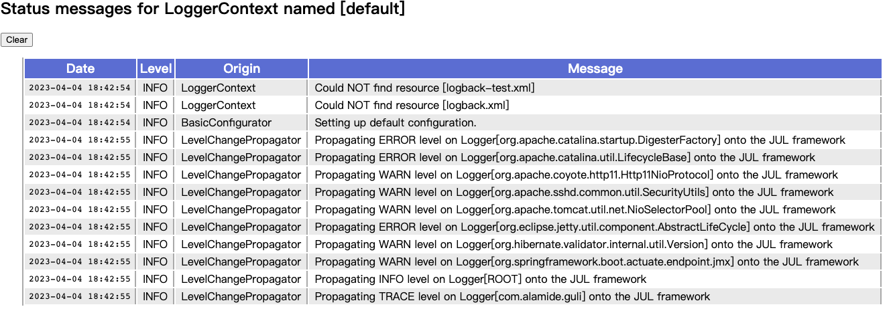

可以通过配置文件来管理 `logger` ，系统寻找配置文件的顺序为，先去 classpath 下找 `logback-test.xml ` ，如未找到，再去找 `logback.xml` 。
所以线下开发时可以配置 `src/test/resources/logback-test.xml ` ，`src/main/resource/logback.xml` 则不会生效。


## 1. logback.xml
简单的配置文件如下
```xml
<?xml version="1.0" encoding="UTF-8" ?>
<!DOCTYPE configuration>

<configuration>
  <import class="ch.qos.logback.classic.encoder.PatternLayoutEncoder"/>
  <import class="ch.qos.logback.core.ConsoleAppender"/>

  <appender name="STDOUT" class="ConsoleAppender">
    <encoder class="PatternLayoutEncoder">
      <pattern>%d{HH:mm:ss.SSS} [%thread] %-5level %logger{36} -%kvp- %msg%n</pattern>
    </encoder>
  </appender>

  <root level="debug">
    <appender-ref ref="STDOUT"/>
  </root>
</configuration>
```
## 2. statusListener 状态信息获取
如果需要输出状态信息，在配置文件中添加下面的语句，状态信息包括 `xml` 文件是否被正确解析、 `logback.xml` 文件是否发现及发现的位置等有用信息，在 `logback` 发生问题时，这些信息是很有效的

```xml
<statusListener class="ch.qos.logback.core.status.OnConsoleStatusListener" />
<!-- <statusListener class="ch.qos.logback.core.status.OnFileStatusListener" /> -->
```

也可以使用 `<configuration debug="true">` 这种方式，`debug="true"` 会自动加上 `OnConsoleStatusListener`


还可以从在线查看状态信息，`logback-classic` 中含有 `ViewStatusMessagesServlet` ，只需要注册一下就可以在线访问了

```java
@Configuration
public class LogbackConfig {
    @Bean
    public ServletRegistrationBean<ViewStatusMessagesServlet> viewStatusMessagesServlet(){
        ViewStatusMessagesServlet statusMessagesServlet = new ViewStatusMessagesServlet();
        return new ServletRegistrationBean<>(statusMessagesServlet, "/lbClassicStatus");
    }
}
```
显示结果如下



## 3.自动更新配置文件
当配置文件，发生变更时，可以自动生效（如果配置文件有语法错误，继续使用上一版本），还可以设置检查的频率。检查的任务会在单独的线程中进行，

```xml
<configuration scan="true" scanPeriod="30 seconds" >
  ...
</configuration> 
```

`scanPeriod` 不设置单位，默认是 `milliseconds` ，单位有 `milliseconds` 、`seconds` 、`minutes` 、`hours`

## 4.packagingData 
输出错误日志时( `logger.error(String, Throwable)` )后面会加上具体的 `jar` 包信息，这个操作很消耗资源
```xml
<configuration packagingData="true">
```
执行这样一段代码
```java
try {
    int i = 1/0;
}catch (Exception e){
    logger.error("Exception: ", e);
}
```

`packagingData` 未开启时输出
```
19:15:55.163 [main] ERROR com.alamide -- Exception: 
java.lang.ArithmeticException: / by zero
	at com.alamide.third.LogbackTest.testHierarchy(LogbackTest.java:31)
	at java.base/jdk.internal.reflect.NativeMethodAccessorImpl.invoke0(Native Method)
	at java.base/jdk.internal.reflect.NativeMethodAccessorImpl.invoke(NativeMethodAccessorImpl.java:77)
	at java.base/jdk.internal.reflect.DelegatingMethodAccessorImpl.invoke(DelegatingMethodAccessorImpl.java:43)
	at java.base/java.lang.reflect.Method.invoke(Method.java:568)
	at org.junit.platform.commons.util.ReflectionUtils.invokeMethod(ReflectionUtils.java:727)
	at org.junit.jupiter.engine.execution.MethodInvocation.proceed(MethodInvocation.java:60)
```

`packagingData` 开启时输出
```
19:15:08.782 [main] ERROR com.alamide -- Exception: 
java.lang.ArithmeticException: / by zero
	at com.alamide.third.LogbackTest.testHierarchy(LogbackTest.java:31) ~[test-classes/:na]
	at java.base/jdk.internal.reflect.NativeMethodAccessorImpl.invoke0(Native Method) ~[na:na]
	at java.base/jdk.internal.reflect.NativeMethodAccessorImpl.invoke(NativeMethodAccessorImpl.java:77) ~[na:na]
	at java.base/jdk.internal.reflect.DelegatingMethodAccessorImpl.invoke(DelegatingMethodAccessorImpl.java:43) ~[na:na]
	at java.base/java.lang.reflect.Method.invoke(Method.java:568) ~[na:na]
	at org.junit.platform.commons.util.ReflectionUtils.invokeMethod(ReflectionUtils.java:727) ~[junit-platform-commons-1.9.2.jar:1.9.2]
	at org.junit.jupiter.engine.execution.MethodInvocation.proceed(MethodInvocation.java:60) ~[junit-jupiter-engine-5.9.2.jar:5.9.2]
```

## 5.关闭 logback-classic
在必要的时候关闭 `logback` 是很有必要的，比如 `webApplication` 宕机时，需要关闭 `logback` ，在 `webApplication` 不需要自己配置

```xml
<configuration debug="true">
   <!-- in the absence of the class attribute, assume
   ch.qos.logback.core.hook.DefaultShutdownHook -->
   <shutdownHook/>

   <!-- rest of the config file.. -->

</configuration>
```

在 `webServer` 中 `logback-classic` 会自行监听
>Logback-classic will automatically ask the web-server to install a LogbackServlet​ContainerInitializer implementing the ServletContainer​Initializer interface (available in servlet-api 3.x and later). This initializer will in turn install and instance of LogbackServlet​ContextListener. This listener will stop the current logback-classic context when the web-app is stopped or reloaded.

## 6.Appender 的累加
`logger` 不仅会输出自己的 `appender` ，还会输出继承自先代的 `appender`
```xml
<configuration>
    <appender name="STDOUT" class="ch.qos.logback.core.ConsoleAppender">
        <encoder>
            <pattern>%d{HH:mm:ss.SSS} [%thread] %-5level %logger{36} -%kvp- %msg%n</pattern>
        </encoder>
    </appender>

    <logger name="com.alamide">
        <appender-ref ref="STDOUT" />
    </logger>

    <root level="debug">
        <appender-ref ref="STDOUT" />
    </root>
</configuration>
```
```java
log.info("Appenders accumulate");
```

`logger` 含有两个 `appender` ， 所以会输出两次，输出如下：
```
19:39:52.871 [main] INFO  com.alamide.third.LogbackTest -- Appenders accumulate
19:39:52.871 [main] INFO  com.alamide.third.LogbackTest -- Appenders accumulate
```

解决方案如下：将 `additivity` 标记为 `false`
```xml
<logger name="com.alamide" additivity="false">
    <appender-ref ref="STDOUT" />
</logger>
```

## 7.使用变量
配置文件中可以使用变量，可以有以下几种形式声明。使用变量 `${USER_HOME}`
1. 使用 `<variable/>` 标签声明
   ```xml
   <variable name="USER_HOME" value="/home/sebastien" />
   ```

2. 使用命令行传入
   ```shell
   java -DUSER_HOME="/home/sebastien" MyApp2
   ```

3. 从外部引入 `properties` 文件
   ```xml
   <!--文件引入-->
   <variable file="src/main/java/chapters/configuration/variables1.properties" />
   <!--类路径下-->
   <variable resource="resource1.properties" />
   ```

还可以有默认值，未定义变量时使用默认值 `${aName:-golden}` ，`aName` 未定义时，则为 `golden`

## 8.配置文件中流程控制
样例如下
```xml
<configuration debug="true">

  <if condition='property("HOSTNAME").contains("torino")'>
    <then>
      <appender name="CON" class="ch.qos.logback.core.ConsoleAppender">
        <encoder>
          <pattern>%d %-5level %logger{35} -%kvp- %msg %n</pattern>
        </encoder>
      </appender>
      <root>
        <appender-ref ref="CON" />
      </root>
    </then>
  </if>

  <appender name="FILE" class="ch.qos.logback.core.FileAppender">
    <file>${randomOutputDir}/conditional.log</file>
    <encoder>
      <pattern>%d %-5level %logger{35} -%kvp- %msg %n</pattern>
   </encoder>
  </appender>

  <root level="ERROR">
     <appender-ref ref="FILE" />
  </root>
</configuration>
```